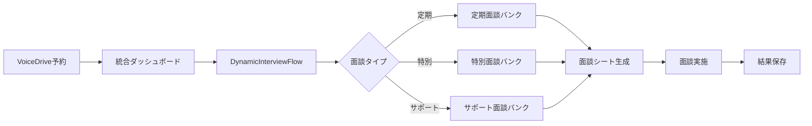

# 新面談予約システム実装再開指示書

**作成日**: 2025年8月16日  
**宛先**: Claude AI Assistant  
**作成者**: システム管理者  
**文書番号**: DOC-INT-2025-0816

---

## 1. 実装状況サマリー

### 1.1 完了済みタスク（2025年8月16日時点）

| No | タスク名 | 状態 | 概要 |
|----|---------|------|------|
| 1 | 定期面談バンクのデータ永続化層実装 | ✅完了 | LocalStorage/API切り替え可能なリポジトリパターン実装 |
| 2 | 職員カルテとの統合（面談履歴表示） | ✅完了 | 面談履歴の表示・動機タイプ診断との連携 |
| 3 | 管理者設定ページ（質問バンク管理） | ✅完了 | 質問の追加・編集・削除機能 |
| 4 | 特別面談バンクシステムの構築 | ✅完了 | 退職・異動・復職・昇進・懲戒面談対応 |
| 5 | サポート面談バンクシステムの構築 | ✅完了 | 7カテゴリのサポート面談生成 |
| 6 | 3つのバンクシステムの統一インターフェース | ✅完了 | UnifiedBankService実装 |
| 7 | VoiceDrive連携機能の実装 | ✅完了 | 予約データ取得・自動パラメータ設定 |
| 8 | DynamicInterviewFlowのエラー修正 | ✅完了 | 型エラー・実行時エラー修正 |
| 9 | サポート/特別面談のクライアントエラー修正 | ✅完了 | シート表示・質問生成エラー修正 |
| 10 | 統合面談ダッシュボードの実装 | ✅完了 | 全面談種別の一元管理UI |

### 1.2 残タスク

| No | タスク名 | 優先度 | 推定工数 |
|----|---------|--------|---------|
| 11 | MCP共有フォルダとの同期機能 | 中 | 8時間 |
| 12 | 既存面談システムの削除とコード整理 | 低 | 4時間 |

---

## 2. システムアーキテクチャ現状

### 2.1 主要コンポーネント構成

```
src/
├── components/interview/
│   ├── DynamicInterviewFlow.tsx       # メイン面談フロー（修正済み）
│   ├── UnifiedInterviewDashboard.tsx  # 統合ダッシュボード（新規）
│   └── SupportInterviewFlow.tsx       # サポート面談（廃止予定）
│
├── lib/interview-bank/
│   ├── services/
│   │   ├── generator.ts               # 定期面談生成
│   │   ├── special-generator.ts       # 特別面談生成
│   │   ├── support-generator.ts       # サポート面談生成
│   │   └── unified-bank-service.ts    # 統一サービス
│   │
│   ├── repositories/
│   │   ├── bank-repository.ts         # リポジトリインターフェース
│   │   ├── local-adapter.ts           # LocalStorage実装
│   │   └── api-adapter.ts             # API実装
│   │
│   └── database/
│       ├── regular-questions.ts       # 定期面談質問DB
│       ├── special-questions.ts       # 特別面談質問DB
│       └── support-questions.ts       # サポート面談質問DB
│
└── services/
    └── voicedriveIntegrationService.ts # VoiceDrive連携
```

### 2.2 データフロー



---

## 3. 再開時の実装手順

### 3.1 タスク11: MCP共有フォルダとの同期機能

#### 実装要件
1. **同期対象フォルダ**
   ```
   mcp-shared/
   ├── docs/           # 共有ドキュメント
   ├── config/         # 設定ファイル
   ├── interfaces/     # TypeScript型定義
   └── logs/          # テスト結果・作業ログ
   ```

2. **必須機能**
   - AI_SUMMARY.md の自動読み込み
   - VoiceDriveからの日次報告取得
   - テスト結果の監視
   - 双方向同期（変更検知）

3. **実装ファイル作成**
   ```typescript
   // src/services/mcpSyncService.ts
   export class MCPSyncService {
     // ファイル監視
     async watchSharedFolder(): Promise<void>
     // 要約取得
     async getLatestSummary(): Promise<string>
     // VoiceDrive報告取得
     async getVoiceDriveReport(): Promise<any>
     // テスト結果取得
     async getTestResults(): Promise<any>
   }
   ```

4. **統合ポイント**
   - DynamicInterviewFlow起動時に要約確認
   - ダッシュボードに同期ステータス表示
   - 新規共有ファイル通知機能

### 3.2 タスク12: 既存システムの削除とコード整理

#### 削除対象ファイル
```
削除予定:
- src/components/interview/SupportInterviewFlow.tsx
- src/components/interview/InterviewSheetSelector.tsx
- src/components/interview/InterviewSheetWrapper.tsx
- docs/v1_interview-sheets/
- docs/v2_interview-sheets/
- docs/v3_interview-sheets/
```

#### 保持ファイル
```
保持:
- docs/v4_interview/          # 統合版として保持
- docs/v5_interview-sheets/   # 最新版として保持
- src/components/interview-bank/  # バンクシステム
```

#### リファクタリング項目
1. 不要なインポート削除
2. 未使用コンポーネントの削除
3. 重複コードの統合
4. 型定義の整理

---

## 4. 注意事項と確認事項

### 4.1 重要な注意点

1. **docs/フォルダは削除禁止**
   - 面談シート・評価シートが含まれる
   - 本番システムで使用中

2. **CLAUDE.mdの設定遵守**
   - MCP共有フォルダの自動確認
   - AI_SUMMARY.mdを最初に読む

3. **ブランチ管理**
   - main と preview/feature-name に必ずpush
   - コミットメッセージに絵文字と署名を含める

### 4.2 テスト確認項目

- [ ] 統合ダッシュボードから全面談タイプが開始可能
- [ ] 予約情報からの自動パラメータ設定が機能
- [ ] 特別面談・サポート面談のシート生成が正常
- [ ] VoiceDrive連携が正常動作
- [ ] 印刷モードが全面談タイプで利用可能

---

## 5. 実装再開時のコマンド

```bash
# 1. 最新の要約を確認
cat mcp-shared/docs/AI_SUMMARY.md

# 2. ブランチの状態確認
git status
git branch

# 3. 開発サーバー起動
npm run dev

# 4. Vercelデプロイ確認
git push origin main
# https://staff-medical-system-v2.vercel.app で確認
```

---

## 6. 連絡事項

### 技術的決定事項
- バンクシステムを全面談で使用（統一化完了）
- ダッシュボードを面談開始の単一エントリーポイントに
- 予約なし面談は面談実施タブから（バックアップ機能）

### ユーザーフィードバック対応済み
- 「定期面談シート」表示問題 → 修正済み
- 質問が空になる問題 → 修正済み
- 作業フローの改善 → ダッシュボード実装で対応

### 次回実装時の優先順位
1. MCP同期機能（業務効率化）
2. コード整理（保守性向上）
3. パフォーマンス最適化（必要に応じて）

---

**実装再開時は本指示書を参照し、タスク11から順次実装を進めてください。**

**署名**: システム管理者  
**日付**: 2025年8月16日