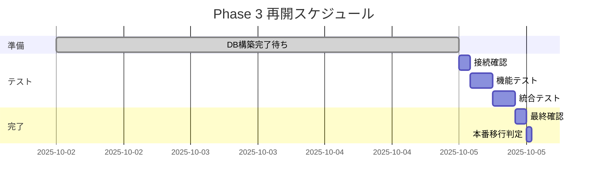

# VoiceDriveチーム向け Phase 3 作業再開依頼書

**文書番号**: VOICEDRIVE-RESTART-001
**発行日**: 2025年10月2日
**発行元**: 医療システムチーム
**宛先**: VoiceDriveチーム
**重要度**: 高

---

## 依頼概要

共通データベース構築完了後、Phase 3「施設別権限レベル管理」の統合テストを再開していただきたく、正式に依頼いたします。

```
═══════════════════════════════════════════════════════
  依頼事項: Phase 3 統合テスト再開
  前提条件: 共通DB構築完了
  目標期限: DB構築完了後3営業日以内
═══════════════════════════════════════════════════════
```

---

## 1. 医療システム側の準備状況

### ✅ 実装完了項目（100%）

| カテゴリ | 状態 | 備考 |
|---------|------|------|
| **API実装** | ✅ 完了 | facilityIdパラメータ対応済み |
| **権限計算ロジック** | ✅ 完了 | 統括主任レベル7実装済み |
| **Webhook通知** | ✅ 完了 | リトライ機構実装済み |
| **単体テスト** | ✅ 完了 | 17/17項目成功 |
| **ドキュメント** | ✅ 完了 | API仕様書完備 |

### 📋 DB構築後に提供予定

```yaml
提供項目:
  1. 本番APIエンドポイントURL
  2. Bearer Token（本番用）
  3. Webhook署名シークレット
  4. SSL証明書情報
  5. テスト用スタッフID（実データ）
```

---

## 2. VoiceDriveチームへの依頼事項

### 2.1 事前準備（DB構築前に可能）

- [ ] 統合テストスクリプトの最終確認
- [ ] モックテスト結果のレビュー
- [ ] 環境変数設定ファイルの準備
- [ ] エラーハンドリングロジックの確認

### 2.2 DB構築完了後の作業

#### Phase 1: 接続確認（2時間）

| 順序 | 作業内容 | 期待結果 |
|-----|---------|----------|
| 1 | API疎通テスト | 200 OK応答 |
| 2 | Bearer Token認証確認 | 認証成功 |
| 3 | SSL証明書検証 | 有効な証明書 |

#### Phase 2: 機能テスト（4時間）

| テスト項目 | 確認内容 | 成功基準 |
|-----------|---------|----------|
| **権限計算** | 立神病院5名のテスト | 全員正しいレベル |
| **統括主任** | レベル7の確認 | Level 7返却 |
| **施設間変換** | 小原→立神の変換 | 調整ルール適用 |
| **Webhook受信** | イベント受信確認 | 正常受信・処理 |

#### Phase 3: 統合テスト（4時間）

| テスト項目 | 内容 | 基準値 |
|-----------|------|--------|
| **負荷テスト** | 100件同時処理 | <3秒 |
| **パフォーマンス** | 平均応答時間 | <500ms |
| **エラー率** | 全API呼び出し | <0.1% |

---

## 3. 確認が必要な仕様

### 3.1 統括主任レベル7

```typescript
// 医療チーム実装済み
if (position === '統括主任' && facilityId === 'tategami-rehabilitation') {
  return { level: 7, adjustment: +1 };  // 基本6 + 調整1
}
```

**確認**: VoiceDrive側でも同じロジックの実装をお願いします。

### 3.2 施設ID形式

| 施設名 | facilityId |
|--------|-----------|
| 小原病院 | `obara-hospital` |
| 立神リハビリテーション温泉病院 | `tategami-rehabilitation` |

**確認**: この形式で統一されていることを確認してください。

### 3.3 Webhookイベント形式

```json
{
  "eventType": "staff.updated",
  "timestamp": "ISO8601形式",
  "data": {
    "staffId": "string",
    "facilityId": "string",
    "changes": {
      "position": "string",
      "accountLevel": "number"
    }
  }
}
```

---

## 4. テストデータ

### 4.1 テスト用スタッフ（DB構築後提供）

```javascript
// 立神リハビリテーション温泉病院
const testStaff = [
  { id: "TATE_001", position: "総師長", expectedLevel: 10 },
  { id: "TATE_002", position: "統括主任", expectedLevel: 7 },  // 重要
  { id: "TATE_003", position: "師長", expectedLevel: 7 },
  { id: "TATE_004", position: "介護主任", expectedLevel: 5 },
  { id: "TATE_005", position: "看護師", expectedLevel: 3.5 }
];
```

---

## 5. コミュニケーション

### 5.1 連絡体制

```yaml
定例会議:
  - DB構築完了翌日 10:00
  - その後、毎日 10:00 進捗確認

Slackチャンネル:
  - #phase3-integration（メイン）
  - #phase3-urgent（緊急用）

エスカレーション:
  レベル1: 各チームリーダー
  レベル2: プロジェクトマネージャー
```

### 5.2 報告内容

毎日の進捗報告に含める項目:
1. 完了したテスト項目
2. 検出された問題
3. 翌日の作業予定
4. ブロッカーの有無

---

## 6. 成功基準

### 6.1 必須達成項目

- [ ] 全API疎通確認（100%）
- [ ] 統括主任レベル7動作確認
- [ ] 施設間権限変換の正常動作
- [ ] Webhook送受信成功
- [ ] パフォーマンス基準達成

### 6.2 品質基準

| 指標 | 基準値 | 備考 |
|------|--------|------|
| テスト成功率 | >95% | Critical項目は100% |
| 応答時間 | <500ms | 95パーセンタイル |
| エラー率 | <0.1% | 本番相当の負荷で |

---

## 7. リスクと対策

| リスク | 影響 | 対策 |
|--------|------|------|
| DB性能不足 | 高 | 初期は段階的に負荷増加 |
| データ不整合 | 中 | バリデーション強化 |
| 認証エラー | 低 | トークン有効期限確認 |

---

## 8. 添付資料

### 医療システム側から提供

1. API仕様書（最新版）
2. テストスクリプト
3. 環境設定テンプレート
4. エラーコード一覧

### VoiceDrive側で準備いただきたい資料

1. 統合テスト計画書
2. Webhook受信ログ
3. パフォーマンステスト結果

---

## 9. スケジュール案



---

## 10. 承認

### 依頼者（医療システムチーム）

- 責任者: [氏名]
- 承認日: 2025年10月2日
- 署名: _________________

### 受領者（VoiceDriveチーム）

- [ ] 依頼内容を確認しました
- [ ] リソースを確保できます
- [ ] スケジュールに同意します

- 責任者: [氏名]
- 受領日: __________
- 署名: _________________

---

## 連絡先

**医療システムチーム**
- 担当: 開発リーダー
- Email: medical-dev@example.com
- Slack: @medical-team
- 緊急: [電話番号]

**エスカレーション先**
- PM: [氏名]
- Email: pm@example.com
- 緊急: [電話番号]

---

**注記**:
- 本依頼書は共通DB構築完了の通知と同時に有効となります
- 作業開始前に両チーム間で最終確認会議を実施します
- 不明点は作業開始前に必ず確認してください

---

文書ID: VOICEDRIVE-RESTART-001
発行日: 2025年10月2日
有効期限: 2025年12月31日