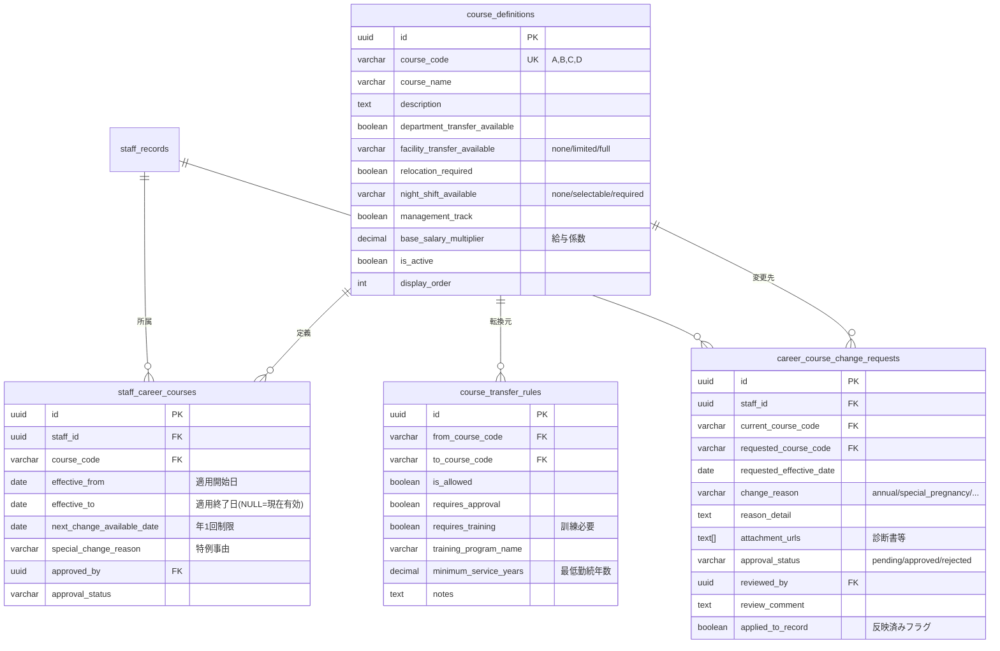

# Phase 5: キャリア選択制度 実装計画書

**作成日**: 2025年9月30日
**作成者**: Claude Code（医療システムチーム）
**承認者**: 川畑法人統括事務局長
**根拠資料**: `docs/20250919_【川畑法人統括事務局長】コース別雇用制度労基資料.pdf`

---

## 📋 目次

1. [制度概要](#1-制度概要)
2. [法的根拠と留意点](#2-法的根拠と留意点)
3. [A～D 4コース体系](#3-a～d-4コース体系)
4. [データ構造設計](#4-データ構造設計)
5. [実装フェーズ](#5-実装フェーズ)
6. [システム連携](#6-システム連携)
7. [今後の課題](#7-今後の課題)

---

## 1. 制度概要

### 1.1 目的

川畑法人統括事務局長の戦略会議（2025年9月）における指示に基づき、以下を目的とする：

1. **移動したくない人と移動できる人の明確化**
   - 職員の意向を尊重しつつ、法人全体の人材流動性を確保
   - 「できる人ばかりに負担が集中する」状況の解消

2. **給与の透明性・公平性の確保**
   - 同じ仕事量なのに給与が同じという問題の解消
   - コースごとに基本給係数を設定（A: 1.2倍、B: 1.1倍、C: 1.0倍、D: 0.9倍）

3. **管理職候補の計画的育成**
   - 標準任期制（3年/5年）による管理職ローテーション
   - 副主任・副師長等の中間ポジション設置

4. **ワークライフバランスの尊重**
   - 育児・介護等の制約がある職員への配慮（Dコース）
   - プライベート優先型の働き方を選択可能（Cコース）

### 1.2 導入スケジュール（想定）

| 時期 | 内容 |
|------|------|
| **2025年10月** | データ基盤整備、システム実装 |
| **2025年11月** | 管理職向け説明会、規定整備 |
| **2025年12月** | 職員向け説明会、意向調査 |
| **2026年1月** | 初回コース選択受付 |
| **2026年3月** | 理事会承認、労基署届出 |
| **2026年4月** | 制度正式スタート |

※ 局長指示：「焦らず着実に」「現場の納得を得ながら」

---

## 2. 法的根拠と留意点

### 2.1 法的根拠

**厚生労働省「コース別雇用管理の留意点」（平成19年）**

> 「コース別雇用管理」とは、雇用する労働者について、労働者の職種、資格等に基づき複数のコースを設定し、コースごとに異なる配置・昇進、教育訓練等の雇用管理を行うシステムをいいます。

### 2.2 男女雇用機会均等法への対応

コース別雇用管理制度を導入する場合、**実質的な男女別の雇用管理とならないように**以下に留意：

#### ✅ 必須事項
1. **労働者の意欲、能力、適性や成果等に基づいて処遇する制度であること**
2. **コース間の転換を柔軟に認める制度を設けること**
3. **転居を伴う転勤要件の情報提供**（期間、場所、頻度、実績）

#### ⚠️ 禁止事項
- コース選択時に性別で異なる扱いをすること
- 「総合職は男性のみ」「一般職は女性のみ」といった制度設計
- 女性についてのみ、結婚・出産の予定を質問すること

### 2.3 当法人の対応

1. **全コースを性別問わず選択可能**
2. **コース間の双方向転換を全て許可**（12パターン）
3. **年1回の定期変更 + 妊娠・介護等の特例変更**
4. **労働契約書・求人票にコース条件を明記**

---

## 3. A～D 4コース体系

### 3.1 コース一覧

| コード | コース名 | 部署異動 | 施設間異動 | 夜勤 | 管理職 | 基本給係数 | 想定割合 |
|:------:|---------|:--------:|:----------:|:----:|:------:|:----------:|:--------:|
| **A** | 全面協力型 | ○ | ◎（全施設） | ◎ | ○ | **1.20** | 30-40% |
| **B** | 施設内協力型 | ○ | ×（施設内のみ） | ◎ | ○ | **1.10** | 20-30% |
| **C** | 専門職型 | × | × | △ | × | **1.00** | 30-40% |
| **D** | 時短・制約あり型 | × | × | × | × | **0.90** | 5-10% |

**凡例**: ◎=必須, ○=可, △=限定的/選択可, ×=不可

### 3.2 各コースの詳細

#### Aコース（全面協力型）
```yaml
対象: 管理職候補として積極的にキャリアアップを目指す職員
条件:
  - 部署間異動: 可（法人内全施設）
  - 施設間異動: 可（鹿児島～宮崎～熊本等）
  - 転居を伴う転勤: 受諾
  - 夜勤: あり（必須）
  - 管理職登用: 対象
給与: 基本給 × 1.20
標準任期: 管理職就任後3～5年（後継者育成義務）
例: 小原病院看護師 → 立神リハビリ病院副看護部長 → 本部看護部長
```

#### Bコース（施設内協力型）
```yaml
対象: 管理職候補だが施設間異動は避けたい職員
条件:
  - 部署間異動: 可（同一施設内の病棟移動等）
  - 施設間異動: なし
  - 転居を伴う転勤: なし
  - 夜勤: あり（必須）
  - 管理職登用: 対象
給与: 基本給 × 1.10
標準任期: 管理職就任後3～5年
例: 小原病院3階病棟 → 小原病院4階病棟主任 ※施設内での昇進
```

#### Cコース（専門職型）
```yaml
対象: 現在の部署で専門性を発揮、プライベート優先
条件:
  - 部署間異動: なし（現在の部署で継続）
  - 施設間異動: なし
  - 転居を伴う転勤: なし
  - 夜勤: 選択可（本人希望に応じて）
  - 管理職登用: 対象外
給与: 基本給 × 1.00（標準）
キャリアパス: スペシャリストとしての技能向上、認定・専門資格取得支援
例: 小原病院ICU看護師、立神リハビリPT専門職
```

#### Dコース（時短・制約あり型）
```yaml
対象: 育児・介護・疾病等により勤務条件に配慮が必要な職員
条件:
  - 部署間異動: なし
  - 施設間異動: なし
  - 転居を伴う転勤: なし
  - 夜勤: なし
  - 管理職登用: 対象外
給与: 基本給 × 0.90（勤務時間短縮等を考慮）
特例措置:
  - 年度途中の変更可能（妊娠・介護発生時）
  - 制約解消後の他コース復帰を積極支援
例: 産休明け看護師（時短勤務）、親の介護中の事務職員
```

---

## 4. データ構造設計

### 4.1 テーブル構成



### 4.2 主要クエリ例

#### 現在のコース分布を取得
```sql
SELECT
  cd.course_code,
  cd.course_name,
  COUNT(scc.staff_id) as staff_count,
  ROUND(COUNT(scc.staff_id) * 100.0 / SUM(COUNT(scc.staff_id)) OVER(), 1) as percentage
FROM course_definitions cd
LEFT JOIN staff_career_courses scc
  ON cd.course_code = scc.course_code
  AND scc.effective_to IS NULL
WHERE cd.is_active = true
GROUP BY cd.course_code, cd.course_name, cd.display_order
ORDER BY cd.display_order;
```

#### 職員の現在のコースを取得
```sql
SELECT
  sr.id,
  sr.name,
  scc.course_code,
  cd.course_name,
  cd.base_salary_multiplier,
  scc.effective_from,
  scc.next_change_available_date
FROM staff_records sr
LEFT JOIN staff_career_courses scc
  ON sr.id = scc.staff_id
  AND scc.effective_to IS NULL
LEFT JOIN course_definitions cd
  ON scc.course_code = cd.course_code
WHERE sr.employment_status = 'active';
```

#### 承認待ちのコース変更申請を取得
```sql
SELECT
  ccr.id,
  sr.name as staff_name,
  ccr.current_course_code,
  ccr.requested_course_code,
  ccr.change_reason,
  ccr.submitted_at,
  ctr.requires_training,
  ctr.notes as transfer_notes
FROM career_course_change_requests ccr
JOIN staff_records sr ON ccr.staff_id = sr.id
LEFT JOIN course_transfer_rules ctr
  ON ccr.current_course_code = ctr.from_course_code
  AND ccr.requested_course_code = ctr.to_course_code
WHERE ccr.approval_status = 'pending'
ORDER BY ccr.submitted_at;
```

---

## 5. 実装フェーズ

### Phase 5-1: データ基盤整備 ✅ **完了**

**期間**: 2025年9月30日
**担当**: Claude Code（医療システムチーム）

- [x] SQLマイグレーション作成
  - `supabase/migrations/20250930_001_create_career_course_tables.sql`
  - 4テーブル + RLS設定 + トリガー

- [x] TypeScript型定義追加
  - `src/types/staff.ts`に190行追加
  - 9種類のinterface/type定義

- [x] AI_SUMMARY.md更新
  - VoiceDriveチームへの情報共有

### Phase 5-2: 管理画面実装 ✅ **完了**

**期間**: 2025年9月30日
**担当**: Claude Code（医療システムチーム）

#### 5-2-1. コース管理画面（人事部向け） ✅
- [x] コース定義一覧画面
  - `/admin/career-courses`
  - A～D 4コース表示（タブ形式）
  - コース概要・定義管理・統計情報タブ
  - 将来のE/Fコース追加対応（UI実装済み）

- [x] 統計ダッシュボード
  - 総職員数、承認待ち申請、アクティブコース数表示
  - コース別職員数・割合（モックデータ、API接続は今後）

- [x] admin/layout.tsxへのメニュー追加
  - 「人事管理」グループ新設
  - 「キャリアコース管理」メニュー追加

#### 5-2-2. 職員カルテへの統合 ✅
- [x] CareerCourseCardコンポーネント作成
  - `src/components/career-course/CareerCourseCard.tsx`
  - 現在のコース表示（A/B/C/D）
  - 部署異動・施設間異動・夜勤・管理職登用の条件表示
  - 基本給係数表示
  - 次回変更可能日と残日数表示
  - 特例変更事由の表示（妊娠・介護・疾病）
  - コース変更申請ボタン（将来実装用UI）

- [ ] PersonalDashboardへの統合（未実装）
  - CareerCourseCardの埋め込み
  - 職員カルテ基本情報タブでの表示

### Phase 5-3: 職員向けアプリ実装 ✅ **完了**

**期間**: 2025年10月1日
**担当**: Claude Code（医療システムチーム）

#### 5-3-1. マイページ拡張 ✅
- [x] キャリアコース情報表示
  - `/my-page/page.tsx` 実装完了
  - CareerCourseCardコンポーネント統合
  - 基本情報とコース情報の統合表示
  - クイックアクションボタン（コース変更申請・申請状況確認）

- [x] コース変更申請フォーム
  - `/my-page/career-course/change-request/page.tsx` 実装完了（400行）
  - 現在のコース表示
  - A/B/C/D コース選択カード（色分け表示）
  - 変更理由選択（annual / special_pregnancy / special_caregiving / special_illness）
  - 変更理由詳細入力（textarea）
  - 添付ファイルアップロード（特例時必須、バリデーション実装）
  - 希望適用日選択（日付ピッカー）
  - 確認モーダル（申請前確認）
  - モック送信処理（2秒遅延、成功後リダイレクト）

- [x] 申請状況確認
  - `/my-page/career-course/my-requests/page.tsx` 実装完了（500行）
  - 申請履歴一覧表示（pending/approved/rejected/withdrawn）
  - 統計サマリー（総申請数、承認待ち、承認済み、却下）
  - 詳細表示モード（申請ID、コース変更内容、変更事由、審査結果）
  - 審査コメント・却下理由表示
  - 申請取り下げボタン（UI実装、機能は将来実装）
  - モックデータ3件（B→A承認待ち、C→B承認済み、C→D却下）

#### 5-3-2. API実装 ✅
- [x] GET /api/my-page
  - マイページデータ取得API
  - 職員基本情報 + キャリアコース情報統合
  - モックレスポンス実装（Supabase接続は今後）

- [x] GET /api/career-courses/definitions
  - コース定義一覧取得API
  - A～D 4コース詳細情報
  - 変更申請フォームでの選択肢に使用

- [x] POST /api/career-course/change-request
  - コース変更申請送信API
  - バリデーション（コース情報、変更事由、適用日、添付ファイル必須判定）
  - モック送信処理（実際のDB保存は今後）

- [x] GET /api/career-course/my-requests
  - 申請履歴取得API
  - 新しい順ソート、審査結果含む
  - モックデータ3件返却

- [x] DELETE /api/career-course/my-requests
  - 申請取下げAPI（承認待ちのみ）
  - モック処理実装

#### 5-3-3. プッシュ通知連携 **[将来実装]**
- [ ] コース変更申請受付通知
- [ ] 承認・却下通知
- [ ] 定期変更期間のリマインダー（毎年3月）

### Phase 5-4: 給与システム連携 **[将来]**

**期間**: 2026年1月～
**担当**: 給与システムベンダー + Claude Code

- [ ] 基本給係数の自動反映
- [ ] 役職手当の連動
- [ ] 給与明細への表示

### Phase 5-5: 移動管理システム連携 **[将来]**

**期間**: 2026年3月～
**担当**: Claude Code

- [ ] 人事異動計画時のコース条件フィルタリング
  - Aコース職員のみを施設間異動候補に表示
  - Bコース職員は施設内のみ異動対象（部署異動のみ）
  - C/Dコース職員は異動対象外

- [ ] 異動通知とコース条件の整合性チェック
  - 内示時に自動チェック
  - コース条件違反時は警告表示

---

## 📊 Phase 5-3 実装完了サマリー（2025年10月1日）

### 実装ファイル一覧

#### フロントエンド（3画面）
1. `src/app/my-page/page.tsx` - マイページダッシュボード
2. `src/app/my-page/career-course/change-request/page.tsx` - コース変更申請フォーム（400行）
3. `src/app/my-page/career-course/my-requests/page.tsx` - 申請状況確認画面（500行）

#### バックエンド（4 API）
1. `src/app/api/my-page/route.ts` - マイページデータ取得
2. `src/app/api/career-courses/definitions/route.ts` - コース定義一覧
3. `src/app/api/career-course/change-request/route.ts` - 申請送信
4. `src/app/api/career-course/my-requests/route.ts` - 申請履歴取得・取下げ

### 機能詳細

#### 1. マイページ (`/my-page`)
- 職員基本情報カード（所属・部署・職種・入職日・勤続年数）
- CareerCourseCard統合表示（現在のコース、条件、次回変更可能日）
- クイックアクション（コース変更申請、申請状況確認、通知設定）
- レスポンシブデザイン（lg: 3カラムレイアウト）

#### 2. コース変更申請フォーム (`/my-page/career-course/change-request`)
- 現在のコース表示（Bコース: 施設内協力型）
- コース選択カード（A/C/D）- クリックで選択、色分け表示
- 変更理由選択（年1回定期 / 妊娠・出産 / 介護 / 疾病）
- 変更理由詳細入力（textarea、必須）
- 希望適用日選択（date picker、最小値=今日）
- ファイル添付（特例変更時必須、複数ファイル対応）
- 確認モーダル（申請内容の最終確認）
- バリデーション完備

#### 3. 申請状況確認画面 (`/my-page/career-course/my-requests`)
- 統計サマリーカード（総申請数、承認待ち、承認済み、却下）
- 申請履歴一覧（コース変更内容、事由、日付、ステータスバッジ）
- 詳細表示モード（申請ID、変更内容、事由、添付ファイル、審査結果）
- 審査コメント・却下理由表示
- 申請取下げボタン（承認待ちのみ、UI実装済み）
- モックデータ3件（B→A承認待ち、C→B承認済み、C→D却下）

### 技術仕様

- **フレームワーク**: Next.js 14 App Router
- **UI**: React Client Components ('use client')
- **スタイリング**: Tailwind CSS + shadcn/ui
- **アイコン**: lucide-react
- **データ取得**: fetch API（モックデータ、Supabase接続は今後）
- **状態管理**: useState + useEffect
- **バリデーション**: クライアントサイド検証実装

### 今後の実装タスク

1. **Supabase接続**
   - 各APIエンドポイントのDB接続実装
   - RLS（Row Level Security）適用
   - 認証連携（supabase.auth.getUser()）

2. **ファイルアップロード**
   - Supabase Storage連携
   - career-course-attachments バケット作成
   - セキュアなファイルアクセス制御

3. **通知機能**
   - 申請受付通知（職員・人事部）
   - 承認・却下通知（職員）
   - リマインダー通知（定期変更期間）

4. **人事部審査画面**
   - 申請一覧・審査インターフェース
   - 承認・却下処理
   - コメント入力

5. **データ移行**
   - 既存職員のデフォルトコース設定
   - 初期データ投入スクリプト

---

## 6. システム連携

### 6.1 職員カルテシステム

```typescript
// 職員詳細取得時にコース情報も取得
const staff = await getStaffDetail(staffId);
console.log(staff.careerCourse.courseCode); // 'A'
console.log(staff.careerCourse.courseName); // 'Aコース（全面協力型）'
console.log(staff.careerCourse.nextChangeAvailableDate); // '2026-03-01'
```

### 6.2 面談システム連携

面談予約時に職員のキャリアコース情報を面談担当者に提供：

```typescript
interface InterviewContext {
  staffId: string;
  careerCourse: CareerCourseCode;  // 'A', 'B', 'C', 'D'
  careerAspiration: 'management' | 'specialist' | 'frontline';
  transferWillingness: boolean;
}
```

面談シート内の質問項目を動的に調整：
- **Aコース職員**: 管理職志向、転勤受諾意向の確認
- **Cコース職員**: 専門性向上、資格取得支援の希望
- **Dコース職員**: 制約状況の変化、復帰希望時期

### 6.3 評価システム連携

コースごとに評価基準を変更：
- **A/Bコース**: リーダーシップ、マネジメント能力を重視
- **Cコース**: 専門スキル、技術力を重視
- **Dコース**: 業務品質、チームワークを重視

### 6.4 勤怠管理システム連携

- **夜勤シフト作成**: C/Dコース職員は夜勤対象外として自動除外
- **残業上限**: Dコース職員は時短勤務のため残業制限

### 6.5 採用管理システム連携

求人票に希望コースを記載：

```
【募集要項】
職種: 正看護師
勤務地: 小原病院（鹿児島県出水市）
コース: A/B/Cコースから選択可能
  ├ Aコース: 施設間異動あり、管理職候補、基本給+20%
  ├ Bコース: エリア内異動、管理職候補、基本給+10%
  └ Cコース: 異動なし、専門職、基本給標準
※入職後の変更可能（年1回）
```

---

## 7. 今後の課題

### 7.1 制度設計上の課題

#### 7.1.1 コース比率の維持
- **目標**: Aコース 30-40%、Bコース 20-30%、Cコース 30-40%
- **課題**: 全員がCコース希望の場合、法人の人材流動性が確保できない
- **対策**:
  - 採用時にコース条件を明示
  - Aコース職員への手厚い研修・キャリア支援
  - 管理職手当の魅力向上

#### 7.1.2 コース変更の制限
- **年1回制限**: 年度途中の変更不可（特例除く）
- **特例変更の濫用防止**: 診断書等の添付義務
- **3年固定案**: 現場から「3年間は変更不可」との要望も（検討中）

#### 7.1.3 既存職員の移行措置
- **不利益変更の回避**: 現在の給与を下回らない配慮
- **移行期間**: 1～2年の猶予期間を設定
- **経過措置**: 従来の給与体系との併用期間

### 7.2 技術的課題

#### 7.2.1 給与システムとの連携
- **基本給係数の反映**: 給与システムベンダーとの調整
- **計算ロジックの整合性**: 基本給 × 係数 × 経験年数等級
- **データ移行**: 既存職員のコース初回設定

#### 7.2.2 権限レベルとの統合
- **Phase 3の権限レベル**: 1-18（小数点対応）
- **コースとの関係**: Aコース = 高レベル権限優先？
- **独立管理**: コースと権限は別個に管理する方針

#### 7.2.3 パフォーマンス
- **大量通知**: 年1回の定期変更期間に500～1000名が申請
- **承認ワークフロー**: 施設長→人事部長→理事長の多段階承認
- **バッチ処理**: 深夜バッチで申請処理、朝に結果通知

### 7.3 運用上の課題

#### 7.3.1 管理職の理解促進
- **説明会**: 施設長・師長向けの事前説明（2025年11月予定）
- **Q&A集**: よくある質問への回答を事前準備
- **デモンストレーション**: 30日の病院運営会議でシステムデモ

#### 7.3.2 職員への周知徹底
- **説明資料**: A4 1枚の分かりやすい比較表
- **個別相談**: 面談時にキャリアコース選択を支援
- **誤解の防止**: 「コース変更=降格」ではないことの説明

#### 7.3.3 労働組合・職員代表との協議
- **過半数代表者の意見聴取**: 労働基準法90条
- **不利益変更**: 就業規則変更の合理性説明
- **理事会承認**: 2026年3月の理事会議題

---

## 8. 音声記録からの重要指示事項

### 8.1 川畑局長の指示（2025年9月・戦略会議）

> **「キャリア選択制度の優先順位を変更する。評価制度よりも、まずコース制度と異動制度を先行させる。」**

**理由**:
- 評価制度は「コース」と「異動」の体制が整ってから
- 移動対象者が不明確な状態では評価もできない
- インフラ整備が全ての基盤

### 8.2 医師へのプレゼン（10月30日・病院運営会議）

- **対象**: 所属長 + ドクター
- **時間**: 5～10分
- **内容**:
  1. 準備室の組織説明
  2. 7-9月の活動報告
  3. 今後の計画
  4. **面談予約システムのデモ**（スマホ操作を見せる）

**局長指示**:
> 「ドクターは看護師さんたちの労働環境を心配している。面談制度がいよいよ創設されかけているんだというのをデモンストレーションを通してぜひ見せてください。少しみんなの心を掴んでおいた方がいい。」

### 8.3 管理職改革よりも職員の信頼獲得を優先

> **「管理職を変えるよりも、職員の信頼を得ることが先。遠回りだけど早い。」**

- 管理職ヒアリングで「できない」前提の文化が判明
- 業務マニュアル・急変対応マニュアルの不備
- 看護部・リハビリ部の本部機能強化が必要

### 8.4 コース選択の説明会での注意点

**局長指示**:
> 「先生方（医師）は頭がいいので、家に帰ってすぐ調べる。若干先のビジョンも見せないとダメ。今現状のものだけでは納得しない。」

**対応**:
- 厚労省ガイドライン準拠を明示
- 他病院の導入事例（6割が導入済み）
- 3年後の組織図（本部機能強化後）

---

## 9. 参考資料

### 9.1 法令・ガイドライン

1. **男女雇用機会均等法**（昭和47年法律第113号）
   - 第6条: コース等で区分した雇用管理における性差別の禁止

2. **厚生労働省「コース別雇用管理の留意点」**（平成19年）
   - リーフレット: `docs/20250919_【川畑法人統括事務局長】コース別雇用制度労基資料.pdf`

3. **労働契約法**（平成19年法律第128号）
   - 第8条: 労働契約の内容の変更（不利益変更の禁止）

### 9.2 他病院の導入事例

- **山形病院**（局長が参考資料として提示）
  - A～Dの4コース体系
  - 夜勤の有無、部署異動・施設異動の可否で区分
  - 基本給がコースごとに異なる投級表

- **玉潮会**（鹿児島県内の医療法人）
  - 介護職でコース選択制度を導入済み
  - 職場体験プログラムと連動

### 9.3 システム関連ドキュメント

- `supabase/migrations/20250930_001_create_career_course_tables.sql`
- `src/types/staff.ts`（190行追加）
- `mcp-shared/docs/AI_SUMMARY.md`

---

## 10. まとめ

### 10.1 現在の進捗（2025年9月30日時点）

| 項目 | 状況 | 完了度 |
|------|------|:------:|
| 制度設計 | A～D4コース確定 | 100% |
| 法的根拠確認 | 厚労省ガイドライン準拠 | 100% |
| データ構造設計 | 4テーブル設計完了 | 100% |
| SQLマイグレーション | 作成完了 | 100% |
| TypeScript型定義 | 9種類の型定義追加 | 100% |
| 管理画面実装 | 未着手 | 0% |
| 職員向けアプリ実装 | 未着手 | 0% |
| 給与システム連携 | 未着手 | 0% |

### 10.2 次のアクション

#### 医療システムチーム（Claude Code）
1. SQLマイグレーションの実行（Supabase本番環境）
2. 管理画面の実装開始（Phase 5-2）
3. 10月30日の医師向けプレゼン資料作成

#### VoiceDriveチーム
1. スマホアプリへのコース情報表示検討
2. コース変更申請フォームのUI設計
3. プッシュ通知の実装計画

#### 人事準備室（橋口氏・内匠氏）
1. 管理職向け説明資料の作成
2. 就業規則の改定案作成
3. 理事会への上申準備

---

**文書管理情報**
- **最終更新**: 2025年9月30日 23:45
- **次回更新予定**: 2025年10月7日（Phase 5-2開始時）
- **承認者**: 川畑法人統括事務局長
- **問い合わせ**: 人事準備室（内線xxx）