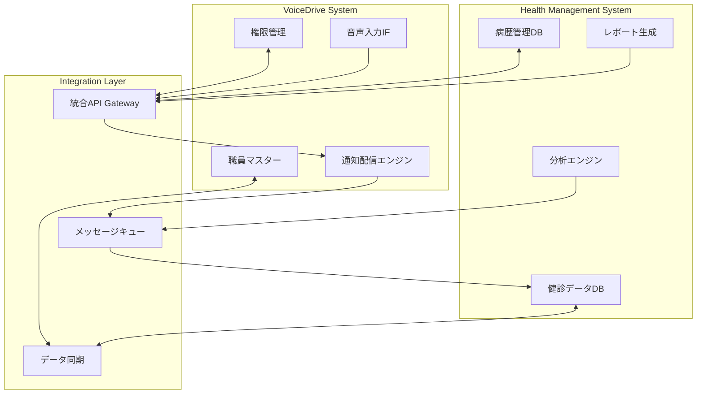

# VoiceDrive × 健康管理システム連携仕様書

**文書番号**: HMS-VD-INTEGRATION-001
**発行日**: 2025年9月29日
**バージョン**: 1.0
**重要度**: 高

---

## 1. 連携概要

### 目的
VoiceDriveシステムと健康管理システムを連携し、職員の健康情報と人事情報を統合的に管理する。

### 連携の価値
```
VoiceDrive側の強み:
- リアルタイム通知配信
- 音声認識によるデータ入力
- 既存の職員マスター管理

健康管理システムの強み:
- 健診データの一元管理
- 医療情報の専門的処理
- コンプライアンス対応

統合効果:
→ 1,250名の健康情報をシームレスに管理
→ 通知から結果確認まで一貫した体験
→ データの二重管理を排除
```

---

## 2. 連携アーキテクチャ

### システム構成図



---

## 3. 連携ポイント詳細

### A. データ同期

#### 1. 職員マスター同期
```typescript
interface StaffDataSync {
  // VoiceDrive → 健康管理
  staffMaster: {
    staffId: string;
    name: string;
    department: string;
    position: string;
    facilityId: string;  // Phase3で実装済み
    employmentDate: Date;
  };

  // 同期タイミング
  syncTrigger: 'realtime' | 'batch' | 'ondemand';
  syncInterval: '1hour' | '1day';

  // 同期方向
  direction: 'bidirectional' | 'voicedrive_to_health' | 'health_to_voicedrive';
}
```

#### 2. 権限レベル連携
```typescript
// Phase 3で実装済みの施設別権限を活用
interface PermissionSync {
  getHealthDataAccess(staffId: string): {
    canViewOwnData: boolean;
    canViewDepartmentData: boolean;
    canEditHealthData: boolean;
    facilityRestriction?: string;  // 施設制限
  };

  // 統括主任レベル7の特別権限
  specialPermissions: {
    crossFacilityAccess?: boolean;  // 施設横断アクセス
    healthDataOverride?: boolean;   // 健康データ編集権限
  };
}
```

### B. 通知配信連携

#### 1. 健診結果通知フロー
```typescript
// 健康管理 → VoiceDrive
interface HealthNotificationRequest {
  type: 'CHECKUP_RESULT' | 'REEXAM_REMINDER' | 'STRESS_CHECK';

  payload: {
    targetStaffIds: string[];
    notificationData: {
      title: string;
      summary: string;  // 簡易情報のみ
      detailUrl: string;  // 詳細は健康管理システムで表示
      expiryDate: Date;
    };

    priority: 'high' | 'medium' | 'low';
    confidential: boolean;  // ストレスチェック等
  };

  // VoiceDrive通知エンジン設定
  deliveryConfig: {
    channels: ('app' | 'email' | 'voice')[];
    retryCount: number;
    trackingEnabled: boolean;
  };
}
```

#### 2. 音声通知対応
```typescript
// VoiceDrive独自機能の活用
interface VoiceNotification {
  // 音声読み上げ用テキスト
  voiceScript: {
    greeting: '健康診断の結果をお知らせします';
    summary: '総合判定はBです。詳細はシステムでご確認ください';
    action: 'システムにログインして結果を確認してください';
  };

  // 音声コマンド対応
  voiceCommands: {
    '結果を確認': 'OPEN_HEALTH_RESULT',
    '再検査予約': 'BOOK_REEXAMINATION',
    '後で確認': 'REMIND_LATER'
  };
}
```

### C. データ入力連携

#### 1. 音声入力による問診
```typescript
// VoiceDrive音声入力 → 健康管理DB
interface VoiceHealthInput {
  // 問診項目の音声入力
  questionnaireInput: {
    staffId: string;
    sessionId: string;
    responses: {
      question: string;
      voiceResponse: string;
      confidence: number;
      timestamp: Date;
    }[];
  };

  // 音声からの構造化データ変換
  processVoiceData: (audio: AudioBuffer) => {
    symptoms?: string[];
    medications?: string[];
    allergies?: string[];
    lifestyle?: {
      smoking: boolean;
      drinking: 'none' | 'occasional' | 'regular';
      exercise: 'none' | 'weekly' | 'daily';
    };
  };
}
```

### D. 分析・レポート連携

#### 1. 統合ダッシュボード
```typescript
interface IntegratedDashboard {
  // VoiceDriveダッシュボードへの健康指標埋め込み
  healthMetrics: {
    departmentHealth: {
      checkupRate: number;
      reexamRate: number;
      stressLevel: 'low' | 'medium' | 'high';
    };

    alerts: {
      uncompletedCheckups: number;
      pendingReexams: number;
      highRiskStaff: number;
    };
  };

  // 更新頻度
  refreshInterval: 'realtime' | 'hourly' | 'daily';
}
```

---

## 4. API仕様

### 共通API設計

```typescript
// Base URL設定
const API_CONFIG = {
  voicedrive: {
    baseUrl: process.env.VOICEDRIVE_API_URL,
    version: 'v3',
    timeout: 30000
  },
  healthManagement: {
    baseUrl: process.env.HEALTH_API_URL,
    version: 'v1',
    timeout: 30000
  }
};
```

### 主要エンドポイント

#### VoiceDrive → 健康管理

```typescript
// 職員健康データ取得
GET /api/health/staff/{staffId}/summary
Authorization: Bearer {token}
Response: {
  staffId: string;
  lastCheckupDate: Date;
  overallStatus: 'A' | 'B' | 'C' | 'D' | 'E';
  alerts: Alert[];
}

// 健診データ一括取得（管理者用）
GET /api/health/checkups/batch
Query: {
  departmentId?: string;
  facilityId?: string;
  dateFrom?: Date;
  dateTo?: Date;
}

// 音声入力データ送信
POST /api/health/voice-input
Body: {
  staffId: string;
  inputType: 'questionnaire' | 'symptoms' | 'medication';
  voiceData: VoiceHealthInput;
}
```

#### 健康管理 → VoiceDrive

```typescript
// 通知送信依頼
POST /api/voicedrive/notifications/health
Body: {
  type: 'checkup' | 'stress' | 'reminder';
  targets: string[];
  content: NotificationContent;
  options: DeliveryOptions;
}

// 権限確認
GET /api/voicedrive/permissions/health/{staffId}
Response: {
  staffId: string;
  level: number;  // Phase3の権限レベル
  healthAccess: HealthAccessPermission;
}

// 職員情報同期
POST /api/voicedrive/sync/staff
Body: {
  action: 'full' | 'delta';
  lastSyncTime?: Date;
  facilityFilter?: string;
}
```

---

## 5. セキュリティ要件

### 認証・認可

```typescript
interface SecurityConfig {
  // 相互認証
  authentication: {
    method: 'OAuth2' | 'APIKey' | 'mTLS';
    tokenExpiry: 3600;  // seconds
    refreshEnabled: true;
  };

  // データ暗号化
  encryption: {
    inTransit: 'TLS1.3';
    atRest: 'AES-256-GCM';
    keyRotation: 'monthly';
  };

  // アクセス制御
  accessControl: {
    ipWhitelist: string[];
    rateLimit: {
      requests: 1000;
      window: '1hour';
    };
  };

  // 監査
  audit: {
    logAllAccess: true;
    retentionDays: 1825;  // 5年
    alertOnAnomaly: true;
  };
}
```

### 健康情報の特別な取り扱い

```yaml
HealthDataProtection:
  Classification: "要配慮個人情報"

  Rules:
    - ストレスチェック結果は実施者以外アクセス不可
    - 健診詳細データは本人と産業医のみ閲覧可
    - VoiceDrive側では要約情報のみ保持
    - 音声データは処理後即座に削除

  Compliance:
    - 個人情報保護法準拠
    - 労働安全衛生法準拠
    - GDPR対応（将来的）
```

---

## 6. 実装フェーズ

### Phase 1: 基本連携（1ヶ月）
- [ ] API Gateway構築
- [ ] 認証機構実装
- [ ] 職員マスター同期
- [ ] 基本的な通知連携

### Phase 2: データ連携（1ヶ月）
- [ ] 健診データ取得API
- [ ] 権限連携
- [ ] セキュリティ実装
- [ ] エラーハンドリング

### Phase 3: 高度連携（1ヶ月）
- [ ] 音声入力統合
- [ ] リアルタイム同期
- [ ] 統合ダッシュボード
- [ ] パフォーマンス最適化

---

## 7. テスト計画

### 統合テスト項目

| カテゴリ | テスト内容 | 成功基準 |
|----------|-----------|----------|
| **認証** | 相互認証 | 100%成功 |
| **データ同期** | 1,250名分同期 | <5分 |
| **通知配信** | 1,000件同時送信 | <30秒 |
| **音声入力** | 音声→構造化データ | 精度95%以上 |
| **権限管理** | Phase3権限レベル | 100%一致 |
| **セキュリティ** | ペネトレーションテスト | 脆弱性0 |

### 負荷テスト

```yaml
LoadTest:
  Scenarios:
    - name: "健診結果一斉配信"
      users: 1250
      duration: 10min
      targetRPS: 100

    - name: "音声入力ピーク時"
      users: 50
      concurrent: true
      duration: 30min

    - name: "API同時アクセス"
      endpoints: 10
      requestsPerEndpoint: 1000
      duration: 5min
```

---

## 8. 運用・保守

### SLA（Service Level Agreement）

| 項目 | 目標値 |
|------|--------|
| 可用性 | 99.9% |
| 応答時間 | <500ms (95%ile) |
| データ同期遅延 | <5分 |
| 障害復旧時間 | <2時間 |

### 監視項目

```typescript
const MonitoringMetrics = {
  // システムメトリクス
  system: ['CPU', 'Memory', 'Disk', 'Network'],

  // アプリケーションメトリクス
  application: [
    'API Response Time',
    'Error Rate',
    'Sync Delay',
    'Queue Length'
  ],

  // ビジネスメトリクス
  business: [
    'Daily Active Users',
    'Notification Delivery Rate',
    'Data Sync Success Rate',
    'Voice Input Accuracy'
  ]
};
```

---

## 9. リスクと対策

| リスク | 影響 | 可能性 | 対策 |
|--------|------|--------|------|
| API障害 | 高 | 中 | サーキットブレーカー実装 |
| データ不整合 | 高 | 低 | トランザクション管理強化 |
| 性能劣化 | 中 | 中 | キャッシュ層追加 |
| セキュリティ侵害 | 高 | 低 | 多層防御実装 |

---

## 10. 今後の展望

### 将来的な機能拡張

1. **AI活用**
   - 健康リスク予測
   - 音声からの健康状態判定
   - 自動問診システム

2. **IoT連携**
   - ウェアラブルデバイス連携
   - バイタルデータ自動収集
   - リアルタイム健康モニタリング

3. **外部連携**
   - 医療機関システム連携
   - 健保組合データ連携
   - 行政報告自動化

---

## 承認

| 役職 | 氏名 | 日付 | 署名 |
|------|------|------|------|
| 医療システムPM | | | |
| VoiceDrive PM | | | |
| セキュリティ責任者 | | | |
| 産業医 | | | |

---

**文書管理情報**
- 作成者: 医療システムチーム
- レビュー: VoiceDriveチーム
- 次回更新: 2025年4月
- 配布先: 両チーム開発メンバー、管理職