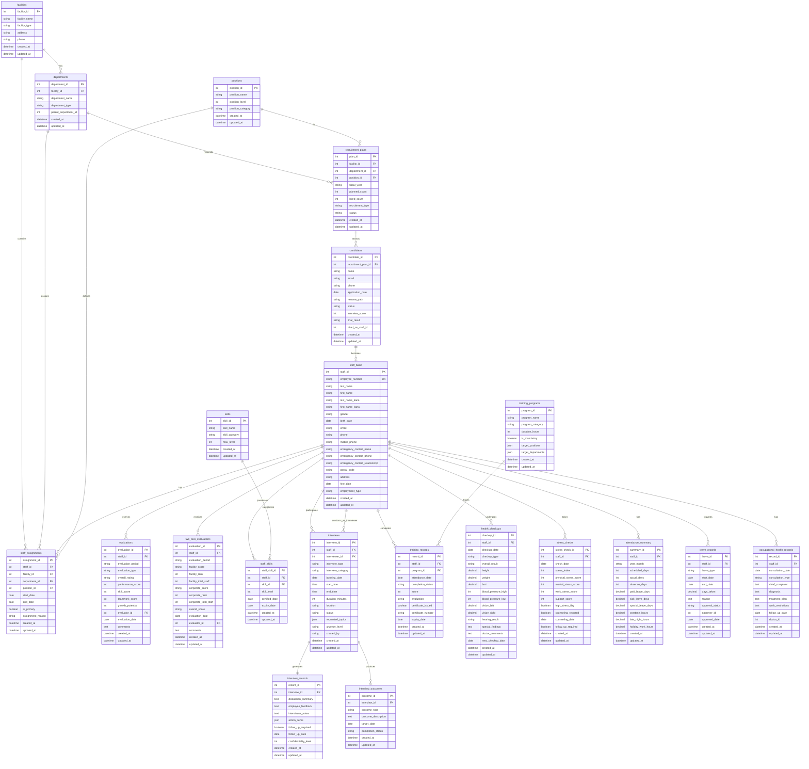
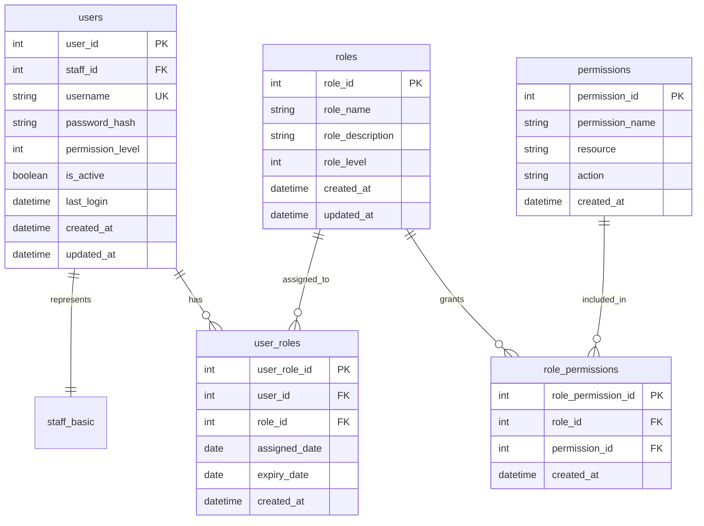

# 職員カルテシステム ER図設計書

## 主要エンティティ関連図



## 権限管理関連のER図



## データフロー関連図

```mermaid
graph TB
    subgraph 外部システム
        A[総務システム] --> B[職員基本情報]
        C[勤怠システム] --> D[勤怠情報]
        E[健診システム] --> F[健康情報]
        G[ストレスチェック<br/>システム] --> H[ストレス情報]
    end
    
    subgraph 職員カルテDB
        B --> I[staff_basic]
        D --> J[attendance_summary]
        F --> K[health_checkups]
        H --> L[stress_checks]
    end
    
    subgraph 人事部門入力
        M[面談実施] --> N[interviews]
        O[評価入力] --> P[evaluations]
        Q[研修管理] --> R[training_records]
    end
    
    subgraph 分析・レポート
        I --> S[離職リスク分析]
        J --> S
        K --> S
        L --> S
        N --> S
        P --> S
        
        S --> T[アラート生成]
        S --> U[レポート出力]
    end
```

## インデックス設計詳細

### プライマリーインデックス
- 各テーブルのPK

### セカンダリーインデックス
```sql
-- 頻繁な検索用
CREATE INDEX idx_staff_employee_number ON staff_basic(employee_number);
CREATE INDEX idx_staff_email ON staff_basic(email);
CREATE INDEX idx_assignments_staff_facility ON staff_assignments(staff_id, facility_id);
CREATE INDEX idx_interviews_staff_date ON interviews(staff_id, booking_date);
CREATE INDEX idx_interviews_interviewer_date ON interviews(interviewer_id, booking_date);
CREATE INDEX idx_evaluations_staff_period ON evaluations(staff_id, evaluation_period);
CREATE INDEX idx_attendance_staff_month ON attendance_summary(staff_id, year_month);

-- 集計用複合インデックス
CREATE INDEX idx_assignments_current ON staff_assignments(is_primary, end_date) WHERE end_date IS NULL;
CREATE INDEX idx_stress_high ON stress_checks(check_date, high_stress_flag) WHERE high_stress_flag = true;
CREATE INDEX idx_interviews_status ON interviews(status, booking_date);

-- フルテキスト検索用
CREATE FULLTEXT INDEX idx_interview_notes ON interview_records(discussion_summary, interviewer_notes);
```

## データ整合性制約

### 外部キー制約
- すべてのFKに対してCASCADE UPDATE、RESTRICT DELETE設定

### チェック制約
```sql
-- 評価スコアの範囲
ALTER TABLE evaluations ADD CONSTRAINT chk_scores 
  CHECK (performance_score BETWEEN 0 AND 100 
    AND skill_score BETWEEN 0 AND 100 
    AND teamwork_score BETWEEN 0 AND 100
    AND growth_potential BETWEEN 1 AND 5);

-- 面談時間の整合性
ALTER TABLE interviews ADD CONSTRAINT chk_interview_time
  CHECK (end_time > start_time);

-- ストレス指数の範囲
ALTER TABLE stress_checks ADD CONSTRAINT chk_stress_index
  CHECK (stress_index BETWEEN 0 AND 100);
```

### トリガー
```sql
-- 年齢自動計算
CREATE TRIGGER calculate_age 
  BEFORE INSERT OR UPDATE ON staff_basic
  FOR EACH ROW
  EXECUTE FUNCTION update_age_from_birthdate();

-- 配属終了時の処理
CREATE TRIGGER end_assignment
  AFTER UPDATE ON staff_assignments
  FOR EACH ROW
  WHEN (NEW.end_date IS NOT NULL AND OLD.end_date IS NULL)
  EXECUTE FUNCTION handle_assignment_end();
```