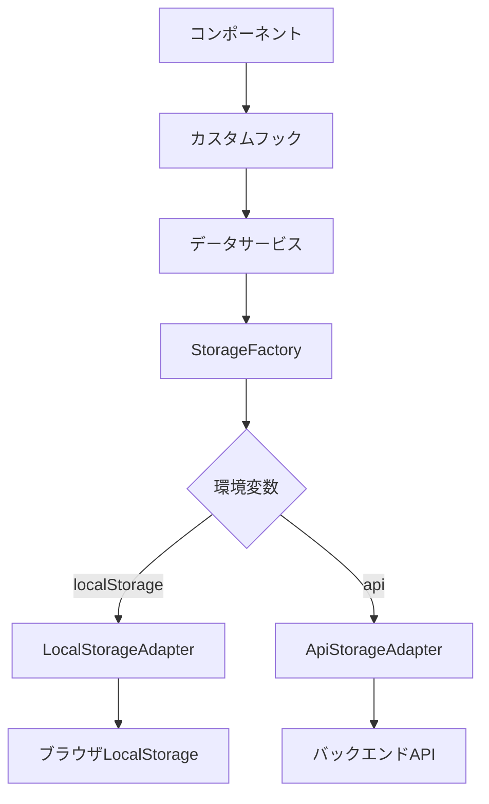

# データ永続化レイヤー実装メモ

**作成日**: 2025年1月14日  
**重要度**: 🔴 最重要

## 📌 重要URL
**マスターデータ管理画面**: https://staff-medical-system-v2.vercel.app/admin/master-data

---

## 🎯 実装の目的
LocalStorageからAPIベースのバックエンドへ、**コード変更なしで移行できる**データ永続化レイヤーを構築

## 📁 実装済みファイル構成

### 1. ストレージアダプター（抽象化レイヤー）
```
src/lib/storage/StorageAdapter.ts
├── StorageAdapter (抽象クラス)
├── LocalStorageAdapter (LocalStorage実装)
├── ApiStorageAdapter (API実装)
└── StorageFactory (切り替え用ファクトリー)
```

### 2. データサービス層
```
src/services/
├── staff/staffDataService.ts        # 職員データ管理
├── interview/interviewDataService.ts # 面談データ管理
└── evaluation/evaluationDataService.ts # 評価データ管理
```

### 3. 設定・フック
```
src/config/storage.config.ts  # ストレージ設定（環境変数対応）
src/hooks/useStaffData.ts     # React用カスタムフック
```

## 🔄 データフロー



## 💡 主な特徴

### 1. 環境変数による切り替え
```env
# LocalStorage使用（現在のデフォルト）
NEXT_PUBLIC_STORAGE_TYPE=localStorage

# API使用（バックエンド連携時）
NEXT_PUBLIC_STORAGE_TYPE=api
NEXT_PUBLIC_API_BASE_URL=https://api.example.com
NEXT_PUBLIC_API_KEY=your-api-key
```

### 2. 統一されたレスポンス形式
```typescript
interface StorageResponse<T> {
  success: boolean;
  data?: T;
  error?: {
    code: string;
    message: string;
  };
  metadata?: {
    timestamp: Date;
    version: string;
  };
}
```

### 3. キャッシュ機能
- 5分間のメモリキャッシュ
- パフォーマンス向上
- ネットワーク負荷軽減

### 4. フォールバック機能
- 既存のstaffDatabaseからの自動移行
- データ欠損時の自動復旧
- 段階的移行のサポート

## 🚀 使用方法

### コンポーネントでの使用例
```typescript
import { useStaffData } from '@/hooks/useStaffData';

function StaffProfile({ staffId }) {
  const { staff, loading, error, updateStaff } = useStaffData(staffId);
  
  if (loading) return <div>Loading...</div>;
  if (error) return <div>Error: {error}</div>;
  
  return (
    <div>
      <h1>{staff?.name}</h1>
      {/* ... */}
    </div>
  );
}
```

### サービス直接使用
```typescript
import { staffDataService } from '@/services/staff/staffDataService';

// データ取得
const staff = await staffDataService.getStaff('123');

// データ保存
await staffDataService.saveStaff(updatedStaff);

// バッチ更新
await staffDataService.batchUpdateStaff(staffArray);
```

## 🔄 バックエンド移行手順

### Phase 1: 準備（現在完了）
- [x] 抽象化レイヤー実装
- [x] データサービス実装
- [x] カスタムフック実装
- [x] 設定ファイル作成

### Phase 2: バックエンド構築時
1. APIエンドポイント実装
   - `/api/storage/{key}` (GET, PUT, DELETE)
   - `/api/storage` (GET for list)
2. データベース設計
   - PostgreSQL or MySQL
   - Lightsail構成（2台構成案）

### Phase 3: 移行実施
1. 環境変数を更新
2. `migrateDataToApi()`関数実行
3. ヘルスチェック確認
4. 段階的ロールアウト

## ⚠️ 注意事項

### 現在の制限
- 画像アップロードは仮実装（Base64）
- 大容量データは要注意（LocalStorageは5-10MB制限）
- 同期処理のみ（非同期バッチ未対応）

### 今後の拡張予定
- [ ] WebSocket対応（リアルタイム同期）
- [ ] オフライン対応（Service Worker）
- [ ] 画像の外部ストレージ対応（S3等）
- [ ] トランザクション処理
- [ ] 楽観的更新の実装

## 📊 データモデル

### Staff（職員）
```typescript
{
  id: string;
  name: string;
  department: string;
  position: string;
  employeeNumber: string;
  photoUrl?: string;  // 顔写真追加予定
  evaluationHistory: EvaluationRecord[];
  interviewHistory: InterviewRecord[];
  trainingHistory: TrainingRecord[];
  motivationType?: string;
  riskLevel?: 'low' | 'medium' | 'high';
}
```

### Interview（面談）
```typescript
{
  id: string;
  staffId: string;
  interviewType: string;
  scheduledDate: string;
  status: 'scheduled' | 'completed' | 'cancelled';
  motivationType?: string;
  actionItems?: ActionItem[];
  sheetData?: any;
}
```

### Evaluation（評価）
```typescript
{
  id: string;
  staffId: string;
  evaluationPeriod: string;
  coreEvaluation: {
    C01: { superior: number; self: number; }
    C02: { superior: number; self: number; }
    C03: { superior: number; self: number; }
  };
  totalScore: number;
  grade: 'S' | 'A' | 'B' | 'C' | 'D';
}
```

## 🔗 関連リソース

- **本番環境**: https://staff-medical-system-v2.vercel.app
- **マスターデータ管理**: https://staff-medical-system-v2.vercel.app/admin/master-data
- **GitHub**: https://github.com/tokubot83/staff-medical-system-v2
- **Lightsail構成案**: `/mcp-shared/docs/lightsail-dual-system-analysis.md`

## 📝 開発者メモ

### なぜこの設計？
1. **将来の拡張性**: バックエンド追加時の変更最小化
2. **テスト容易性**: モックとの切り替えが簡単
3. **段階的移行**: 一部機能から順次移行可能
4. **開発効率**: フロントエンド開発をブロックしない

### パフォーマンス考慮
- キャッシュによる高速化
- バッチ処理対応
- 遅延読み込み（必要時のみ）

### セキュリティ考慮
- APIキーの環境変数管理
- HTTPS通信必須
- 入力値検証

---

**最終更新**: 2025年1月14日  
**作成者**: Claude Code Assistant  
**レビュー**: 未実施

## 次のステップ
1. バックエンド構築方針の決定待ち
2. Lightsail 2台構成での実装
3. 本番データの移行計画策定