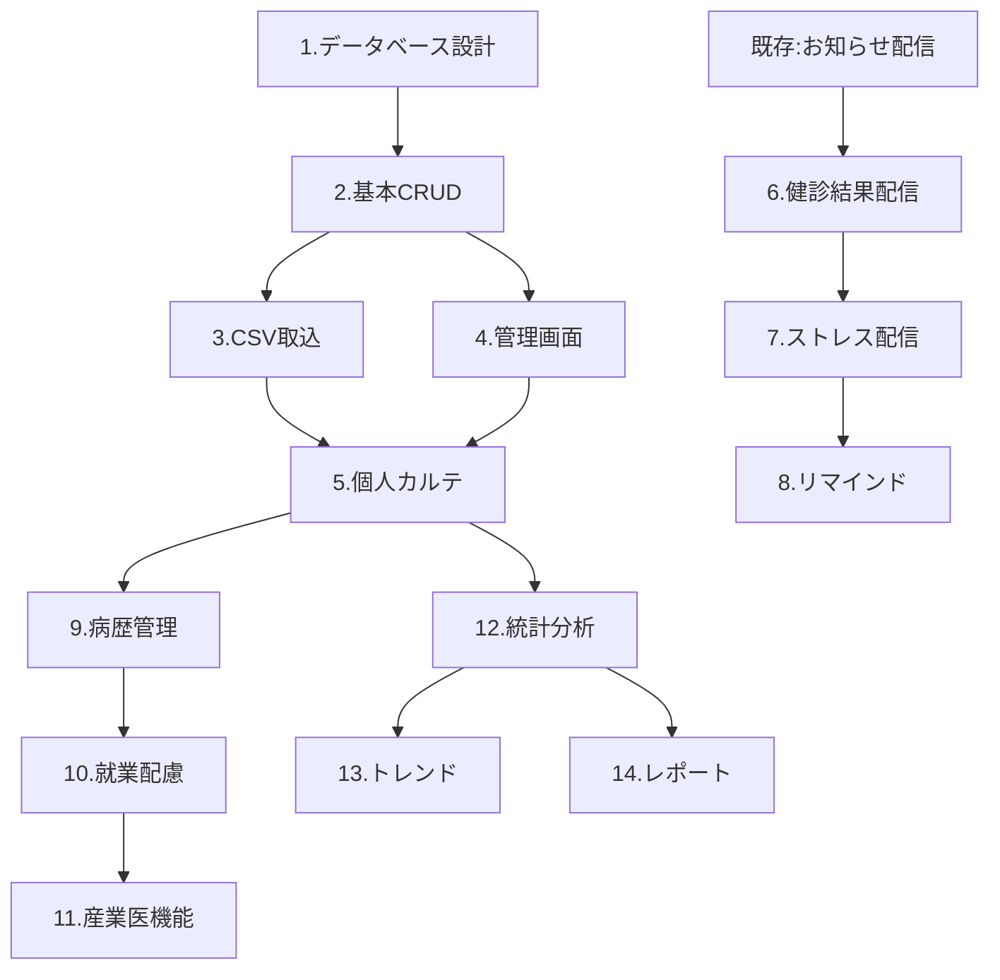

# 健康管理システム実装項目 総合整理

## 📊 実装項目の全体像

### A. コア機能（必須）
```
優先度: ★★★（最優先）
期間: 2-3ヶ月
```

| 機能 | 内容 | 工数 | 依存関係 |
|------|------|------|----------|
| **1. データベース構築** | 健診・病歴・配慮管理テーブル | 2週間 | なし |
| **2. CSV取込機能** | 健診データ一括インポート | 1週間 | DB完成後 |
| **3. 基本CRUD** | データの登録・更新・削除・検索 | 2週間 | DB完成後 |
| **4. 健診結果閲覧** | 個人カルテ表示機能 | 2週間 | CRUD完成後 |
| **5. 管理ダッシュボード** | 健診実施率、要再検査者リスト | 1週間 | データ取込後 |

### B. 通知・配信機能
```
優先度: ★★★（コアと並行可能）
期間: 1-2ヶ月
```

| 機能 | 内容 | 工数 | 依存関係 |
|------|------|------|----------|
| **6. 健診結果配信** | お知らせ配信での結果通知 | 2週間 | 既存配信機能 |
| **7. ストレスチェック配信** | 機密性の高い個別配信 | 2週間 | 健診配信後 |
| **8. リマインド機能** | 未読・未対応者への自動通知 | 1週間 | 配信機能後 |

### C. 拡張機能
```
優先度: ★★（第2フェーズ）
期間: 2-3ヶ月
```

| 機能 | 内容 | 工数 | 依存関係 |
|------|------|------|----------|
| **9. 病歴管理** | 既往歴・治療情報の登録 | 2週間 | コア完成後 |
| **10. 就業配慮設定** | 就業制限・配置転換管理 | 2週間 | 病歴管理後 |
| **11. 産業医所見** | 面談記録・判定管理 | 1週間 | 基本機能後 |
| **12. 統計分析** | 部署別・年齢別分析 | 2週間 | データ蓄積後 |

### D. 高度機能
```
優先度: ★（第3フェーズ）
期間: 2-3ヶ月
```

| 機能 | 内容 | 工数 | 依存関係 |
|------|------|------|----------|
| **13. トレンド分析** | 経年変化グラフ、予測 | 3週間 | 2年分データ |
| **14. レポート自動生成** | 労基署提出書類等 | 2週間 | 統計機能後 |
| **15. 他システム連携** | 勤怠・ストレスチェック連携 | 3週間 | API整備後 |

## 🎯 実装の優先順位マトリックス

### 緊急度×重要度で分類

```
        高重要度
            ↑
    ┌───────┬───────┐
    │   1   │   2   │
    │ 最優先 │ 計画的 │
    ├───────┼───────┤
    │   3   │   4   │
    │ 効率化 │ 将来的 │
    └───────┴───────┘
    →           高緊急度
```

| 区分 | 項目 | 理由 |
|------|------|------|
| **1. 最優先** | CSV取込、基本閲覧、結果配信 | 即効性が高く業務に直結 |
| **2. 計画的** | 病歴管理、就業配慮 | 重要だが段階的実装可能 |
| **3. 効率化** | リマインド、統計 | 自動化による効率向上 |
| **4. 将来的** | トレンド分析、予測 | データ蓄積後に価値発揮 |

## 📅 推奨実装ロードマップ

### Phase 1: MVP（最小構成）【2ヶ月】
```
目標: 基本的な健診データ管理を実現
```

**Month 1**
- Week 1-2: データベース設計・構築
- Week 3: CSV取込機能開発
- Week 4: 基本CRUD実装

**Month 2**
- Week 1-2: 管理画面（一覧・検索）
- Week 3: 個人カルテ表示
- Week 4: テスト・調整

**成果物**
✅ 健診データの一括取込
✅ 職員別健診結果の閲覧
✅ 管理者ダッシュボード

### Phase 2: 通知統合【1.5ヶ月】
```
目標: お知らせ配信での結果通知を実現
```

**Month 3**
- Week 1-2: 健診結果配信機能
- Week 3-4: ストレスチェック配信

**Month 4前半**
- Week 1: セキュリティ強化
- Week 2: リマインド機能

**成果物**
✅ 健診結果の自動配信
✅ 機密情報の安全な配信
✅ 未対応者への自動催促

### Phase 3: 管理機能強化【2ヶ月】
```
目標: 総合的な健康管理プラットフォーム
```

**Month 4後半-5**
- Week 3-4: 病歴管理システム
- Week 5-6: 就業配慮機能

**Month 6**
- Week 1-2: 産業医機能
- Week 3-4: 統計・レポート

**成果物**
✅ 包括的な健康情報管理
✅ 就業判定の効率化
✅ 各種レポート自動生成

## 🔧 技術的な実装順序

### 依存関係を考慮した実装順序



## 💡 実装を効率化するポイント

### 1. 並行開発可能な項目

| チームA | チームB |
|---------|---------|
| DB・バックエンド | UI・フロントエンド |
| CSV取込 | 管理画面 |
| 病歴管理 | 配信機能 |

### 2. 既存資産の活用

- **お知らせ配信**: そのまま健診結果配信に転用
- **認証システム**: 既存の権限管理を流用
- **UIコンポーネント**: 他画面から再利用

### 3. 段階的リリース

```
リリース1: 健診データ閲覧のみ（読み取り専用）
リリース2: データ編集・配信機能追加
リリース3: 分析・レポート機能追加
```

## 📝 必要最小限の実装項目（MVP）

もし最短で価値を提供したい場合：

### 30日で実装可能なミニマム構成

1. **CSVインポート**（5日）
2. **データ一覧表示**（5日）
3. **検索・フィルター**（3日）
4. **個人詳細表示**（5日）
5. **結果配信機能**（7日）
6. **テスト・調整**（5日）

これだけでも：
- 年間200時間の作業削減
- 健診データのデジタル管理
- 結果配信の自動化

が実現できます。

## 🎯 結論

### 推奨アプローチ

1. **まずMVPを30日で構築**
   - CSV取込と基本表示機能のみ
   - すぐに業務で使い始める

2. **使いながら段階的に拡張**
   - ユーザーフィードバックを反映
   - 最も要望の多い機能から追加

3. **6ヶ月後の完成形**
   - 全機能が統合された健康管理プラットフォーム
   - 1,250名の健康情報を効率的に管理

この段階的アプローチにより、リスクを最小化しながら、確実に価値を提供できます。