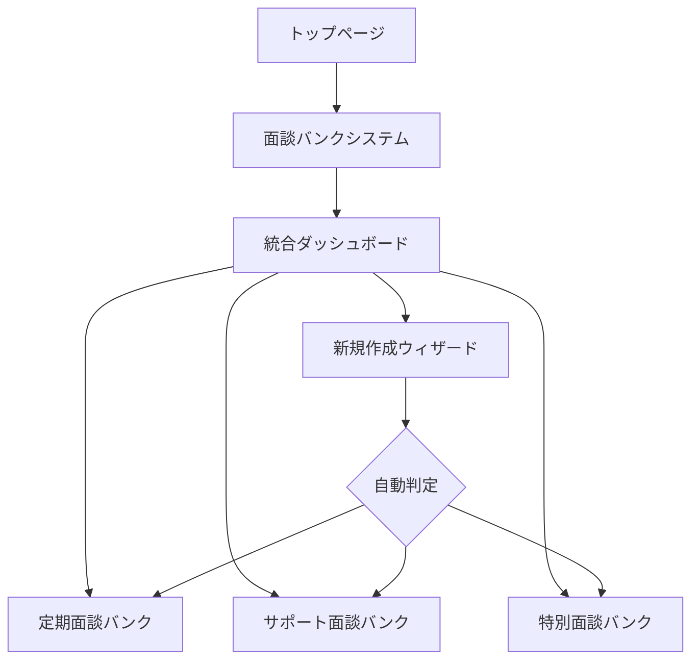

# 面談バンクシステム ナビゲーションガイド

## 🗺️ システムマップ

### メインエントリーポイント
- **統合ダッシュボード**: `/interview-bank`
  - 全バンクシステムの統計表示
  - 最近の面談一覧
  - 各バンクへのクイックアクセス

### 機能別アクセス方法

## 1. 🎯 自動判定機能
**場所**: `/interview-bank/create` (面談作成ウィザード)

```
アクセス手順:
1. ダッシュボード右上の「新規面談作成」ボタンをクリック
2. ウィザードのステップ1で状況を入力
3. AIが自動的に推奨タイプを表示
```

**使用例**:
- VoiceDriveからの申込 → サポート面談を推奨
- 退職申し出 → 特別面談を推奨
- 3ヶ月以上面談なし → 定期面談を推奨

## 2. 🔍 横断検索機能
**場所**: `/interview-bank` (ダッシュボードの検索セクション)

```typescript
// 内部的に使用されている検索メソッド
const results = await unifiedService.searchInterviews({
  keyword: "キャリア",
  bankType: undefined, // 全バンク横断
  dateFrom: new Date('2024-01-01'),
  status: 'completed'
});
```

**検索可能な項目**:
- 職員名
- 部署
- 面談タイプ（定期/サポート/特別）
- ステータス（予定/実施中/完了）
- 日付範囲
- キーワード

## 3. 📊 統合統計
**場所**: `/interview-bank` (ダッシュボードのトップセクション)

### 表示される統計情報:
- **総面談数**: 全バンクの合計
- **実施中**: 現在進行中の面談数
- **完了率**: 平均完了率
- **平均時間**: 面談あたりの平均所要時間

### バンク別詳細統計:
- **定期面談バンク**: 実施数、完了数、保留数
- **サポート面談バンク**: 申込数、解決率、カテゴリ別内訳
- **特別面談バンク**: 実施数、重要案件数、要フォロー数

## 4. 🚀 クイックアクセス

### 個別バンクシステムへの直接アクセス:
- **定期面談**: `/interviews/regular` または `/interview-bank/regular`
- **サポート面談**: `/interviews/support` または `/interview-bank/support`
- **特別面談**: `/interviews/special` または `/interview-bank/special`

### 管理者機能:
- **質問バンク管理**: `/admin/interview-bank`
- **統計レポート**: `/interview-bank/reports`
- **履歴検索**: `/interview-bank/history`

## 5. 📱 ナビゲーションフロー



## 6. 🔧 API/サービス使用方法

### プログラム的アクセス（開発者向け）:

```typescript
import { UnifiedBankService } from '@/lib/interview-bank/services/unified-bank-service';

// サービスインスタンス取得
const service = UnifiedBankService.getInstance();

// 1. 自動判定
const recommendedType = service.detectBankType({
  source: 'voicedrive',
  urgency: 'high'
});

// 2. 横断検索
const searchResults = await service.searchInterviews({
  keyword: '退職',
  bankType: undefined, // 全バンク検索
  status: 'completed'
});

// 3. 統合統計
const statistics = await service.getUnifiedStatistics({
  start: new Date('2024-01-01'),
  end: new Date()
});
```

## 7. 🎨 UI コンポーネントの場所

### メインコンポーネント:
- `/src/app/interview-bank/page.tsx` - 統合ダッシュボード
- `/src/app/interview-bank/create/page.tsx` - 作成ウィザード
- `/src/components/interview/DynamicInterviewFlow.tsx` - 定期面談フロー
- `/src/components/interview/SupportInterviewBankFlow.tsx` - サポート面談フロー
- `/src/components/interview/SpecialInterviewBankFlow.tsx` - 特別面談フロー

## 8. 📋 推奨ワークフロー

### 新規面談作成の流れ:
1. ダッシュボード (`/interview-bank`) にアクセス
2. 「新規面談作成」ボタンをクリック
3. ウィザードで状況入力（自動判定が動作）
4. 推奨されたタイプを確認・選択
5. 職員情報を入力
6. 面談を生成・実施

### 面談検索・分析の流れ:
1. ダッシュボード (`/interview-bank`) にアクセス
2. 統計情報を確認
3. 必要に応じて検索・フィルタリング
4. 詳細レポートへアクセス

## 9. ⚡ ショートカット

### キーボードショートカット（実装予定）:
- `Ctrl + N`: 新規面談作成
- `Ctrl + F`: 検索フォーカス
- `Ctrl + 1/2/3`: バンクタイプ切り替え

### ブックマーク推奨:
- 統合ダッシュボード: `/interview-bank`
- 作成ウィザード: `/interview-bank/create`
- 管理画面: `/admin/interview-bank`

---

作成日: 2025/08/16
更新日: 2025/08/16