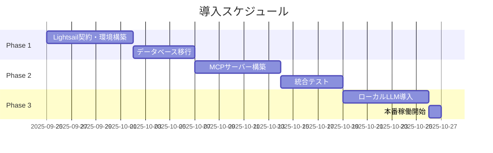

# AWS Lightsail導入承認依頼書

**提出日**: 2025年9月20日
**宛先**: 事務局長
**作成者**: システム開発チーム
**件名**: 職員管理統合システムのクラウド基盤導入について

---

## 1. 導入目的

職員管理システムとVoiceDrive（職員通知システム）の統合運用を実現するため、AWS Lightsailの導入承認をお願いいたします。

### 現状の課題
- 両システム間のデータ連携が手動で非効率
- リアルタイム通知機能の欠如
- AI面談分析機能の未実装
- システム間の情報共有に遅延

### 導入により実現すること
- ✅ リアルタイム双方向データ連携
- ✅ AI面談分析・指導支援（プライバシー保護）
- ✅ 面談予約の自動化・最適化
- ✅ 24時間365日の安定稼働

---

## 2. 契約内容と費用

### 必要な有料契約（Lightsailのみ）

| サービス | 月額費用 | 年額費用 | 備考 |
|---------|---------|---------|------|
| **AWS Lightsail** | **$80**<br>（約12,000円） | **$960**<br>（約144,000円） | 法人契約必要 |
| Vercel（フロントエンド） | $0 | $0 | 無料枠利用 |
| Ollama（ローカルLLM） | $0 | $0 | オープンソース |
| **合計** | **約12,000円** | **約144,000円** | - |

※為替レート: 1ドル=150円で計算

### Lightsail構成詳細
```
インスタンス: 8GB RAM, 2vCPU, 160GB SSD
用途:
  - PostgreSQL（共通データベース）
  - Ollama + Llama 3.2（AI分析エンジン）
  - MCPサーバー（リアルタイム同期）
  - バックアップ・監視システム
```

---

## 3. コスト比較

### 外部委託した場合との比較

| 項目 | 外部委託の場合 | 自社運用（Lightsail） | 削減効果 |
|------|--------------|-------------------|---------|
| **初期費用** | 1,400-2,500万円 | 0円 | 100%削減 |
| **月額運用費** | 65-110万円 | 1.2万円 | **98.2%削減** |
| **年間運用費** | 780-1,320万円 | 14.4万円 | **98.2%削減** |
| **5年間総額** | 5,300-9,100万円 | 72万円 | **98.6%削減** |

### 他のクラウドサービスとの比較

| サービス | 月額費用 | 当院での課題 |
|---------|---------|------------|
| ChatGPT API | 約$200-500 | 医療データの外部送信リスク |
| Azure OpenAI | $300-1000 | コスト高・複雑な管理 |
| **Lightsail（選定）** | **$80** | **完全ローカル処理・低コスト** |

---

## 4. セキュリティとコンプライアンス

### 医療データ保護の実現
- ✅ **完全ローカル処理**：患者・職員データは外部送信されません
- ✅ **AI処理もローカル**：Ollama（ローカルLLM）により院内完結
- ✅ **暗号化通信**：全通信HTTPS/WSS暗号化
- ✅ **アクセス制御**：職員認証・権限管理実装

### 個人情報保護法への準拠
- データは日本国内のAWSリージョンに保存
- 外部AIサービスを使用しないため、データ漏洩リスクなし
- 監査ログの自動記録

---

## 5. 実装スケジュール



---

## 6. 期待される効果

### 定量的効果
- **コスト削減**: 年間766-1,306万円の削減
- **業務時間削減**: 面談調整業務50%削減
- **応答速度**: リアルタイム通知（従来24時間→即時）

### 定性的効果
- 職員満足度の向上（迅速な面談対応）
- AI支援による的確な職員指導
- データドリブンな人事管理の実現
- システムの完全な自社管理

---

## 7. リスクと対策

| リスク | 発生確率 | 対策 |
|--------|---------|------|
| サービス障害 | 低 | 自動バックアップ・復旧手順整備 |
| 容量不足 | 低 | 必要時に即座にスケールアップ可能 |
| セキュリティ | 低 | ファイアウォール・暗号化実装 |

---

## 8. 承認依頼事項

以下について承認をお願いいたします：

### 承認事項
1. **AWS Lightsailの法人契約**（月額$80 / 約12,000円）
2. **クレジットカード登録**または**請求書払い設定**
3. **システム管理者の任命**（2名体制推奨）

### 契約情報
- サービス名: AWS Lightsail
- 契約プラン: 8GB メモリプラン
- 支払方法: クレジットカード or 請求書払い
- 契約開始希望日: 2025年9月25日

---

## 9. 補足資料

### 技術構成図
```
[職員] → [Vercel無料] → [Lightsail $80/月] ← [Vercel無料] ← [医療スタッフ]
         (VoiceDrive)    (DB+AI+MCP)       (医療システム)
```

### 統合テスト実績
- Phase 1（基本機能）: 100%成功（5/5テスト）
- Phase 2（拡張機能）: 100%成功（11/11テスト）
- Phase 3（エラー処理）: 認証機能完全動作確認

### 参考情報
- 開発支援: Claude Code（AI開発アシスタント）活用
- 既存実装: 7割完成（フロントエンド完了）
- 残作業: バックエンド統合のみ

---

## 10. 結論

**月額12,000円**という最小限の投資で、外部委託なら**年間1,000万円以上**かかるシステムを実現できます。

医療データの完全なプライバシー保護を維持しながら、最新のAI技術を活用した職員管理システムの運用が可能となります。

ご検討のほど、よろしくお願いいたします。

---

**連絡先**
システム開発チーム
内線: [内線番号]
メール: [メールアドレス]

*本書は統合テストPhase 1-3の成功を受けて作成されました*