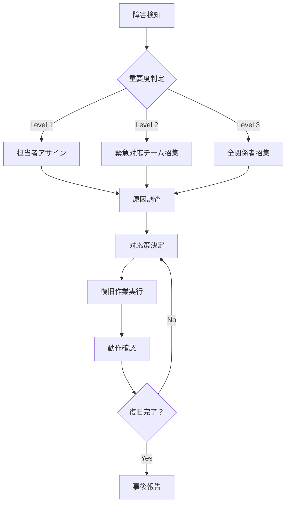

# 障害対応手順書 - V3評価システム

## 1. 緊急連絡先

### システム担当者
- **システム管理者**: 田中太郎 (090-1234-5678) tanaka@example.com
- **VoiceDrive担当**: 山田花子 (080-9876-5432) yamada@voicedrive.com
- **運用責任者**: 佐藤次郎 (070-1111-2222) sato@example.com

### エスカレーション先
- **Level 1**: システム管理者
- **Level 2**: 運用責任者 + VoiceDrive担当
- **Level 3**: 全関係者 + 経営陣

## 2. 障害レベル定義

### Level 1: 軽微な障害
- **影響**: 一部機能の軽微な問題
- **例**: ログ出力異常、軽微なパフォーマンス劣化
- **対応時間**: 営業時間内（8時間以内）
- **通知方法**: Slack通知のみ

### Level 2: 中程度の障害
- **影響**: 特定機能の停止・重大なパフォーマンス劣化
- **例**: 異議申立の受信エラー、VoiceDrive連携障害
- **対応時間**: 2時間以内
- **通知方法**: Slack + メール + 電話（必要に応じて）

### Level 3: 重大な障害
- **影響**: システム全体の停止・データ損失の可能性
- **例**: データベース接続断、システム全体のダウン
- **対応時間**: 即時対応（30分以内に初動）
- **通知方法**: 全通知手段 + 緊急連絡網

## 3. 具体的な障害シナリオと対応

### 3.1 V3異議申立API障害

#### 症状
- VoiceDriveからの異議申立が受信できない
- 500エラーが連続発生
- レスポンス時間が異常に長い

#### 確認手順
```bash
# 1. APIの生存確認
curl -H "Authorization: Bearer vd_prod_key" \
     http://localhost:3000/api/v3/appeals/submit

# 2. ログ確認
tail -f /var/log/medical-system/error.log | grep "APPEAL"

# 3. システムリソース確認
top
free -h
df -h
```

#### 対応手順
1. **即座対応** (5分以内)
   - アプリケーションの再起動
   ```bash
   sudo systemctl restart medical-system
   ```

2. **原因調査** (15分以内)
   - エラーログの詳細確認
   - データベース接続状態確認
   - VoiceDrive側の状態確認

3. **復旧作業** (30分以内)
   - 必要に応じてロールバック
   - 外部サービス接続確認
   - 関係者への状況報告

### 3.2 データベース接続障害

#### 症状
- 全API リクエストで500エラー
- コンソールにDB接続エラー
- 異議申立データの保存/取得不可

#### 確認手順
```bash
# DB接続確認
psql -h db-host -U username -d medical_system -c "SELECT 1;"

# アプリケーションログ確認
grep -i "database\|connection" /var/log/medical-system/error.log
```

#### 対応手順
1. **DB接続確認**
   - プライマリDBの状態確認
   - レプリカDBへの切り替え検討

2. **アプリケーション対応**
   - コネクションプールのリセット
   - 必要に応じて読み取り専用モードに切り替え

### 3.3 VoiceDrive連携障害

#### 症状
- 異議申立の通知が送信されない
- VoiceDriveからの認証エラー
- webhook応答なし

#### 確認手順
```bash
# VoiceDrive webhook確認
curl -X POST https://voicedrive.example.com/api/webhooks/medical-system \
     -H "Content-Type: application/json" \
     -d '{"test": true}'
```

#### 対応手順
1. **VoiceDriveチームに連絡**
   - 障害状況の共有
   - 暫定対応の協議

2. **代替手段の検討**
   - メール通知への切り替え
   - 手動での状況確認

## 4. 障害対応フロー

### 4.1 障害検知から復旧まで



### 4.2 コミュニケーションフロー

#### 初動報告 (5分以内)
```
【障害発生】医療システム V3評価機能
発生時刻: 2025-XX-XX XX:XX
影響範囲: 異議申立API
初期症状: XXX
対応者: XXX
```

#### 状況更新 (15分ごと)
```
【進捗更新】医療システム障害対応
経過時間: XX分
調査状況: XXX
推定復旧時刻: XX:XX
```

#### 復旧完了報告
```
【復旧完了】医療システム V3評価機能
復旧時刻: 2025-XX-XX XX:XX
障害時間: XX分
原因: XXX
対策: XXX
```

## 5. 復旧確認チェックリスト

### 5.1 システム全体
- [ ] アプリケーションの起動確認
- [ ] ヘルスチェックAPI の正常応答
- [ ] データベース接続の正常性
- [ ] 外部サービス連携の正常性

### 5.2 V3異議申立機能
- [ ] 異議申立受信API の動作確認
- [ ] 異議申立一覧API の動作確認
- [ ] ステータス更新API の動作確認
- [ ] VoiceDrive通知の送信確認

### 5.3 性能確認
- [ ] レスポンス時間が基準値以内
- [ ] CPU/メモリ使用率が正常範囲
- [ ] エラー率が基準値以下
- [ ] 同時アクセス処理の正常性

## 6. 事後対応

### 6.1 インシデントレポート作成

#### 必要情報
- 障害発生時刻・検知時刻
- 影響範囲・影響時間
- 根本原因
- 対応経緯・復旧手順
- 再発防止策

#### テンプレート
```markdown
# インシデントレポート

## 概要
- 発生日時: YYYY-MM-DD HH:MM
- 復旧日時: YYYY-MM-DD HH:MM
- 影響時間: XX分
- 影響範囲: XXX

## 事象
- 発生した問題: XXX
- 影響を受けた機能: XXX
- ユーザーへの影響: XXX

## 根本原因
XXX

## 対応経緯
1. XX:XX - 障害検知
2. XX:XX - 初動対応開始
3. XX:XX - 原因特定
4. XX:XX - 復旧作業完了

## 再発防止策
1. XXX
2. XXX
3. XXX

## 改善アクション
- [ ] XXX (担当者: XXX, 期限: YYYY-MM-DD)
- [ ] XXX (担当者: XXX, 期限: YYYY-MM-DD)
```

### 6.2 振り返り会議

#### アジェンダ
1. 障害の概要説明
2. 対応の振り返り
3. 課題・改善点の抽出
4. 再発防止策の検討
5. アクションプランの策定

#### 改善観点
- **検知の早期化**: モニタリングの強化
- **対応の迅速化**: 自動化・手順の改善
- **情報共有**: 連絡体制の見直し
- **技術的改善**: アーキテクチャの見直し

## 7. 定期メンテナンス

### 7.1 予防保守スケジュール

| 項目 | 頻度 | 実施日 | 担当者 |
|------|------|--------|--------|
| ログローテーション | 日次 | 毎日 2:00 | 自動 |
| データベースバックアップ | 日次 | 毎日 3:00 | 自動 |
| セキュリティパッチ適用 | 月次 | 第2土曜日 | システム管理者 |
| 障害対応訓練 | 四半期 | 各四半期末 | 全担当者 |

### 7.2 緊急メンテナンス手順

1. **事前通知** (可能な限り24時間前)
   - ユーザーへの事前告知
   - VoiceDriveチームへの連絡

2. **メンテナンス実施**
   - メンテナンスモード有効化
   - 作業実行
   - 動作確認

3. **メンテナンス完了**
   - 正常稼働確認
   - メンテナンスモード解除
   - 完了通知

---

**作成日**: 2025-08-22  
**承認者**: システム管理責任者  
**次回レビュー**: 2025-11-22  
**緊急連絡先確認**: 毎月1日