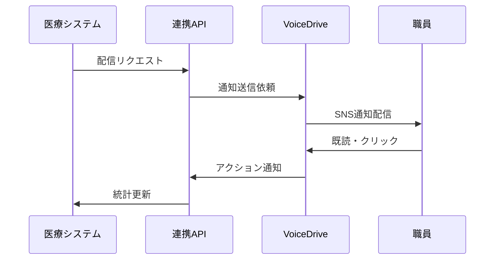

# ストレスチェック配信管理機能 実装提案書

## 1. アーキテクチャ設計

### 1.1 コンポーネント構成
```
src/
├── features/
│   ├── stress-check/
│   │   ├── components/
│   │   │   ├── DistributionDashboard.tsx     # 配信ダッシュボード
│   │   │   ├── TargetingModal.tsx            # ターゲティング設定
│   │   │   ├── MessageTemplates.tsx          # メッセージテンプレート
│   │   │   ├── ScheduleManager.tsx           # スケジュール管理
│   │   │   └── RealTimeMetrics.tsx           # リアルタイム実施状況
│   │   ├── hooks/
│   │   │   ├── useDistribution.ts            # 配信管理ロジック
│   │   │   ├── useTargeting.ts               # ターゲティングロジック
│   │   │   └── useMetrics.ts                 # メトリクス取得
│   │   └── services/
│   │       ├── distributionService.ts        # 配信API
│   │       └── voiceDriveIntegration.ts     # VoiceDrive連携
│   └── hr-announcements/                     # 人事部お知らせ機能
```

### 1.2 データモデル

```typescript
// 配信キャンペーン
interface DistributionCampaign {
  id: string
  type: 'stress_check' | 'interview' | 'general'
  title: string
  message: string
  targetCriteria: TargetCriteria
  schedule: ScheduleConfig
  status: 'draft' | 'scheduled' | 'active' | 'completed'
  statistics: CampaignStatistics
  voiceDriveIntegrationId?: string
}

// ターゲティング条件
interface TargetCriteria {
  departments?: string[]
  employmentTypes?: string[]
  completionStatus?: 'not_started' | 'in_progress' | 'completed'
  stressLevel?: 'low' | 'medium' | 'high'
  lastCompletionDate?: DateRange
  customConditions?: CustomCondition[]
}

// 配信統計
interface CampaignStatistics {
  totalTargets: number
  delivered: number
  opened: number
  clicked: number
  completed: number
  departmentBreakdown: DepartmentStats[]
}
```

## 2. VoiceDrive連携設計

### 2.1 連携フロー


### 2.2 連携API仕様
```typescript
// VoiceDrive通知送信
POST /api/voicedrive/notifications
{
  "type": "stress_check_reminder",
  "recipients": ["user_ids"],
  "message": {
    "title": "ストレスチェック実施のお願い",
    "body": "...",
    "action": {
      "label": "今すぐ実施",
      "url": "/health/stress-check"
    }
  },
  "schedule": {
    "sendAt": "2025-01-24T09:00:00Z"
  }
}

// 配信統計取得
GET /api/voicedrive/campaigns/{campaignId}/stats
```

## 3. 実装優先順位

### Phase 1: 基本配信機能（2週間）
- [x] 配信ダッシュボード基本UI
- [ ] 一斉配信機能
- [ ] 基本的なターゲティング（部署・実施状況）
- [ ] シンプルなテンプレート管理

### Phase 2: 高度な配信機能（2週間）
- [ ] AIによる配信最適化提案
- [ ] 詳細なターゲティング条件
- [ ] スケジュール配信
- [ ] A/Bテスト機能

### Phase 3: VoiceDrive完全統合（3週間）
- [ ] 双方向データ同期
- [ ] リアルタイム統計
- [ ] 自動フォローアップ
- [ ] 統合ダッシュボード

## 4. 技術的考慮事項

### 4.1 パフォーマンス最適化
- **バッチ処理**: 大量配信は非同期ジョブキューで処理
- **キャッシング**: 部署別統計はRedisでキャッシュ
- **ページネーション**: 対象者リストは仮想スクロール実装

### 4.2 セキュリティ
- **配信承認フロー**: 重要な配信は上長承認必須
- **配信履歴監査**: 全配信操作をログ記録
- **個人情報保護**: ターゲティングはIDベースで実施

### 4.3 UI/UX改善案
1. **ドラッグ&ドロップ**: スケジュール管理をカレンダーUI化
2. **プレビュー機能**: 実際の通知見た目を事前確認
3. **テンプレート推奨**: 過去の高成果テンプレートをAI推奨
4. **ダークモード対応**: 既存システムとの統一性

## 5. 実装サンプル

### 5.1 配信管理Hooks
```typescript
// useDistribution.ts
export function useDistribution() {
  const [campaigns, setCampaigns] = useState<DistributionCampaign[]>([])
  const [loading, setLoading] = useState(false)

  const sendCampaign = async (campaign: DistributionCampaign) => {
    setLoading(true)
    try {
      // ターゲット選定
      const targets = await fetchTargets(campaign.targetCriteria)

      // VoiceDrive連携
      const result = await voiceDriveService.sendNotification({
        recipients: targets.map(t => t.voiceDriveId),
        message: campaign.message,
        schedule: campaign.schedule
      })

      // 統計更新
      await updateCampaignStats(campaign.id, result)

      toast.success(`${targets.length}名への配信を開始しました`)
    } catch (error) {
      toast.error('配信エラーが発生しました')
    } finally {
      setLoading(false)
    }
  }

  return { campaigns, sendCampaign, loading }
}
```

### 5.2 AIサジェスション実装
```typescript
// useAISuggestions.ts
export function useAISuggestions(metrics: DepartmentMetrics[]) {
  const suggestions = useMemo(() => {
    const lowPerformers = metrics.filter(m => m.completionRate < 40)

    if (lowPerformers.length > 0) {
      return {
        type: 'warning',
        title: '実施率改善の提案',
        message: `${lowPerformers[0].name}の実施率が低い状況です`,
        actions: [
          { label: '部長経由フォロー', action: 'manager_follow' },
          { label: '個別リマインダー', action: 'targeted_reminder' }
        ]
      }
    }

    return null
  }, [metrics])

  return suggestions
}
```

## 6. テスト戦略

### 6.1 単体テスト
- ターゲティングロジックのテスト
- 配信スケジュール計算のテスト
- 統計集計ロジックのテスト

### 6.2 統合テスト
- VoiceDrive連携エンドツーエンドテスト
- 大量配信負荷テスト（1000名以上）
- 障害時のリトライ処理テスト

### 6.3 ユーザビリティテスト
- 人事部担当者による操作性評価
- 配信設定フローの使いやすさ検証
- ダッシュボード情報の理解しやすさ確認

## 7. 今後の拡張性

### 7.1 機能拡張案
- **多言語対応**: 外国人職員向け配信
- **チャットボット連携**: 自動応答での実施促進
- **予測分析**: 実施率予測と最適配信タイミング提案

### 7.2 他システムとの連携
- **勤怠システム**: 休暇中職員の除外
- **人事評価システム**: 評価時期との連動配信
- **健康管理アプリ**: 個人の健康データと連携

## 8. コスト見積もり

### 開発工数
- Phase 1: 2人×2週間 = 4人週
- Phase 2: 2人×2週間 = 4人週
- Phase 3: 3人×3週間 = 9人週
- **合計**: 17人週

### インフラコスト（月額）
- Redis Cache: ￥10,000
- ジョブキューサーバー: ￥20,000
- VoiceDrive API利用料: ￥50,000
- **合計**: ￥80,000/月

---

この提案書に基づき、段階的に実装を進めることを推奨します。
まずはPhase 1の基本機能から着手し、運用しながら改善を重ねていく方針です。