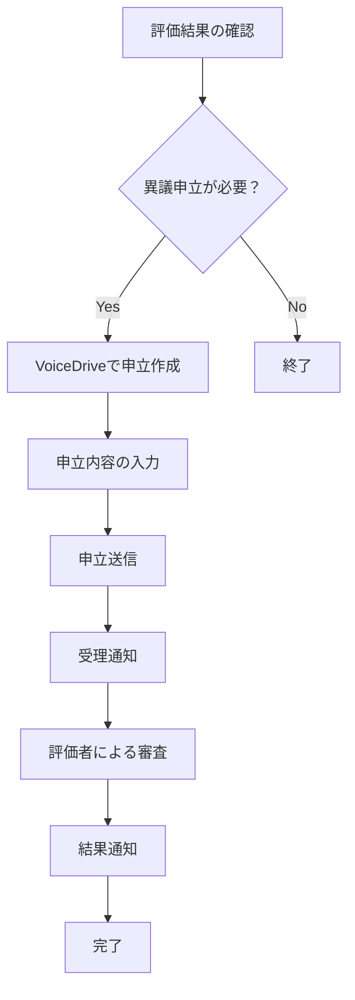

# 職員向け VoiceDrive異議申立操作ガイド

## 📋 目次
1. [概要](#概要)
2. [異議申立の流れ](#異議申立の流れ)
3. [VoiceDriveでの操作手順](#voicedriveでの操作手順)
4. [申立内容の書き方](#申立内容の書き方)
5. [進捗確認方法](#進捗確認方法)
6. [よくある質問](#よくある質問)
7. [お問い合わせ](#お問い合わせ)

---

## 概要

### V3評価システムの異議申立について
V3評価システムでは、評価結果に疑問や異議がある場合、**VoiceDriveを通じて**異議申立を行うことができます。

### 重要なポイント
- 📱 **VoiceDriveアプリで申立**: 医療システムからは申立できません
- ⏰ **期限**: 評価結果通知から **2週間以内**
- 📞 **サポート**: 不明な点はVoiceDriveまたは人事部にお問い合わせください

---

## 異議申立の流れ



### 処理期間の目安
- **受理確認**: 即座
- **初回回答**: 3営業日以内  
- **最終回答**: 3週間以内

---

## VoiceDriveでの操作手順

### Step 1: VoiceDriveアプリを開く
1. スマートフォンでVoiceDriveアプリを起動
2. 職員IDでログイン
3. メニューから「評価システム」を選択

### Step 2: 異議申立を選択
1. 「評価結果」画面を表示
2. 該当する評価期間を選択（例：2025年度上期）
3. 「異議申立をする」ボタンをタップ

### Step 3: 申立内容を入力
1. **異議申立の種類**を選択
   - 技術評価に関する異議
   - 組織貢献評価に関する異議
   - 相対評価（グレード）に関する異議
   - 計算ミスの指摘
   - その他

2. **具体的な理由**を入力
   - 何に対してどのような異議があるのか
   - 具体的な根拠や事実

3. **希望する内容**を記載
   - どのような見直しを希望するのか
   - 期待するスコアがあれば記載

### Step 4: 申立を送信
1. 入力内容を確認
2. 「異議申立を送信」をタップ
3. 確認画面で「送信する」をタップ

### Step 5: 受理確認
- 送信後すぐに受理通知が表示されます
- 申立ID（例：APL20250821001）をメモしてください

---

## 申立内容の書き方

### 📝 良い例

#### 技術評価への異議
```
【異議の対象】
技術評価の施設固有項目「医療機器操作技能」

【現在のスコア】
15点/25点

【異議の理由】
4月から新規導入されたX線装置について、私が他の職員5名に操作指導を行い、
全員が独り立ちできるまでサポートしました。この指導実績が評価に反映されて
いないと考えます。

【根拠・証拠】
・4/15 山田看護師への指導記録
・4/22 田中看護師への指導記録  
・5/10 新人研修での装置操作説明担当
・5/30 操作マニュアル作成（添付資料参照）

【希望する対応】
指導実績を踏まえ、20点以上の評価を希望します。
```

### ❌ 悪い例

```
技術評価が低すぎます。
もっと高く評価されるべきだと思います。
納得できません。
```

### 📋 記載のポイント

1. **具体性**
   - 何について異議があるのか明確に
   - いつ、どこで、何をしたかを具体的に

2. **客観性**
   - 感情的な表現は避ける
   - 事実ベースで記載

3. **根拠**
   - 可能な限り証拠や具体例を提示
   - 日付や関係者名を含める

4. **建設的**
   - 単なる不満ではなく改善提案として
   - 希望する対応を明確に

---

## 進捗確認方法

### VoiceDriveでの確認
1. VoiceDriveアプリ内「評価システム」
2. 「異議申立状況」をタップ
3. 申立ID で検索または一覧表示

### ステータスの意味
| ステータス | 意味 | 次のアクション |
|-----------|------|----------------|
| 受理済み | 申立を受け取りました | 初回回答をお待ちください |
| 審査中 | 評価者が内容を確認中 | 追加情報の要求がある場合があります |
| 追加情報待ち | 追加の情報提供が必要 | VoiceDriveで追加情報を提供 |
| 承認 | 異議が認められました | 評価の修正が行われます |
| 却下 | 異議が認められませんでした | 理由をご確認ください |
| 取り下げ | 申立者が取り下げ | 手続き完了 |

---

## よくある質問

### Q1: 異議申立に期限はありますか？
**A**: はい、評価結果通知から **2週間以内** です。期限を過ぎると申立できませんのでご注意ください。

### Q2: 複数の項目に異議がある場合はどうすればよいですか？
**A**: 項目ごとに個別に申立を行ってください。1つの申立で複数項目を扱うと審査が複雑になります。

### Q3: 申立後に内容を変更できますか？
**A**: 審査開始前であれば変更可能です。VoiceDriveサポートにお問い合わせください。

### Q4: 異議申立をしたことが上司に知られますか？
**A**: 直接の上司には通知されませんが、評価を行った評価者（部門責任者など）には通知されます。

### Q5: 異議申立の結果に不満がある場合は？
**A**: 人事部への相談窓口をご利用ください。ただし、再審査は原則として行われません。

### Q6: VoiceDriveが使えない場合はどうすればよいですか？
**A**: 以下の方法でお問い合わせください：
- VoiceDriveサポート: support@voicedrive.com
- 人事部異議申立窓口: hr-appeals@example.com
- 内線: 1234

### Q7: 申立をしたら評価が下がることはありますか？
**A**: いいえ、異議申立により既存の評価が下がることはありません。適正な再評価のみ行われます。

---

## お問い合わせ

### VoiceDriveサポート
- **メール**: support@voicedrive.com
- **電話**: 0120-XXX-XXXX（平日9-18時）
- **チャット**: VoiceDriveアプリ内サポート

### 人事部 評価相談窓口
- **メール**: hr-appeals@example.com
- **内線**: 1234
- **窓口**: 人事部（本館2階）

### 緊急時
評価結果に重大な誤りがあると思われる場合：
- **人事部長**: 直通03-XXXX-XXXX
- **総務部**: 内線9999

---

## 📝 チェックリスト

異議申立前の確認事項：

- [ ] 評価結果通知書を手元に用意
- [ ] 異議の根拠となる資料を整理
- [ ] 申立内容を明確に整理
- [ ] 期限（2週間以内）を確認
- [ ] VoiceDriveアプリにログイン可能
- [ ] 申立ID をメモする準備

---

**最終更新**: 2025年8月22日  
**次回更新**: 2025年11月（制度改定時）  
**問い合わせ件数**: 月平均X件（適正運用中）

*この操作ガイドは、職員の皆様が適切に異議申立制度を利用できるよう作成されています。不明な点がございましたら、遠慮なくお問い合わせください。*