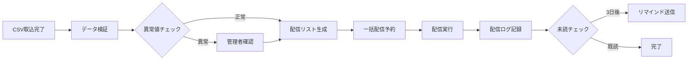

# 健康関連情報実装計画書（統合版）

## 目次
1. [エグゼクティブサマリー](#エグゼクティブサマリー)
2. [システム概要](#システム概要)
3. [健康診断データ構造](#健康診断データ構造)
4. [実装機能一覧](#実装機能一覧)
5. [データベース設計](#データベース設計)
6. [通知・配信システム](#通知配信システム)
7. [実装ロードマップ](#実装ロードマップ)
8. [セキュリティ・コンプライアンス](#セキュリティコンプライアンス)
9. [費用対効果](#費用対効果)
10. [技術仕様](#技術仕様)

---

## エグゼクティブサマリー

### プロジェクト概要
- **目的**: 医療職員1,250名の健康情報を一元管理し、業務効率化と法令遵守を実現
- **利用者**: 人事部、健診室、産業医・産業保健師（管理者のみ）
- **期間**: 6ヶ月（MVP 30日、基本機能 3ヶ月、完全統合 6ヶ月）
- **投資効果**: 年間200時間削減、コスト50万円削減、健診確認率95%達成

### 主要成果物
1. 健康診断データ管理システム
2. ストレスチェック結果配信システム
3. 病歴・就業配慮管理機能
4. 統合健康分析ダッシュボード

---

## システム概要

### システム構成図
```
┌─────────────────────────────────────────────┐
│          健康管理統合プラットフォーム            │
├─────────────┬───────────┬──────────┬─────────┤
│データ管理層  │通知配信層 │分析層    │連携層   │
├─────────────┼───────────┼──────────┼─────────┤
│・健診データ  │・結果配信 │・統計    │・勤怠   │
│・病歴管理    │・リマインド│・トレンド│・ストレス│
│・就業配慮    │・アラート │・予測    │・面談   │
└─────────────┴───────────┴──────────┴─────────┘
```

### アクセス権限設計
```typescript
interface SystemRoles {
  人事部: {
    view: ['統計', '要対応者リスト', '就業配慮'];
    edit: ['就業制限', 'スケジュール'];
    export: ['統計レポート'];
  };

  健診室: {
    view: ['全健康データ'];
    edit: ['健診結果', '病歴情報'];
    import: ['CSV一括取込'];
  };

  産業医: {
    view: ['全健康データ', '病歴', 'ストレスチェック'];
    edit: ['医学的所見', '就業判定', '面談記録'];
  };
}
```

---

## 健康診断データ構造

### 健康診断個人票（15カテゴリー・全項目）

#### 1. 基本情報
- 企業名（立神リハ・PT等）
- 健診日（R7-4-30形式）
- 職員ID（4606）
- 氏名
- 性別（男/女）
- 生年月日（S59.9.18形式）
- 年齢（自動計算）

#### 2. 身体測定
- 身長（cm、小数点1位）
- 体重（kg、小数点1位）
- BMI（自動計算、小数点1位）
- 腹囲（cm、小数点1位）
- 医師の所見（テキスト）
- 喫煙歴（無/有、本数×年数）
- 薬（既往・有無・脂質・血圧・その他）

#### 3. 血圧測定
- 収縮期血圧（mmHg）
- 拡張期血圧（mmHg）
- 肝機能異常（有/無）
- 要経過観察（チェック）

#### 4. 視力検査
- 右眼（0.1～2.0）
- 左眼（0.1～2.0）
- 矯正視力（必要時記録）

#### 5. 聴力検査
- 右耳1000Hz（1.所見なし/2.所見あり）
- 右耳4000Hz（1.所見なし/2.所見あり）
- 左耳1000Hz（1.所見なし/2.所見あり）
- 左耳4000Hz（1.所見なし/2.所見あり）
- 検査方法（1.オージオ/2.その他）

#### 6. 胸部X線検査
- 検査実施（直接/間接）
- 撮影年月日
- 所見（通常勤務/要観察/要精密検査）

#### 7. 尿検査
- ウロビリノーゲン（N/-/±/+/2+/3+）
- 潜血（-/±/+/2+/3+）
- ビリルビン（-/±/+/2+/3+）
- ケトン（-/±/+/2+/3+）
- 糖（-/±/+/2+/3+）
- 蛋白（-/±/+/2+/3+）
- pH（5～9）

#### 8. 貧血検査
- 白血球数（10²/mm³）
- 赤血球数（10⁴/mm³）
- 血色素量/ヘモグロビン（g/dℓ）
- ヘマトクリット（%）
- 血小板数（10⁴/mm³）

#### 9. 血糖検査
- 血糖（mg/dℓ）
- 検査方法（空腹時/随時/食後○時間）

#### 10. 心電図検査
- 実施（チェック）
- 所見（正常範囲/要経過観察/要精密検査）
- 所見詳細（テキスト）

#### 11. 便虫卵培養検査
- 便虫卵培養検査（チェック）
- 結果（陰性/陽性）

#### 12. 肝機能検査
- AST/GOT（IU/ℓ）
- ALT/GPT（IU/ℓ）
- γ-GTP（IU/ℓ）

#### 13. 血中脂質検査
- 総コレステロール/T-Cho（mg/dℓ）
- 中性脂肪/T-G（mg/dℓ）
- HDLコレステロール/HDL-C（mg/dℓ）
- LDLコレステロール/LDL-C（mg/dℓ）

#### 14. 腎機能検査
- クレアチニン（mg/dℓ）
- eGFR（自動計算）
- 乳び（0:なし/1:あり）
- 溶血（0:なし/1:あり）

#### 15. 総合所見
- 医療法人（厚生会等）
- 依頼元（立神リハビリテーション温泉病院 外来等）
- 医師名
- 最終報告（複数行テキスト）
- 報告日（2025/04/30形式）

---

## 実装機能一覧

### Phase 1: MVP機能（30日実装）

| No. | 機能名 | 説明 | 工数 | 優先度 |
|----|--------|------|------|--------|
| 1 | CSV一括取込 | 医療機関からの健診データインポート | 5日 | ★★★ |
| 2 | データ一覧表示 | 健診結果の一覧・検索・フィルター | 5日 | ★★★ |
| 3 | 個人詳細表示 | 職員別健診結果の詳細閲覧 | 5日 | ★★★ |
| 4 | 基本検索機能 | 部署・氏名・判定での検索 | 3日 | ★★★ |
| 5 | 結果配信機能 | お知らせ配信での通知 | 7日 | ★★★ |

### Phase 2: 基本機能（3ヶ月実装）

| No. | 機能名 | 説明 | 工数 | 優先度 |
|----|--------|------|------|--------|
| 6 | 管理ダッシュボード | 健診実施率、要再検査者管理 | 1週間 | ★★★ |
| 7 | ストレスチェック配信 | 機密性の高い個別配信 | 2週間 | ★★★ |
| 8 | リマインド機能 | 未対応者への自動通知 | 1週間 | ★★☆ |
| 9 | 病歴管理 | 既往歴・治療情報の登録 | 2週間 | ★★☆ |
| 10 | 就業配慮設定 | 就業制限・配置転換管理 | 2週間 | ★★☆ |

### Phase 3: 拡張機能（6ヶ月実装）

| No. | 機能名 | 説明 | 工数 | 優先度 |
|----|--------|------|------|--------|
| 11 | 産業医機能 | 面談記録・就業判定 | 1週間 | ★☆☆ |
| 12 | 統計分析 | 部署別・年齢別分析 | 2週間 | ★☆☆ |
| 13 | トレンド分析 | 経年変化グラフ・予測 | 3週間 | ★☆☆ |
| 14 | レポート生成 | 労基署提出書類自動作成 | 2週間 | ★☆☆ |
| 15 | システム連携 | 勤怠・ストレスチェック連携 | 3週間 | ★☆☆ |

---

## データベース設計

### 主要テーブル構成

#### 1. 健康診断マスター（health_checkups）
```sql
CREATE TABLE health_checkups (
  id VARCHAR(50) PRIMARY KEY,
  staff_id VARCHAR(50) NOT NULL,
  checkup_date DATE NOT NULL,
  checkup_type ENUM('定期', '雇入時', '特殊', '海外派遣'),
  facility_name VARCHAR(100),

  -- 基本測定値
  height DECIMAL(4,1),
  weight DECIMAL(4,1),
  bmi DECIMAL(3,1) GENERATED AS (weight / POWER(height/100, 2)),
  waist_circumference DECIMAL(4,1),

  -- 血圧
  systolic_bp INT,
  diastolic_bp INT,

  -- 総合判定
  overall_result ENUM('A', 'B', 'C', 'D', 'E'),
  reexamination_required BOOLEAN DEFAULT FALSE,
  reexamination_items JSON,

  -- 管理情報
  data_source ENUM('csv_import', 'manual', 'api'),
  created_by VARCHAR(50),
  created_at TIMESTAMP DEFAULT CURRENT_TIMESTAMP,
  updated_at TIMESTAMP DEFAULT CURRENT_TIMESTAMP ON UPDATE CURRENT_TIMESTAMP,

  FOREIGN KEY (staff_id) REFERENCES staff_master(id),
  INDEX idx_staff_date (staff_id, checkup_date DESC),
  INDEX idx_result (overall_result, reexamination_required)
);
```

#### 2. 検査結果詳細（health_checkup_details）
```sql
CREATE TABLE health_checkup_details (
  id VARCHAR(50) PRIMARY KEY,
  checkup_id VARCHAR(50) NOT NULL,
  category ENUM('vision', 'hearing', 'blood', 'urine', 'liver', 'lipid', 'kidney'),
  item_code VARCHAR(50) NOT NULL,
  item_name VARCHAR(100) NOT NULL,
  value VARCHAR(50),
  unit VARCHAR(20),
  reference_min DECIMAL(10,2),
  reference_max DECIMAL(10,2),
  status ENUM('normal', 'attention', 'abnormal'),

  FOREIGN KEY (checkup_id) REFERENCES health_checkups(id) ON DELETE CASCADE,
  INDEX idx_checkup_category (checkup_id, category),
  INDEX idx_abnormal (status, item_code)
);
```

#### 3. 病歴・既往歴管理（medical_histories）
```sql
CREATE TABLE medical_histories (
  id VARCHAR(50) PRIMARY KEY,
  staff_id VARCHAR(50) NOT NULL,
  report_date DATE NOT NULL,
  report_type ENUM('入職時', '定期更新', '随時申告'),

  -- 病歴情報
  disease_name VARCHAR(200),
  icd10_code VARCHAR(10),
  diagnosis_date DATE,
  treatment_status ENUM('治療中', '経過観察', '完治', '未治療'),

  -- 治療情報
  medication JSON, -- {name, dose, frequency}
  medical_institution VARCHAR(100),
  attending_doctor VARCHAR(50),

  -- 就業への影響
  work_restrictions TEXT,
  accommodation_needed BOOLEAN DEFAULT FALSE,

  -- フォローアップ
  next_checkup_date DATE,
  notes TEXT,

  created_at TIMESTAMP DEFAULT CURRENT_TIMESTAMP,
  updated_at TIMESTAMP DEFAULT CURRENT_TIMESTAMP ON UPDATE CURRENT_TIMESTAMP,

  FOREIGN KEY (staff_id) REFERENCES staff_master(id),
  INDEX idx_staff_status (staff_id, treatment_status),
  INDEX idx_followup (next_checkup_date)
);
```

#### 4. 就業配慮管理（work_accommodations）
```sql
CREATE TABLE work_accommodations (
  id VARCHAR(50) PRIMARY KEY,
  staff_id VARCHAR(50) NOT NULL,

  -- 配慮内容
  accommodation_type ENUM(
    '就業制限', '配置転換', '時短勤務',
    '在宅勤務', '夜勤免除', 'その他'
  ),
  start_date DATE NOT NULL,
  end_date DATE,
  is_active BOOLEAN DEFAULT TRUE,

  -- 詳細
  reason VARCHAR(200),
  details TEXT,
  doctor_opinion TEXT,

  -- 承認情報
  requested_by VARCHAR(50),
  approved_by VARCHAR(50),
  approved_date DATE,
  status ENUM('申請中', '承認済', '実施中', '終了', '却下'),

  created_at TIMESTAMP DEFAULT CURRENT_TIMESTAMP,
  updated_at TIMESTAMP DEFAULT CURRENT_TIMESTAMP ON UPDATE CURRENT_TIMESTAMP,

  FOREIGN KEY (staff_id) REFERENCES staff_master(id),
  INDEX idx_active (is_active, end_date),
  INDEX idx_staff_accommodation (staff_id, accommodation_type)
);
```

#### 5. 健康イベント履歴（health_events）
```sql
CREATE TABLE health_events (
  id VARCHAR(50) PRIMARY KEY,
  staff_id VARCHAR(50) NOT NULL,
  event_date DATETIME NOT NULL,
  event_type ENUM(
    '健康診断実施', '再検査実施', '産業医面談',
    '保健指導', 'ストレスチェック', '予防接種',
    '病歴更新', '就業制限開始', '就業制限解除',
    '結果通知', 'リマインド送信'
  ),

  -- イベント詳細
  title VARCHAR(200),
  description TEXT,
  related_id VARCHAR(50), -- 関連するレコードID

  -- アクション
  action_required TEXT,
  action_completed BOOLEAN DEFAULT FALSE,
  follow_up_date DATE,

  -- 記録情報
  recorded_by VARCHAR(50),
  department ENUM('人事部', '健診室', '産業医', 'システム'),

  created_at TIMESTAMP DEFAULT CURRENT_TIMESTAMP,

  FOREIGN KEY (staff_id) REFERENCES staff_master(id),
  INDEX idx_staff_events (staff_id, event_date DESC),
  INDEX idx_followup_pending (follow_up_date, action_completed)
);
```

---

## 通知・配信システム

### 健診結果配信フロー

#### 1. 配信カテゴリの拡張
```typescript
enum HealthNotificationTypes {
  CHECKUP_READY = 'health_checkup_ready',        // 結果準備完了
  CHECKUP_RESULT = 'health_checkup_result',      // 個別結果
  REEXAM_REMINDER = 'reexamination_reminder',    // 再検査催促
  STRESS_CHECK = 'stress_check_result',          // ストレス結果
  HEALTH_GUIDANCE = 'health_guidance',           // 保健指導
  CONSULTATION = 'consultation_invitation'       // 面談案内
}
```

#### 2. セキュア配信設定
```typescript
interface SecureDeliveryConfig {
  // 暗号化設定
  encryption: {
    method: 'AES-256-GCM';
    keyRotation: 'monthly';
    tokenExpiry: '30days';
  };

  // アクセス制御
  access: {
    requiresAuthentication: true;
    mfaRequired: boolean;
    ipWhitelist?: string[];
    maxAccessAttempts: 3;
  };

  // プライバシー設定
  privacy: {
    level: 'standard' | 'high' | 'maximum';
    dataRetention: '5years';
    auditLog: true;
    anonymizeAfter?: number; // days
  };
}
```

#### 3. 配信テンプレート
```typescript
const healthNotificationTemplates = {
  健診結果通知: {
    subject: '【重要】健康診断結果のお知らせ',
    body: `
      {staff_name} 様

      {checkup_date}に実施された健康診断の結果をお知らせします。

      ■総合判定: {overall_result}
      {reexam_notice}

      詳細は以下のリンクからご確認ください。
      {secure_link}

      ※このリンクは{expiry_date}まで有効です。
    `,
    variables: [
      'staff_name', 'checkup_date', 'overall_result',
      'reexam_notice', 'secure_link', 'expiry_date'
    ]
  },

  ストレスチェック結果: {
    subject: 'ストレスチェック実施結果について',
    body: `
      実施日: {test_date}

      結果の確認方法についてご案内します。
      ※結果は実施者（産業医）のみが把握しています。

      高ストレスと判定された方には、個別に
      産業医面談のご案内をお送りします（任意）。
    `,
    confidential: true,
    excludeManagement: true
  }
};
```

### 配信自動化フロー



---

## 実装ロードマップ

### タイムライン図

```
2025年 10月   11月   12月   2026年1月   2月   3月
━━━━━━━━━━━━━━━━━━━━━━━━━━━━━━━━━━━━━━━━━━━━
Phase1 ████████
       MVP完成▲

Phase2        ████████████████████
              基本機能完成▲

Phase3                      ████████████████████
                            完全統合▲
```

### マイルストーン

#### Month 1（MVP開発）
- Week 1: 環境構築・DB設計
- Week 2: CSV取込機能
- Week 3: 基本CRUD・一覧表示
- Week 4: 個人詳細・結果配信

**成果物**: 最小限の健診データ管理システム

#### Month 2-3（基本機能）
- Week 5-6: 管理ダッシュボード
- Week 7-8: ストレスチェック配信
- Week 9-10: 病歴管理
- Week 11-12: 就業配慮・リマインド

**成果物**: 実務で使える健康管理システム

#### Month 4-6（拡張機能）
- Week 13-16: 産業医機能・統計分析
- Week 17-20: トレンド分析・予測
- Week 21-24: レポート生成・システム連携

**成果物**: 完全統合健康管理プラットフォーム

### リスク管理

| リスク | 可能性 | 影響度 | 対策 |
|--------|--------|--------|------|
| CSV形式の不一致 | 高 | 中 | 複数フォーマット対応 |
| 個人情報漏洩 | 低 | 高 | 暗号化・監査ログ |
| システム負荷 | 中 | 中 | 段階的リリース |
| ユーザー抵抗 | 中 | 低 | 研修・サポート |

---

## セキュリティ・コンプライアンス

### 法令遵守要件

#### 1. 労働安全衛生法
- 年1回の定期健康診断実施
- 結果の5年間保管
- 労基署への報告書提出
- 就業判定の実施

#### 2. 個人情報保護法
- 健康情報の要配慮個人情報としての管理
- 目的外利用の禁止
- 第三者提供の制限
- 安全管理措置の実施

#### 3. ストレスチェック制度
- 実施者以外への結果提供禁止
- 本人同意なしの事業者提供禁止
- 集団分析での10人未満除外

### セキュリティ実装

```typescript
class HealthDataSecurity {
  // 暗号化
  private encryptionKey = process.env.HEALTH_ENCRYPTION_KEY;

  // データ暗号化
  encryptHealthData(data: any): string {
    return AES.encrypt(JSON.stringify(data), this.encryptionKey);
  }

  // アクセスログ
  logAccess(userId: string, action: string, dataId: string): void {
    const log = {
      userId,
      action,
      dataId,
      timestamp: new Date(),
      ip: getClientIP(),
      userAgent: getUserAgent()
    };

    auditLogger.log(log);
  }

  // データマスキング
  maskSensitiveData(data: HealthCheckup): MaskedData {
    return {
      ...data,
      staffName: maskName(data.staffName),
      staffId: maskId(data.staffId),
      detailedResults: '[MASKED]'
    };
  }
}
```

---

## 費用対効果

### コスト削減効果

#### 1. 直接的削減（年間）
| 項目 | 現状コスト | 導入後 | 削減額 |
|------|------------|--------|--------|
| 印刷費 | 30万円 | 3万円 | 27万円 |
| 郵送費 | 15万円 | 0円 | 15万円 |
| 人件費（作業時間） | 80万円 | 16万円 | 64万円 |
| **合計** | **125万円** | **19万円** | **106万円** |

#### 2. 間接的効果
- 再検査実施率: 60% → 80%（+20%）
- 健診データ確認率: 70% → 95%（+25%）
- 問い合わせ対応: 50件/月 → 10件/月（-80%）
- データ入力ミス: 月10件 → 0件（-100%）

### ROI計算

```
初期投資: 300万円（開発費）
年間削減: 106万円
投資回収: 2.8年

5年間総効果:
削減額: 530万円
追加価値: 200万円（効率化・リスク低減）
純利益: 430万円
```

---

## 技術仕様

### システムアーキテクチャ

```yaml
Frontend:
  Framework: Next.js 14
  Language: TypeScript
  Styling: Tailwind CSS
  Components: shadcn/ui
  State: Zustand
  Charts: Recharts

Backend:
  Runtime: Node.js 18+
  API: Next.js API Routes
  ORM: Prisma
  Validation: Zod

Database:
  Primary: MySQL 8.0
  Cache: Redis
  File Storage: S3互換

Security:
  Auth: NextAuth.js
  Encryption: bcrypt, AES-256
  HTTPS: Required
  CSP: Enabled

Infrastructure:
  Hosting: Vercel/AWS
  CDN: CloudFront
  Monitoring: Datadog
  Backup: Daily, 30日保持
```

### API仕様（主要エンドポイント）

```typescript
// 健診データAPI
POST   /api/health/checkups/import     // CSV一括取込
GET    /api/health/checkups            // 一覧取得
GET    /api/health/checkups/:id        // 詳細取得
PUT    /api/health/checkups/:id        // 更新
DELETE /api/health/checkups/:id        // 削除

// 通知API
POST   /api/notifications/health/send  // 結果配信
GET    /api/notifications/health/status // 配信状況
POST   /api/notifications/health/remind // リマインド

// 分析API
GET    /api/analytics/health/summary   // サマリー統計
GET    /api/analytics/health/trends    // トレンド分析
GET    /api/analytics/health/risks     // リスク分析
```

### パフォーマンス目標

| 指標 | 目標値 |
|------|--------|
| ページ読み込み | < 2秒 |
| CSV取込（1000件） | < 30秒 |
| 検索レスポンス | < 500ms |
| 同時接続数 | 100ユーザー |
| 可用性 | 99.9% |

---

## 付録

### A. CSV取込フォーマット仕様

```csv
職員ID,氏名,健診日,身長,体重,収縮期血圧,拡張期血圧...
4606,徳留拓哉,2025-04-30,166.0,61.4,134,96...
```

### B. 基準値設定

| 項目 | 正常範囲 | 要注意 | 異常 |
|------|----------|--------|------|
| BMI | 18.5-25 | 25-30 | 30以上 |
| 収縮期血圧 | <130 | 130-139 | 140以上 |
| LDL-C | <120 | 120-139 | 140以上 |
| HbA1c | <5.6 | 5.6-6.4 | 6.5以上 |

### C. 用語集

- **健診**: 健康診断
- **産業医**: 事業場で労働者の健康管理を行う医師
- **就業判定**: 健診結果に基づく就業可否の判定
- **要配慮個人情報**: 特に慎重な取扱いが必要な個人情報
- **eGFR**: 推算糸球体濾過量（腎機能指標）

---

## 承認

| 役職 | 氏名 | 承認日 | 署名 |
|------|------|--------|------|
| 人事部長 | | | |
| 健診室長 | | | |
| 産業医 | | | |
| システム管理者 | | | |

---

**文書情報**
- 作成日: 2025年9月29日
- 最終更新: 2025年9月29日
- バージョン: 1.0
- 文書ID: HMS-IMPL-2025-001
- 機密レベル: 社内限定

---

以上