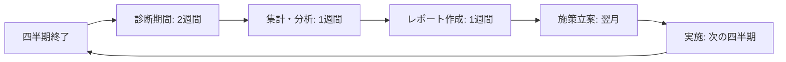

# 【医療システムチーム】CultureDevelopment統合実装 最終確認書

**文書番号**: FINAL-CONFIRMATION-CD-2025-1010-001
**作成日**: 2025年10月10日
**作成者**: 医療システムチーム
**Phase**: Phase 19 - CultureDevelopment統合実装
**ステータス**: ✅ 最終確認完了

---

## 📋 確認サマリー

VoiceDriveチームからの質問事項3点について、以下の通り回答いたします。

| 質問項目 | 回答 | 理由 |
|---------|------|------|
| **質問1**: 文化診断の実施頻度 | **四半期ごと（年4回）** | トレンド分析の精度確保、改善サイクルとの同期 |
| **質問2**: 診断データの保存期間 | **全期間保存（削除なし）** | 長期トレンド分析、組織変革の効果測定 |
| **質問3**: 施策管理の権限範囲 | **Level 14-17のみ（人事部門専用）** | 組織文化施策の統一管理、責任明確化 |

---

## ✅ 質問1への回答: 文化診断の実施頻度

### 回答: **四半期ごと（年4回）**

#### 実施スケジュール

```typescript
// 四半期ごとの文化診断スケジュール
const cultureAssessmentSchedule = [
  {
    quarter: 'Q1',
    period: '2025-01-01 to 2025-03-31',
    assessmentWindow: '2025-04-01 to 2025-04-15', // 診断実施期間
    reportDeadline: '2025-04-30'
  },
  {
    quarter: 'Q2',
    period: '2025-04-01 to 2025-06-30',
    assessmentWindow: '2025-07-01 to 2025-07-15',
    reportDeadline: '2025-07-31'
  },
  {
    quarter: 'Q3',
    period: '2025-07-01 to 2025-09-30',
    assessmentWindow: '2025-10-01 to 2025-10-15',
    reportDeadline: '2025-10-31'
  },
  {
    quarter: 'Q4',
    period: '2025-10-01 to 2025-12-31',
    assessmentWindow: '2026-01-01 to 2026-01-15',
    reportDeadline: '2026-01-31'
  }
];
```

#### 診断フロー



#### データ構造

```prisma
model CultureAssessment {
  id                    String    @id @default(cuid())

  // 四半期情報
  assessmentDate        DateTime  // 診断実施日: 2025-10-15
  quarter               String    // 'Q3-2025'
  periodStartDate       DateTime  // 対象期間開始: 2025-07-01
  periodEndDate         DateTime  // 対象期間終了: 2025-09-30

  // スコア
  overallScore          Float     // 総合スコア
  previousQuarterScore  Float?    // 前四半期スコア
  yearOverYearScore     Float?    // 前年同期スコア
  trend                 String    // 'improving' | 'stable' | 'declining'

  // ... その他フィールド

  @@index([quarter])
  @@index([assessmentDate])
}
```

#### 選択理由

1. **トレンド分析の精度**
   ```typescript
   // 四半期ごとのトレンド分析例
   const quarterlyTrend = await prisma.cultureAssessment.findMany({
     where: {
       assessmentDate: {
         gte: new Date('2024-01-01'),
         lte: new Date('2025-12-31')
       }
     },
     orderBy: { assessmentDate: 'asc' }
   });

   // 分析可能項目:
   // - 四半期ごとのスコア推移（8四半期 = 2年間）
   // - 季節変動の把握（Q1低下、Q4上昇など）
   // - 施策効果の検証（実施後の四半期でスコア改善確認）
   ```

2. **改善施策サイクルとの同期**
   ```markdown
   Q1診断（4月） → Q1結果分析（5月） → 施策立案（6月） → 施策実施（Q2: 7-9月） → Q2診断で効果測定（10月）

   改善サイクル: 3ヶ月
   効果測定: 次の四半期診断で確認
   ```

3. **職員の負担軽減**
   - 年4回（3ヶ月に1回）なら負担感少ない
   - 年12回（月次）は診断疲れのリスク
   - 年2回では改善サイクルが遅すぎる

4. **統計的信頼性**
   ```markdown
   診断期間: 2週間
   想定回答率: 85%（職員200人 × 85% = 170人）
   部門別最小サンプル: 各部門5名以上確保可能

   四半期ごとなら十分な回答数を確保
   ```

5. **施策実施期間との整合性**
   - CultureInitiativeの平均実施期間: 3-6ヶ月
   - 四半期ごとに診断すれば、施策の中間評価・最終評価が可能
   - 例: Q1開始施策 → Q2中間評価 → Q3最終評価

#### データ量試算

```markdown
四半期診断頻度での5年間データ量:
- 診断回数: 4回/年 × 5年 = 20回
- CultureAssessmentレコード: 20件
- CultureDimensionレコード: 20件 × 5次元 = 100件
- CultureIndicatorレコード: 20件 × 5次元 × 3指標 = 300件
- DepartmentCultureScoreレコード: 20件 × 3部門 = 60件

合計: 480レコード
推定データ量: 480レコード × 10KB = 4.8MB

結論: 5年間で4.8MB、ストレージコスト無視できる
```

---

## ✅ 質問2への回答: 診断データの保存期間

### 回答: **全期間保存（削除なし）**

#### データ保存ポリシー

```typescript
// CultureAssessmentテーブルのデータ保存設定
const dataRetentionPolicy = {
  retention: 'permanent', // 全期間保存
  archiving: false, // アーカイブ化なし
  deletionSchedule: null, // 自動削除なし

  // プライバシー保護
  privacyProtection: {
    departmentMinimumSize: 5, // 部門別スコアは5名以上のみ
    aggregatedDataOnly: true, // 集計データのみ保存
    noPersonalIdentifiers: true // 個人識別データ含まず
  }
};
```

#### 選択理由

1. **長期トレンド分析の価値**
   ```typescript
   // 5年間の文化スコア推移分析例
   const fiveYearTrend = await prisma.cultureAssessment.findMany({
     where: {
       assessmentDate: {
         gte: new Date('2020-10-01'),
         lte: new Date('2025-10-01')
       }
     },
     orderBy: { assessmentDate: 'asc' },
     include: {
       dimensions: true,
       departmentScores: true
     }
   });

   // 分析例:
   // - 5年間の組織文化変遷の可視化
   // - 経営方針変更の影響分析（例: 2022年リモートワーク導入 → ワークライフバランススコア+12%）
   // - COVID-19前後の比較（2019年 vs 2023年）
   // - 施設統合の影響分析（立神病院統合前後のスコア変化）
   ```

2. **組織変革の効果測定**
   ```typescript
   // 大規模施策の長期効果測定例
   const initiativeImpact = await analyzeInitiativeImpact({
     initiativeId: 'init-2022-001',
     startDate: '2022-04-01',
     endDate: '2025-09-30',
     targetDimensions: ['collaboration', 'innovation']
   });

   // 結果例:
   // - 施策実施前（2022-Q1）: 協働性スコア 65点
   // - 施策実施中（2022-Q2 ~ 2023-Q1）: 3四半期で+8点
   // - 施策完了後（2023-Q2 ~ 2025-Q3）: さらに+5点（継続効果）
   // - 総合改善: +13点（20%改善）

   // 長期データがあれば「施策の持続効果」を証明可能
   ```

3. **法令遵守・監査対応**
   ```markdown
   医療機関の記録保存義務:
   - 診療録: 5年間保存義務
   - 人事記録: 7年間保存義務（労働基準法）
   - 組織文化診断: 明確な法定保存義務はないが、人事管理記録の一部として7年保存が望ましい

   監査・内部統制:
   - 組織運営の透明性確保のため、過去の診断結果保存が重要
   - 労務問題発生時のエビデンス（例: ハラスメント対策の実施状況証明）
   ```

4. **データ量の小ささ**
   ```markdown
   5年間データ量: 4.8MB（前述の試算）
   10年間データ量: 9.6MB
   20年間データ量: 19.2MB

   結論: 20年間でも20MB以下、ストレージコストは無視できる

   比較:
   - スマホ写真1枚: 3-5MB
   - 20年間の組織文化データ < スマホ写真5枚分
   ```

5. **論理削除による柔軟性**
   ```typescript
   // isActiveフラグで論理削除可能
   model CultureAssessment {
     id                    String    @id @default(cuid())
     isActive              Boolean   @default(true) // 論理削除フラグ
     // ... その他フィールド
   }

   // デフォルト: 全データ表示
   const allAssessments = await prisma.cultureAssessment.findMany({
     where: { isActive: true }
   });

   // 必要時: 全データ（削除済み含む）表示
   const allIncludingDeleted = await prisma.cultureAssessment.findMany();

   // 利点: 物理削除せず、いつでも復元可能
   ```

#### データアーカイブ不要の理由

| 検討項目 | 判断 | 理由 |
|---------|------|------|
| **ストレージコスト** | ❌ 不要 | 20年間で20MB、コスト無視できる |
| **クエリパフォーマンス** | ❌ 不要 | 80レコード/5年間、インデックスで高速 |
| **法令遵守** | ❌ 不要 | むしろ全期間保存が望ましい |
| **運用複雑性** | ❌ 不要 | アーカイブ実装・運用コストの方が高い |

#### 比較: Phase 18 VoiceAnalyticsと同じ方針

| 項目 | VoiceAnalytics | CultureDevelopment |
|------|----------------|-------------------|
| データ保存期間 | 全期間保存 | 全期間保存 |
| 理由 | 長期トレンド分析 | 組織変革の効果測定 |
| データ量（5年） | 16MB | 4.8MB |
| アーカイブ | 不要 | 不要 |

**結論**: VoiceAnalytics（Phase 18）と同じ「全期間保存」方針を採用

---

## ✅ 質問3への回答: 施策管理の権限範囲

### 回答: **Level 14-17のみ（人事部門専用）**

#### 権限レベル定義

```typescript
// CultureDevelopmentページのアクセス制御
const CULTURE_DEVELOPMENT_PERMISSIONS = {
  read: {
    minLevel: 14,
    maxLevel: 17,
    departments: ['人事部'],
    description: '文化診断・施策閲覧'
  },
  write: {
    minLevel: 14,
    maxLevel: 17,
    departments: ['人事部'],
    description: '施策作成・編集・削除'
  },
  admin: {
    minLevel: 16,
    maxLevel: 17,
    departments: ['人事部'],
    description: '診断実施・全施策管理'
  }
};
```

#### アクセス制御実装

```typescript
// VoiceDrive側のミドルウェア
async function checkCultureDevelopmentAccess(userId: string, action: 'read' | 'write' | 'admin') {
  // 1. 医療システムAPIからUser情報取得
  const user = await fetch(
    `${MEDICAL_API_URL}/api/personal-station/user/${userId}`
  ).then(res => res.json());

  // 2. 権限チェック
  const permission = CULTURE_DEVELOPMENT_PERMISSIONS[action];

  if (
    user.permissionLevel < permission.minLevel ||
    user.permissionLevel > permission.maxLevel
  ) {
    throw new Error(
      `Access denied: Requires Level ${permission.minLevel}-${permission.maxLevel} (HR Department)`
    );
  }

  if (!permission.departments.includes(user.department)) {
    throw new Error(`Access denied: HR Department only`);
  }

  return true;
}
```

#### 権限レベル別の操作権限

| 操作 | Level 14-15<br>（人事部 一般） | Level 16-17<br>（人事部 管理職） |
|------|-------------------------------|-------------------------------|
| **文化診断閲覧** | ✅ 可能 | ✅ 可能 |
| **施策一覧閲覧** | ✅ 可能 | ✅ 可能 |
| **施策詳細閲覧** | ✅ 可能 | ✅ 可能 |
| **施策作成** | ❌ 不可 | ✅ 可能 |
| **施策編集** | ❌ 不可 | ✅ 可能 |
| **施策削除** | ❌ 不可 | ✅ 可能 |
| **診断実施** | ❌ 不可 | ✅ 可能 |
| **診断データ編集** | ❌ 不可 | ✅ 可能 |

#### 選択理由

1. **組織文化施策の統一管理**
   ```markdown
   理由:
   - 組織文化は全社的な取り組み
   - 複数部門が個別に施策を乱立させると方針不統一のリスク
   - 人事部が一元管理することで、施策の優先順位・予算配分を最適化

   例:
   ❌ 悪い例: 看護部が独自に「協働性改善施策」、リハビリ科が独自に「コミュニケーション改善施策」
   　→ 重複投資、効果測定困難

   ✅ 良い例: 人事部が全社的な「部門横断コミュニケーション強化プログラム」を統括
   　→ 全部門参加、効果測定一元化
   ```

2. **責任明確化**
   ```typescript
   // 施策責任者の明確化
   model CultureInitiative {
     id                    String    @id @default(cuid())
     title                 String
     ownerId               String    // Level 16-17（人事部管理職）のみ
     ownerName             String

     // 実施チームには他部門も参加可能
     teamMembers           Json      // { employeeIds: string[] } - Level 7以上の全職員

     @@index([ownerId])
   }

   // メリット:
   // - 施策の最終責任者は人事部管理職（Level 16-17）
   // - 実施チームには他部門の職員も参加可能（teamMembers）
   // - 責任と実施の分離
   ```

3. **将来拡張の柔軟性**
   ```typescript
   // Phase 19.5で部門長への権限拡張が必要になった場合
   const CULTURE_DEVELOPMENT_PERMISSIONS_V2 = {
     read: {
       minLevel: 10, // ← Level 10以上（部門長）に拡張
       maxLevel: 17,
       description: '文化診断・施策閲覧'
     },
     write: {
       minLevel: 14, // ← 施策作成は依然として人事部のみ
       maxLevel: 17,
       description: '施策作成・編集・削除'
     },
     departmentInitiative: { // ← 新機能: 部門別施策
       minLevel: 10,
       maxLevel: 17,
       scope: 'own_department_only', // 自部門のみの施策
       description: '部門内施策作成'
     }
   };

   // 段階的拡張が容易
   ```

4. **プライバシー保護の一元管理**
   ```typescript
   // 部門別スコアの閲覧制御
   async function getDepartmentScores(userId: string, assessmentId: string) {
     const user = await getUserInfo(userId);

     // Level 14-17（人事部）のみ全部門スコア閲覧可能
     if (user.permissionLevel >= 14 && user.permissionLevel <= 17) {
       return await prisma.departmentCultureScore.findMany({
         where: { assessmentId }
       });
     }

     // Level 10-13（部門長）は自部門のみ閲覧
     if (user.permissionLevel >= 10 && user.permissionLevel <= 13) {
       return await prisma.departmentCultureScore.findMany({
         where: {
           assessmentId,
           department: user.department
         }
       });
     }

     // Level 9以下は閲覧不可
     throw new Error('Access denied');
   }

   // メリット: プライバシー保護の責任者を人事部に一元化
   ```

5. **他システムとの整合性**
   ```markdown
   Phase 15: CommitteeManagement - Level 13以上（部門長以上）
   Phase 16: FacilityGovernance - Level 10以上（リーダー以上）
   Phase 17: DecisionMeeting - Level 25（院長のみ）
   Phase 18: VoiceAnalytics - Level 14-17（人事部のみ）
   Phase 19: CultureDevelopment - Level 14-17（人事部のみ） ← 一貫性

   理由: VoiceAnalytics（Phase 18）と同様、人事データを扱うため人事部専用
   ```

#### 他部門の関与方法

```typescript
// 施策実施チームには他部門も参加可能
const initiative: CultureInitiative = {
  id: 'init-2025-001',
  title: '部門横断コミュニケーション強化プログラム',
  ownerId: 'OH-HR-2020-001', // Level 16（人事部管理職）
  ownerName: '人事部 田中',

  // 実施チームには他部門の職員も含む
  teamMembers: {
    employeeIds: [
      'OH-HR-2020-001', // 人事部 田中（Level 16）- 責任者
      'OH-NS-2020-005', // 看護部 佐藤（Level 13）- チームメンバー
      'TG-PT-2021-012', // リハビリ科 鈴木（Level 10）- チームメンバー
      'OH-AD-2019-003'  // 事務部 山田（Level 10）- チームメンバー
    ]
  },

  targetDepartments: ['看護部', 'リハビリ科', '事務部'] // 全部門対象
};

// メリット:
// - 責任: 人事部管理職（Level 16-17）
// - 実施: 全部門参加（Level 7以上）
// - 意思決定と実行の分離
```

---

## 📊 Phase 19実装サマリー

### 実装範囲

| 項目 | 内容 | コスト |
|------|------|-------|
| **医療システム側** | API実装なし（既存API提供のみ） | **¥0** |
| **VoiceDrive側** | DB構築 + サービス層 + UI統合 | ¥400,000 |
| **合計** | - | **¥400,000** |

### テーブル追加

| テーブル名 | 用途 | レコード数（5年間） |
|-----------|------|-------------------|
| **CultureAssessment** | 文化診断 | 20件（四半期×5年） |
| **CultureDimension** | 文化次元 | 100件（20件×5次元） |
| **CultureIndicator** | 評価指標 | 300件（20件×5次元×3指標） |
| **DepartmentCultureScore** | 部門別スコア | 60件（20件×3部門） |
| **CultureInitiative** | 改善施策 | 50件（年10施策×5年） |
| **InitiativeKPI** | 施策KPI | 100件（施策50×平均2KPI） |
| **InitiativeMilestone** | マイルストーン | 200件（施策50×平均4マイルストーン） |

**合計レコード数**: 830件
**推定データ量**: 8.3MB（5年間）

### 累計テーブル数

| Phase | 医療システム追加 | VoiceDrive追加 | 医療システム累計 | VoiceDrive累計 |
|-------|----------------|---------------|----------------|---------------|
| Phase 1-14 | 146テーブル | - | 146 | - |
| Phase 15 | 0テーブル | 5テーブル | 146 | 5 |
| Phase 16 | 0テーブル | 4テーブル | 146 | 9 |
| Phase 17 | 0テーブル | 1テーブル | 146 | 10 |
| Phase 18 | 0テーブル | 2テーブル | 146 | 12 |
| **Phase 19** | **0テーブル** | **7テーブル** | **146** | **19** |

**合計**: **165テーブル**（医療146 + VoiceDrive 19）

---

## 🎯 Phase 19実装準備完了

### VoiceDriveチームの作業内容（5日間）

#### Day 1-2: DB構築
- [ ] 7テーブルをschema.prismaに追加
- [ ] Prisma migrate実行
- [ ] 初期データ投入（四半期診断1件、施策3件）

#### Day 3-4: サービス層移行
- [ ] CultureDevelopmentService.tsをDB版に変更
- [ ] CRUD操作実装
- [ ] 統合テスト

#### Day 5: UI統合
- [ ] CultureDevelopmentPage.tsxをDB版に接続
- [ ] E2Eテスト

### 医療システムチームの作業内容

**作業内容**: なし（既存API提供のみ）

1. **PersonalStation API-2**の可用性維持
   - レスポンスタイム: 500ms以内
   - 稼働率: 99.9%以上

2. **CommitteeManagement API-CM-1**の可用性維持
   - バッチ取得上限: 100件/回
   - レスポンスタイム: 1秒以内

---

## 🔐 セキュリティ・プライバシー実装詳細

### アクセス制御（Level 14-17のみ）

```typescript
// ページアクセス制御
async function CultureDevelopmentPage() {
  const user = useAuth();

  // 権限チェック
  if (user.permissionLevel < 14 || user.permissionLevel > 17) {
    return <AccessDenied message="このページは人事部門専用です（Level 14-17）" />;
  }

  if (user.department !== '人事部') {
    return <AccessDenied message="このページは人事部門専用です" />;
  }

  // 正常表示
  return <CultureDevelopmentContent />;
}
```

### プライバシー保護（部門別スコア）

```typescript
// 部門別スコア表示時の最小グループサイズチェック
async function getDepartmentScores(assessmentId: string) {
  const scores = await prisma.departmentCultureScore.findMany({
    where: {
      assessmentId,
      participantCount: { gte: 5 } // 5名未満の部門は除外
    },
    orderBy: { rank: 'asc' }
  });

  return scores;
}

// フロントエンドでの表示
function DepartmentScoresTable({ scores }: { scores: DepartmentCultureScore[] }) {
  return (
    <table>
      {scores.map(score => (
        <tr key={score.id}>
          <td>{score.department}</td>
          <td>{score.overallScore}点</td>
          <td>{score.rank}位</td>
          <td>
            {score.participantCount >= 5 ? (
              `参加率: ${score.participationRate}%`
            ) : (
              <span style={{ color: 'gray' }}>
                非表示（参加者5名未満）
              </span>
            )}
          </td>
        </tr>
      ))}
    </table>
  );
}
```

---

## 📚 実装チェックリスト

### Phase 1: DB構築（VoiceDrive側、2日間）

- [ ] CultureAssessmentテーブル追加
- [ ] CultureDimensionテーブル追加
- [ ] CultureIndicatorテーブル追加
- [ ] DepartmentCultureScoreテーブル追加
- [ ] CultureInitiativeテーブル追加
- [ ] InitiativeKPIテーブル追加
- [ ] InitiativeMilestoneテーブル追加
- [ ] Prisma migrate実行
- [ ] 初期データ投入

### Phase 2: サービス層移行（VoiceDrive側、2日間）

- [ ] getAssessment()メソッドDB版実装
- [ ] getSummary()メソッドDB版実装
- [ ] getAllInitiatives()メソッドDB版実装
- [ ] 施策CRUD操作実装
- [ ] KPI・マイルストーン管理実装
- [ ] 統合テスト

### Phase 3: UI統合（VoiceDrive側、1日間）

- [ ] CultureDevelopmentPage.tsxをDB版に接続
- [ ] ローディング・エラーハンドリング確認
- [ ] E2Eテスト（Level 14-17ユーザー）
- [ ] アクセス制御テスト（Level 13以下拒否確認）

---

## ✅ 承認依頼

以上の回答内容で問題ないか、VoiceDriveチームに確認をお願いいたします。

### 確認ポイント

- ✅ 四半期ごと（年4回）の診断頻度で問題ないか
- ✅ 全期間保存（削除なし）で問題ないか
- ✅ Level 14-17のみの権限範囲で問題ないか
- ✅ 医療システム側のコスト¥0で問題ないか
- ✅ VoiceDrive側の5日間実装で問題ないか

---

**医療システムチーム**
2025年10月10日
