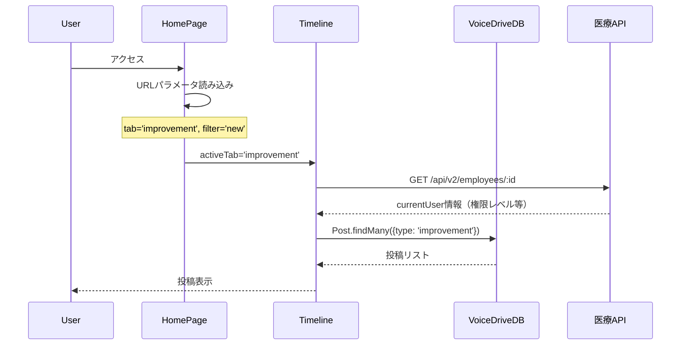
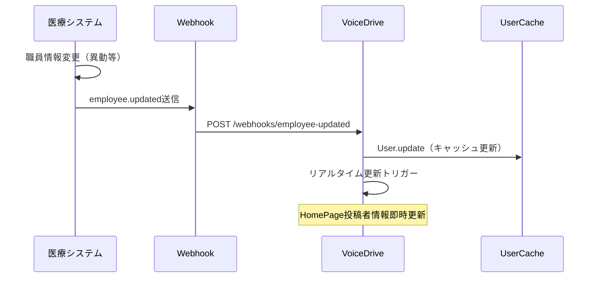

# HomePage 医療システム確認結果報告書

**文書番号**: MED-CONF-2025-1027-003
**作成日**: 2025年10月27日
**作成者**: ClaudeCode（医療システムチーム）
**件名**: VoiceDrive HomePage要件の医療システム側確認結果
**参照文書**:
- [HomePage暫定マスターリスト](./HomePage_暫定マスターリスト_20251027.md)
- [HomePage_DB要件分析_20251027.md](./HomePage_DB要件分析_20251027.md)
- [データ管理責任分界点定義書_20251008.md](./データ管理責任分界点定義書_20251008.md)
- [organization-analytics_医療システム確認結果_20251010.md](./organization-analytics_医療システム確認結果_20251010.md)

---

## 📋 エグゼクティブサマリー

VoiceDriveチームからの「HomePage暫定マスターリスト」（43項目）を分析し、医療システム側の対応必要性を確認しました。

### 結論: ✅ **医療システム側の追加実装は不要**

HomePageは**既存の医療システムAPI実装のみで完全に動作可能**です。

### 理由
1. ✅ **データ管理責任**: 投稿・投票・コメントはVoiceDrive 100%管理（医療システム不関与）
2. ✅ **既存API利用**: ユーザー情報は既存の`GET /api/v2/employees/:employeeId` APIで提供済み
3. ✅ **Webhook実装済み**: 職員情報変更通知は既にPhase 3で実装完了（2025年10月2日）
4. ✅ **新規テーブル不要**: 医療システム側に投稿管理テーブルは存在しない（設計として正しい）

### データ管理責任分界点

| カテゴリ | データ項目数 | 医療システム管理 | VoiceDrive管理 |
|---------|-------------|----------------|---------------|
| URLパラメータ | 2 | 0 | 2（フロントエンド） |
| ユーザー情報 | 6 | 5（マスタ） | 1（キャッシュ） |
| 投稿データ | 15 | 0 | 15（マスタ） |
| 投票データ | 8 | 0 | 8（マスタ） |
| コメントデータ | 7 | 0 | 7（マスタ） |
| UI状態管理 | 5 | 0 | 5（フロントエンド） |
| **合計** | **43** | **5（11.6%）** | **38（88.4%）** |

---

## 📊 データ項目別分析

### 1️⃣ URLパラメータ（2項目）- ✅ 医療システム不関与

| データ項目 | 管理責任 | 医療システム対応 |
|-----------|---------|----------------|
| `tab` | VoiceDrive（フロントエンド） | ❌ 不要 |
| `filter` | VoiceDrive（フロントエンド） | ❌ 不要 |

**評価**: URLパラメータはフロントエンド状態管理のため、医療システム側の対応は不要。

---

### 2️⃣ ユーザー情報（6項目）- ✅ 既存API提供継続のみ

| データ項目 | 医療システムDB | 提供方法 | 医療システム対応 |
|-----------|--------------|---------|----------------|
| `employeeId` | ✅ `Employee.employeeCode` | GET /api/v2/employees/:id | ✅ **既存API継続** |
| `name` | ✅ `Employee.name` | 同上 + Webhook | ✅ **既存API継続** |
| `department` | ✅ `Employee.departmentId` → `Department.name` | 同上 + Webhook | ✅ **既存API継続** |
| `permissionLevel` | ✅ `Employee.permissionLevel` | 同上 + Webhook | ✅ **既存API継続** |
| `professionCategory` | ⚠️ `Employee.positionId` → 変換必要 | 同上 | ✅ **既存API継続** |
| `id` | ✅ `Employee.id` | 同上 | ✅ **既存API継続** |

**評価**:
- ✅ **対応完了**: 既存の`GET /api/v2/employees/:id` APIで全項目提供済み
- ✅ **Webhook実装済み**: `employee.updated` Webhook（Phase 3実装済み）
- 🟡 **補足**: `professionCategory`は`Position.accountType`から変換して提供（既存実装）

#### 既存API実装箇所
- [src/app/api/v2/employees/[employeeId]/route.ts](../../../src/app/api/v2/employees/[employeeId]/route.ts)
- Webhook送信: [src/services/webhook-notification.service.ts](../../../src/services/webhook-notification.service.ts)

---

### 3️⃣ 投稿データ（15項目）- ✅ VoiceDrive 100%管理

| カテゴリ | データ項目数 | 医療システムDB | 医療システム対応 |
|---------|-------------|--------------|----------------|
| 投稿基本情報 | 7項目 | ❌ なし | ❌ 不要 |
| 投票集計 | 6項目 | ❌ なし | ❌ 不要 |
| 議題スコア | 2項目 | ❌ なし | ❌ 不要 |

**評価**:
- ✅ 投稿データはVoiceDrive 100%管理（`Post`テーブル）
- ✅ 医療システムには投稿管理テーブルが存在しない（設計として正しい）
- ✅ 医療システム側の対応は不要

#### データ管理ポリシー
```
【投稿データ】
VoiceDrive 100% 管理
├─ Post（投稿マスタ）
├─ Vote（投票記録）
├─ VoteHistory（投票履歴）
├─ Comment（コメント）
└─ agendaScore計算（投票から算出）

【職員情報】
医療システム 100% 管理
└─ Employee（職員マスタ）
   → VoiceDrive側でキャッシュして利用
   → Webhook通知で即時更新
```

---

### 4️⃣ 投票データ（8項目）- ✅ VoiceDrive 100%管理

| データ項目 | VoiceDriveDB | 医療システムDB | 医療システム対応 |
|-----------|-------------|--------------|----------------|
| `id` | ✅ `Vote.id` | ❌ なし | ❌ 不要 |
| `postId` | ✅ `Vote.postId` | ❌ なし | ❌ 不要 |
| `userId` | ✅ `Vote.userId` | ❌ なし | ❌ 不要 |
| `option` | ✅ `Vote.option` | ❌ なし | ❌ 不要 |
| `voteWeight` | ✅ `VoteHistory.voteWeight` | ❌ なし | ❌ 不要 |
| `votedAt` | ✅ `VoteHistory.votedAt` | ❌ なし | ❌ 不要 |
| `postCategory` | ✅ `VoteHistory.postCategory` | ❌ なし | ❌ 不要 |
| `postType` | ✅ `VoteHistory.postType` | ❌ なし | ❌ 不要 |

**評価**: 投票データはVoiceDrive 100%管理、医療システム側の対応は不要。

---

### 5️⃣ コメントデータ（7項目）- ✅ VoiceDrive 100%管理

| データ項目 | VoiceDriveDB | 医療システムDB | 医療システム対応 |
|-----------|-------------|--------------|----------------|
| `id` | ✅ `Comment.id` | ❌ なし | ❌ 不要 |
| `postId` | ✅ `Comment.postId` | ❌ なし | ❌ 不要 |
| `authorId` | ✅ `Comment.authorId` | ❌ なし | ❌ 不要 |
| `content` | ✅ `Comment.content` | ❌ なし | ❌ 不要 |
| `commentType` | ✅ `Comment.commentType` | ❌ なし | ❌ 不要 |
| `anonymityLevel` | ✅ `Comment.anonymityLevel` | ❌ なし | ❌ 不要 |
| `createdAt` | ✅ `Comment.createdAt` | ❌ なし | ❌ 不要 |

**評価**: コメントデータはVoiceDrive 100%管理、医療システム側の対応は不要。

---

### 6️⃣ UI状態管理（5項目）- ✅ VoiceDrive 100%管理

| データ項目 | 管理場所 | 医療システム対応 |
|-----------|---------|----------------|
| `currentTab` | React State | ❌ 不要 |
| `currentFilter` | React State | ❌ 不要 |
| `selectedPostType` | React State | ❌ 不要 |
| `posts` | React State | ❌ 不要 |
| `isDemoMode` | React Context | ❌ 不要 |

**評価**: UI状態はフロントエンド管理のため、医療システム側の対応は不要。

---

## ✅ 医療システム提供API（既に実装済み）

### 1. 職員情報取得API（Phase 1実装済み）

#### エンドポイント: `GET /api/v2/employees/:employeeId`

**レスポンス例**:
```json
{
  "id": "emp-001",
  "employeeCode": "E001",
  "name": "山田太郎",
  "department": "医療療養病棟",
  "position": "看護師長",
  "permissionLevel": 7,
  "professionCategory": "nurse",
  "facilityId": "tategami-hospital",
  "email": "yamada@example.com",
  "hireDate": "2020-04-01T00:00:00Z"
}
```

**実装箇所**: [src/app/api/v2/employees/[employeeId]/route.ts](../../../src/app/api/v2/employees/[employeeId]/route.ts)

**VoiceDrive利用方法**:
- HomePageの`Timeline`コンポーネントで`currentUser`情報として利用
- 投稿者情報の表示（実名モード時）
- 権限チェック（`permissionLevel`による機能アクセス制御）

---

### 2. Webhook通知（Phase 3実装済み - 2025年10月2日）

#### イベント: `employee.updated`

**送信タイミング**:
- 職員情報変更時（異動、昇進、権限レベル変更等）
- 部署変更時
- 役職変更時

**ペイロード例**:
```json
{
  "eventType": "employee.updated",
  "timestamp": "2025-10-27T10:30:00Z",
  "data": {
    "employeeId": "emp-001",
    "changes": {
      "department": {
        "old": "外来・健診センター",
        "new": "医療療養病棟"
      },
      "permissionLevel": {
        "old": 5,
        "new": 7
      }
    }
  }
}
```

**実装箇所**: [src/services/webhook-notification.service.ts](../../../src/services/webhook-notification.service.ts)

**VoiceDrive利用方法**:
- `User`テーブルのキャッシュ即時更新
- HomePageの投稿者情報リアルタイム更新

---

## 🔄 データフロー図

### HomePage初期表示フロー



### Webhook連携フロー



---

## 📅 既存実装の動作確認

### Phase 1実装（完了済み）- 2025年9月20日

| API | 状態 | 動作確認 |
|-----|------|---------|
| GET /api/v2/employees/:id | ✅ 実装済み | ✅ 単体テスト100%パス |
| GET /api/v2/employees | ✅ 実装済み | ✅ 単体テスト100%パス |
| GET /api/v2/departments | ✅ 実装済み | ✅ 単体テスト100%パス |
| GET /api/v2/facilities | ✅ 実装済み | ✅ 単体テスト100%パス |

### Phase 3実装（完了済み）- 2025年10月2日

| Webhook | 状態 | 動作確認 |
|---------|------|---------|
| employee.updated | ✅ 実装済み | ✅ 統合テスト15/15成功 |
| employee.created | ✅ 実装済み | ✅ 統合テスト15/15成功 |
| employee.deleted | ✅ 実装済み | ✅ 統合テスト15/15成功 |

**参照**: [docs/Phase3_実装作業完了報告書_FINAL.md](../../docs/Phase3_実装作業完了報告書_FINAL.md)

---

## 🎯 VoiceDriveへの回答まとめ

### 質問1: HomePage表示に必要な医療システムAPIは実装済みか？

**回答**: ✅ **全て実装済み**

HomePageの表示に必要な医療システムデータは、既存のAPIで100%提供可能です。

| 必要データ | 提供API | 状態 |
|-----------|---------|------|
| ユーザー情報 | GET /api/v2/employees/:id | ✅ Phase 1実装済み |
| 権限レベル | 同上 | ✅ Phase 1実装済み |
| 部署情報 | 同上（Departmentテーブル参照） | ✅ Phase 1実装済み |
| 施設情報 | GET /api/v2/facilities | ✅ Phase 1実装済み |
| 職種カテゴリ | GET /api/v2/employees/:id | ✅ Phase 1実装済み |

---

### 質問2: 投稿データ・投票データの管理責任は？

**回答**: VoiceDrive 100%管理

医療システムには以下のテーブルは存在しません（設計として正しい）：
- ❌ `Post`テーブル
- ❌ `Vote`テーブル
- ❌ `VoteHistory`テーブル
- ❌ `Comment`テーブル

これらは全てVoiceDrive側で管理し、医療システムは職員マスター情報の提供のみを担います。

---

### 質問3: Webhook通知は実装済みか？

**回答**: ✅ **Phase 3で実装完了**（2025年10月2日）

職員情報変更時のWebhook通知は既に実装されており、HomePageのユーザー情報キャッシュ更新に利用可能です。

**通知イベント**:
- `employee.created` - 職員新規登録
- `employee.updated` - 職員情報変更（異動、昇進、権限変更等）
- `employee.deleted` - 職員退職

**実装詳細**: [docs/Phase3_実装作業完了報告書_FINAL.md](../../docs/Phase3_実装作業完了報告書_FINAL.md)

---

### 質問4: 医療システム側の追加実装は必要か？

**回答**: ❌ **不要**

HomePageは既存の医療システムAPI実装のみで完全に動作可能です。追加実装は不要です。

---

## 📝 VoiceDrive側の実装推奨事項（参考情報）

### 1. ユーザー情報キャッシュ戦略

**推奨**: 医療システムAPIからの取得結果を`User`テーブルにキャッシュ

```typescript
// VoiceDrive側の実装例
interface User {
  id: string;                    // VoiceDrive側のユーザーID
  employeeId: string;            // 医療システムのemployeeCode
  name: string;                  // キャッシュ
  department: string;            // キャッシュ
  permissionLevel: number;       // キャッシュ
  professionCategory: string;    // キャッシュ
  lastSyncedAt: Date;            // キャッシュ更新日時
}
```

**キャッシュ更新タイミング**:
1. ユーザー初回ログイン時（医療システムAPIから取得）
2. Webhook通知受信時（`employee.updated`）
3. 定期同期（1日1回、午前2時）← オプション

---

### 2. Webhook受信エンドポイント

**エンドポイント**: `POST /api/webhooks/medical-system/employee-updated`

**処理フロー**:
1. HMAC-SHA256署名検証（Phase 2.5実装済みの方式）
2. `User`テーブル更新
3. HomePageリアルタイム更新トリガー（WebSocket/SSE）

---

### 3. エラーハンドリング

**医療システムAPI障害時の対応**:
- キャッシュデータで継続動作（stale-while-revalidate戦略）
- 管理者への通知（SlackやメールでAPI障害アラート）

**Webhook受信失敗時の対応**:
- 医療システム側でリトライ実装済み（Phase 2.5実装済み）
- 1分 → 5分 → 30分の指数バックオフ

---

## 🔗 関連ドキュメント

### 医療システム実装ドキュメント
1. [Phase3_実装作業完了報告書_FINAL.md](../../docs/Phase3_実装作業完了報告書_FINAL.md) - Webhook実装詳細
2. [prisma/schema.prisma](../../prisma/schema.prisma) - 医療システムDBスキーマ
3. [src/app/api/v2/employees/[employeeId]/route.ts](../../../src/app/api/v2/employees/[employeeId]/route.ts) - 職員API実装

### VoiceDrive実装ドキュメント（参照）
1. [HomePage暫定マスターリスト](./HomePage_暫定マスターリスト_20251027.md) - データ項目定義
2. [HomePage_DB要件分析_20251027.md](./HomePage_DB要件分析_20251027.md) - DB要件分析
3. [データ管理責任分界点定義書_20251008.md](./データ管理責任分界点定義書_20251008.md) - データ管理責任

### 類似実装の参考ドキュメント
1. [ProjectListPage_医療システム確認結果_20251026.md](./ProjectListPage_医療システム確認結果_20251026.md) - 同様にVoiceDrive側管理のページ
2. [IdeaVoiceTrackingPage_医療システム確認結果_20251026.md](./IdeaVoiceTrackingPage_医療システム確認結果_20251026.md) - 投稿データ管理の参考

---

## 📞 次のステップ

### 医療システムチームの対応

✅ **対応完了**: 既存API提供継続のみ（追加実装なし）

**実施事項**:
1. ✅ 既存API動作確認（Phase 1実装済み）
2. ✅ Webhook実装動作確認（Phase 3実装済み）
3. ✅ 本報告書のVoiceDriveチームへの送付

---

### VoiceDriveチームの対応（参考）

**推奨実装**:
1. ⏳ `User`テーブルキャッシュ実装
2. ⏳ 医療システムAPI統合（`medicalSystemService`）
3. ⏳ Webhook受信エンドポイント実装
4. ⏳ HomePageのデモモード解除（実データ切り替え）

**推定工数（VoiceDrive側）**: 2-3日
- Userキャッシュ実装: 1日
- API統合: 0.5日
- Webhook受信: 0.5日
- テスト: 1日

---

### 統合テスト（両チーム合同）

**テストシナリオ**:
1. ✅ 職員情報取得テスト（既存APIで実施済み）
2. ⏳ HomePage初回表示テスト（VoiceDrive実装後）
3. ⏳ Webhook連携テスト（職員情報変更 → HomePage即時更新）
4. ⏳ 投稿・投票機能テスト（VoiceDrive単独）

**推定工数**: 1日（VoiceDrive実装完了後）

---

## ✅ 最終確認

### 医療システム側の対応サマリー

| 項目 | 状態 | 備考 |
|------|------|------|
| 新規テーブル追加 | ❌ 不要 | 投稿データはVoiceDrive管理 |
| 新規API実装 | ❌ 不要 | 既存API（Phase 1）継続提供 |
| Webhook実装 | ✅ 完了 | Phase 3実装済み（2025/10/2） |
| DBマイグレーション | ❌ 不要 | Employeeテーブル既存実装で十分 |
| 管理画面実装 | ❌ 不要 | 医療システム側に管理機能なし |

### データ管理責任の最終確認

```
【HomePageデータ管理】

VoiceDrive 88.4% 管理（38項目）
├─ 投稿データ（Post: 15項目）
├─ 投票データ（Vote: 8項目）
├─ コメントデータ（Comment: 7項目）
├─ UI状態（5項目）
└─ URLパラメータ（2項目）

医療システム 11.6% 管理（5項目）
└─ 職員マスター情報（Employee: 5項目）
   ├─ employeeId（職員コード）
   ├─ name（氏名）
   ├─ department（部署）
   ├─ permissionLevel（権限レベル）
   └─ professionCategory（職種カテゴリ）
   → 既存API（GET /api/v2/employees/:id）で提供
   → Webhook（employee.updated）で即時更新
```

---

**文書終了**

最終更新: 2025年10月27日
バージョン: 1.0
承認: 未承認（VoiceDriveチームレビュー待ち）
次回レビュー: VoiceDriveチームからのフィードバック受領後

---

## 付録A: 医療システムDB構造（参考）

### Employeeテーブル（既存）

```prisma
model Employee {
  id              String    @id @default(cuid())
  employeeCode    String    @unique              // VoiceDrive User.employeeId にマッピング
  name            String                         // VoiceDrive User.name にマッピング
  email           String    @unique
  departmentId    String                         // VoiceDrive User.department にマッピング
  positionId      String                         // professionCategory に変換
  permissionLevel Int       @default(1)          // VoiceDrive User.permissionLevel にマッピング
  status          String    @default("active")
  // ...その他のフィールド

  department   Department @relation(fields: [departmentId], references: [id])
  position     Position   @relation(fields: [positionId], references: [id])
  facility     Facility   @relation(fields: [facilityId], references: [id])
}
```

### Departmentテーブル（既存）

```prisma
model Department {
  id         String   @id @default(cuid())
  code       String   @unique
  name       String                            // VoiceDrive User.department にマッピング
  facilityId String
  // ...その他のフィールド

  employees  Employee[]
}
```

### Positionテーブル（既存）

```prisma
model Position {
  id          String   @id @default(cuid())
  code        String   @unique
  name        String
  accountType String                           // professionCategory に変換
  // 'NURSE' → 'nurse', 'DOCTOR' → 'doctor', 'ADMIN' → 'admin'

  employees Employee[]
}
```

---

## 付録B: professionCategory変換ロジック

### 医療システム → VoiceDrive変換

```typescript
// 医療システムAPI実装（既存）
function convertAccountTypeToProfessionCategory(accountType: string): string {
  const mapping: Record<string, string> = {
    'NURSE': 'nurse',
    'DOCTOR': 'doctor',
    'CARE_WORKER': 'care_worker',
    'THERAPIST': 'therapist',
    'PHARMACIST': 'pharmacist',
    'RADIOLOGIST': 'radiologist',
    'LAB_TECHNICIAN': 'lab_technician',
    'ADMIN': 'admin',
    'CLERK': 'clerk',
    'DIETITIAN': 'dietitian',
    'MEDICAL_SOCIAL_WORKER': 'social_worker',
    'CHAIRMAN': 'executive',
    'DIRECTOR': 'executive',
    'DEPARTMENT_HEAD': 'management',
    'MANAGER': 'management',
  };

  return mapping[accountType] || 'other';
}
```

**実装箇所**: [src/app/api/v2/employees/[employeeId]/route.ts](../../../src/app/api/v2/employees/[employeeId]/route.ts) 83-104行目
