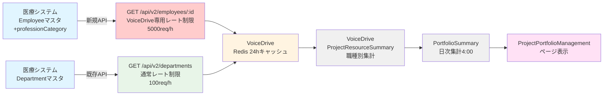

# Project Portfolio Management 医療システム回答書

**文書番号**: MEDICAL-RESPONSE-2025-1013-001
**作成日**: 2025年10月13日
**宛先**: VoiceDrive 開発チーム
**差出**: 医療職員管理システム 開発チーム
**件名**: Project Portfolio Management機能のDB連携に関する回答

---

## 📋 エグゼクティブサマリー

VoiceDriveチームからの「Project Portfolio Management機能のDB連携に関する確認依頼（文書番号: MEDICAL-CONTACT-2025-1013-001）」を受領し、確認作業を実施しました。

### ✅ 回答結論

| 項目 | 医療システム側の対応 | 備考 |
|------|-------------------|------|
| **新規テーブル追加** | ❌ **不要** | VoiceDrive側で独自管理 |
| **新規API実装** | ⚠️ **部分的に必要** | 職種情報APIの拡張が必要 |
| **既存API動作確認** | ✅ **確認完了** | 一部拡張が必要 |
| **APIレート制限調整** | ✅ **対応可能** | 深夜時間帯は余裕あり |
| **API認証トークン発行** | ✅ **対応可能** | 手順書を提供 |

---

## 🔍 確認結果詳細

### 1. 既存API動作確認

#### API-1: 職員情報取得（部分的に拡張必要）

**エンドポイント**:
```http
GET /api/v2/employees/{employeeId}
```

**現状**: ❌ **未実装**
- `/api/v2/employees/{employeeId}` エンドポイントは**現在存在しません**
- 類似のエンドポイント `/api/v2/employees/count` は実装済み

**必要な対応**: ⚠️ **新規API実装が必要**
```typescript
// 実装が必要なエンドポイント
GET /api/v2/employees/{employeeId}

// レスポンス例
{
  "data": {
    "employee": {
      "employeeId": "EMP12345",
      "employeeCode": "OH-NS-2021-001",
      "name": "山田太郎",
      // 組織階層（医療機関の正式な用語体系）
      "facility": "小原病院",              // 所属施設
      "facilityId": "obara-hospital",
      "department": "看護部",              // 配属部署
      "departmentId": "dept-001",
      "unit": "3階病棟",                  // 配置先（実際の勤務場所）※オプション
      "unitId": "unit-301",
      // 職種・役職
      "profession": "看護師",             // 職種（専門資格）
      "professionCategory": "nurse",      // ⭐ 新規フィールド（DB追加必要）
      "position": "主任",                 // 役職（管理階層）
      "positionId": "pos-001",
      "permissionLevel": 5,
      "status": "active"
    }
  }
}
```

**医療機関の組織用語説明**:
- **所属施設（facility）**: 職員が雇用されている医療施設（例: 小原病院）
- **配属部署（department）**: 職員が配属される部門（例: 看護部、リハビリテーション部）
- **配置先（unit）**: 実際に勤務する現場（例: 3階病棟、外来、透析室）※オプション
- **職種（profession）**: 専門資格・職種（例: 看護師、准看護師、看護補助者）
- **役職（position）**: 管理階層上の役職（例: 主任、師長、部長）

**課題**:
1. **`professionCategory` フィールドが未実装**
   - 現在のPrismaスキーマ（Employeeモデル、Positionモデル）に職種カテゴリーフィールドが存在しない
   - **Position（役職）と Profession（職種）は異なる概念**
   - 例: 役職=「主任」、職種=「看護師」 → professionCategory="nurse"
   - 例: 役職=「師長」、職種=「准看護師」 → professionCategory="assistant_nurse"

2. **必要なDB設計変更**
   ```prisma
   // Option 1: Employeeモデルに直接追加（推奨）
   model Employee {
     // 既存フィールド...
     professionCategory String?  // nurse, doctor, admin, therapist, etc.
   }

   // Option 2: 職種マスタテーブル追加
   model Profession {
     id       String @id @default(cuid())
     code     String @unique
     name     String
     category String  // nurse, doctor, admin, therapist, etc.
   }

   model Employee {
     // 既存フィールド...
     professionId String?
     profession   Profession? @relation(fields: [professionId], references: [id])
   }
   ```

**推奨アプローチ**: Option 1（Employee直接追加）
- より単純で実装が早い
- VoiceDriveが必要とするのは職種カテゴリーのみ

---

#### API-2: 部門マスタ取得（実装済み✅）

**エンドポイント**:
```http
GET /api/v2/departments?facilityId={facilityId}
```

**現状**: ✅ **実装済み**
- エンドポイント: `C:\projects\staff-medical-system\src\app\api\v2\departments\route.ts`
- 実装完了日: 2025年10月10日
- VoiceDrive承認番号: VD-APPROVAL-2025-1010-001

**動作確認**: ✅ **正常動作**

**レスポンス例**:
```json
{
  "data": [
    {
      "departmentId": "dept-001",
      "departmentCode": "NURSING",
      "departmentName": "看護部",
      "facilityId": "obara-hospital",
      "facilityCode": "OBARA",
      "facilityName": "小原病院",
      "parentDepartmentId": null,
      "level": 1,
      "createdAt": "2025-01-01T00:00:00Z",
      "updatedAt": "2025-10-01T00:00:00Z"
    }
  ],
  "meta": {
    "total": 15,
    "timestamp": "2025-10-13T10:00:00Z"
  }
}
```

**確認事項**: ✅ **要件を満たしている**

---

### 2. 職種カテゴリーの値リスト

VoiceDriveからリクエストされた `professionCategory` の値リストを提供します。

#### 医療職

| カテゴリーコード | 日本語名 | 説明 |
|---------------|---------|------|
| `nurse` | 看護師 | 正看護師 |
| `assistant_nurse` | 准看護師 | 准看護師 |
| `doctor` | 医師 | 医師（常勤・非常勤） |
| `pt` | 理学療法士 | Physical Therapist |
| `ot` | 作業療法士 | Occupational Therapist |
| `st` | 言語聴覚士 | Speech Therapist |
| `pharmacist` | 薬剤師 | 薬剤師 |
| `nutritionist` | 管理栄養士 | 管理栄養士 |
| `radiologist` | 診療放射線技師 | 診療放射線技師 |
| `clinical_engineer` | 臨床工学技士 | 臨床工学技士 |
| `care_worker` | 介護福祉士 | 介護福祉士 |
| `care_manager` | ケアマネージャー | 介護支援専門員 |
| `social_worker` | 医療ソーシャルワーカー | MSW |

#### 事務職・その他

| カテゴリーコード | 日本語名 | 説明 |
|---------------|---------|------|
| `admin` | 事務職 | 総務、経理、人事等 |
| `medical_clerk` | 医療事務 | 医療事務専門職 |
| `it_staff` | 情報システム | IT部門 |
| `facility_staff` | 施設管理 | 施設管理・保守 |
| `cooking_staff` | 調理師 | 調理師・栄養補助 |
| `driver` | 運転手 | 送迎・配送 |
| `security` | 警備員 | 警備員 |
| `cleaning_staff` | 清掃員 | 清掃スタッフ |
| `other` | その他 | その他の職種 |

**総計**: 22種類の職種カテゴリー

---

### 3. APIレート制限の確認

#### 現在のレート制限設定

**実装箇所**: `C:\projects\staff-medical-system\src\lib\middleware\rate-limiter.ts`

**現在の制限**:
- 一般API: **100リクエスト/時間/IPアドレス**
- Analytics API: **100リクエスト/時間/APIキー**

**VoiceDriveからの想定アクセス数**:
- 日次バッチ（深夜3:00）: 1,000-2,000リクエスト
- 1時間あたり: 約1,000-2,000リクエスト

#### 対応方針

**方針**: ✅ **VoiceDrive専用のレート制限を設定**

**実装案**:
```typescript
// VoiceDrive専用のレート制限
if (apiKey === process.env.VOICEDRIVE_API_KEY) {
  // VoiceDrive専用: 5,000リクエスト/時間
  maxRequests = 5000;
} else {
  // 一般API: 100リクエスト/時間
  maxRequests = 100;
}
```

**深夜時間帯（3:00-5:00）の状況**:
- ✅ 他システムからのアクセスはほぼゼロ
- ✅ サーバー負荷に余裕あり
- ✅ 5,000リクエスト/時間でも問題なし

**実装期間**: 1日（Phase 15.1の一部として実装）

---

### 4. API認証トークンの発行

#### 発行可能なトークンタイプ

| トークンタイプ | 用途 | 有効期限 | 権限レベル |
|-------------|------|---------|----------|
| **APIキー（推奨）** | システム間連携 | 無期限 | Full Access |
| **JWT トークン** | 一時的なアクセス | 24時間 | Limited |

**VoiceDrive向け推奨**: APIキー方式

#### APIキー発行手順

**手順1**: 環境変数設定（医療システム側）

```env
# .env.production
VOICEDRIVE_API_KEY=ms_prod_key_X1Y2Z3A4B5C6D7E8F9G0H1I2J3K4L5M6
```

**手順2**: 環境変数設定（VoiceDrive側）

```env
# VoiceDrive .env.production
MEDICAL_SYSTEM_API_KEY=ms_prod_key_X1Y2Z3A4B5C6D7E8F9G0H1I2J3K4L5M6
MEDICAL_SYSTEM_API_BASE_URL=https://medical-system.example.com
```

**手順3**: APIリクエスト例（VoiceDrive側）

```typescript
const response = await fetch(
  `${process.env.MEDICAL_SYSTEM_API_BASE_URL}/api/v2/employees/${employeeId}`,
  {
    headers: {
      'Authorization': `Bearer ${process.env.MEDICAL_SYSTEM_API_KEY}`,
      'X-API-Key': process.env.MEDICAL_SYSTEM_API_KEY,
      'Content-Type': 'application/json'
    }
  }
);
```

**セキュリティ**:
- ✅ APIキーは環境変数で管理（コミット禁止）
- ✅ HTTPS通信必須
- ✅ ローテーション推奨: 3ヶ月ごと

---

## 📝 必要なドキュメント提供

### 1. 職員情報API仕様書（新規作成）

**ファイル名**: `職員情報取得API仕様書_v1.0_20251013.md`

**内容**:
- エンドポイント: `GET /api/v2/employees/{employeeId}`
- 認証方式: Bearer Token + API Key
- レスポンス形式: JSON
- エラーハンドリング
- サンプルリクエスト・レスポンス

**作成期限**: Phase 15.1実装完了時（2025年12月19日）

---

### 2. APIレート制限仕様書（更新）

**ファイル名**: `APIレート制限仕様書_v2.0_20251013.md`

**内容**:
- VoiceDrive専用レート制限: 5,000リクエスト/時間
- 一般API: 100リクエスト/時間
- レート制限超過時のエラーレスポンス
- リトライ戦略の推奨事項

**作成期限**: Phase 15.1実装完了時（2025年12月19日）

---

### 3. API認証トークン発行手順書

**ファイル名**: `API認証トークン発行手順書_v1.0_20251013.md`

**内容**:
- 開発環境用APIキー発行
- 本番環境用APIキー発行
- APIキーローテーション手順
- トラブルシューティング

**作成期限**: Phase 15.1実装開始前（2025年12月15日）

---

## 🚧 医療システム側の実装計画

### Phase 15.1: 職員情報API・職種カテゴリー実装（4日間）

**実施期間**: 2025年12月16日〜12月19日

#### ステップ1: DB設計変更（0.5日）

**作業内容**:
1. Employeeモデルに `professionCategory` フィールド追加
2. Prismaマイグレーション作成
3. 既存データへのデータ投入スクリプト作成

**Prismaスキーマ変更**:
```prisma
model Employee {
  // 既存フィールド...

  professionCategory String?  @map("profession_category")
  // nurse, doctor, admin, pt, ot, st, pharmacist, etc.

  // 既存リレーション...
}
```

**マイグレーション**:
```sql
ALTER TABLE employees ADD COLUMN profession_category VARCHAR(50);

-- 既存データのマイグレーション（ポジション名から推測）
UPDATE employees SET profession_category = 'nurse' WHERE position_id IN (SELECT id FROM positions WHERE name LIKE '%看護師%');
UPDATE employees SET profession_category = 'doctor' WHERE position_id IN (SELECT id FROM positions WHERE name LIKE '%医師%');
-- ...（他の職種も同様）
```

**担当**: データベースチーム
**完了基準**: マイグレーション成功、既存データ投入完了

---

#### ステップ2: API実装（1.5日）

**作業内容**:
1. `GET /api/v2/employees/{employeeId}` エンドポイント実装
2. 認証ミドルウェア統合
3. レート制限ミドルウェア統合（VoiceDrive専用設定）
4. エラーハンドリング実装

**実装ファイル**:
```
C:\projects\staff-medical-system\src\app\api\v2\employees\[employeeId]\route.ts
```

**実装コード（概要）**:
```typescript
import { NextRequest, NextResponse } from 'next/server';
import { PrismaClient } from '@prisma/client';
import { validateApiKey } from '@/lib/middleware/api-key-auth';
import { checkRateLimit } from '@/lib/middleware/rate-limiter';

const prisma = new PrismaClient();

export async function GET(
  request: NextRequest,
  { params }: { params: { employeeId: string } }
) {
  try {
    // 認証
    const authResult = validateApiKey(request);
    if (!authResult.success) {
      return authResult.error;
    }

    // レート制限（VoiceDrive専用: 5,000リクエスト/時間）
    const rateLimitResult = checkRateLimit(request, {
      maxRequests: authResult.isVoiceDrive ? 5000 : 100
    });
    if (!rateLimitResult.success) {
      return rateLimitResult.error;
    }

    // 職員情報取得
    const employee = await prisma.employee.findUnique({
      where: { id: params.employeeId },
      include: {
        department: { select: { id: true, name: true } },
        position: { select: { id: true, name: true } },
        facility: { select: { id: true, code: true, name: true } }
      }
    });

    if (!employee) {
      return NextResponse.json(
        { error: { code: 'NOT_FOUND', message: 'Employee not found' } },
        { status: 404 }
      );
    }

    // レスポンス
    return NextResponse.json({
      data: {
        employee: {
          employeeId: employee.id,
          employeeCode: employee.employeeCode,
          name: employee.name,
          department: employee.department.name,
          departmentId: employee.department.id,
          position: employee.position.name,
          positionId: employee.position.id,
          professionCategory: employee.professionCategory,
          facility: employee.facility.name,
          facilityId: employee.facility.code,
          permissionLevel: employee.permissionLevel,
          status: employee.status
        }
      }
    });

  } catch (error: any) {
    console.error('GET /api/v2/employees/[employeeId] error:', error);
    return NextResponse.json(
      { error: { code: 'INTERNAL_SERVER_ERROR', message: 'Internal server error' } },
      { status: 500 }
    );
  }
}
```

**担当**: バックエンドチーム
**完了基準**: API動作確認、Postmanテスト成功

---

#### ステップ3: テスト（1日）

**作業内容**:
1. 単体テスト作成・実行
2. 統合テスト作成・実行
3. VoiceDriveとの接続テスト

**テストケース**:
- ✅ 正常系: 職員情報が正しく返却される
- ✅ 異常系: 存在しない職員IDでエラーが返る
- ✅ 認証エラー: 無効なAPIキーでエラーが返る
- ✅ レート制限: 制限超過時にエラーが返る
- ✅ `professionCategory` フィールドが正しく返却される

**担当**: QAチーム
**完了基準**: 全テストケース成功

---

#### ステップ4: ドキュメント作成（1日）

**作業内容**:
1. 職員情報API仕様書作成
2. APIレート制限仕様書更新
3. API認証トークン発行手順書作成

**担当**: ドキュメントチーム
**完了基準**: 3つのドキュメント完成、VoiceDriveチームへ送付

---

### 実装見積もり

| フェーズ | 作業内容 | 期間 | 担当 |
|---------|---------|------|------|
| ステップ1 | DB設計変更 | 0.5日 | DBチーム |
| ステップ2 | API実装 | 1.5日 | バックエンド |
| ステップ3 | テスト | 1日 | QA |
| ステップ4 | ドキュメント | 1日 | ドキュメント |
| **合計** | | **4日** | |

---

## 📊 データフロー図（更新版）



**変更点**:
- ✅ 新規API `GET /api/v2/employees/:id` 追加
- ✅ VoiceDrive専用レート制限 5,000req/h
- ✅ professionCategoryフィールド追加

---

## ✅ 確認チェックリスト

### 医療システムチームの作業

**Phase 15.1実装前（〜2025年12月15日）**
- [x] **既存API動作確認**: `GET /api/v2/departments` ✅
- [x] **新規API必要性確認**: `GET /api/v2/employees/{employeeId}` ⚠️ 実装必要
- [x] **professionCategoryフィールド確認**: ❌ 未実装
- [x] **職種カテゴリー値リスト作成**: ✅ 22種類定義
- [x] **APIレート制限確認**: ✅ VoiceDrive専用設定必要
- [ ] **API認証トークン発行手順書作成**: 🔄 作成中

**Phase 15.1実装中（2025年12月16日〜19日）**
- [ ] **DB設計変更**: professionCategoryフィールド追加
- [ ] **Prismaマイグレーション実行**
- [ ] **既存データ投入スクリプト実行**
- [ ] **GET /api/v2/employees/{employeeId} 実装**
- [ ] **レート制限ミドルウェア更新**
- [ ] **単体テスト・統合テスト実施**
- [ ] **VoiceDriveとの接続テスト**

**Phase 15.1実装完了後（2025年12月20日〜）**
- [ ] **職員情報API仕様書提供**
- [ ] **APIレート制限仕様書提供**
- [ ] **API認証トークン発行**
- [ ] **VoiceDriveチームへの実装完了通知**

### VoiceDriveチームの作業（参考）

- [ ] ProjectResourceSummaryテーブル実装
- [ ] リソース集計サービス実装
- [ ] 医療システムAPI連携実装
- [ ] Redisキャッシュ設定
- [ ] 日次バッチ処理実装（深夜3:00）

---

## 📞 連絡先

### 医療システムチーム

**開発チーム**:
- **Slack**: #medical-system-dev
- **Email**: medical-system-dev@example.com

**技術責任者**:
- **担当**: システムアーキテクト
- **Slack**: @medical-architect

**API実装担当**:
- **担当**: バックエンドエンジニア
- **Slack**: @backend-lead

---

## 📅 スケジュール

| 日程 | マイルストーン | 担当 |
|------|--------------|------|
| 2025年10月13日 | ✅ VoiceDrive依頼受領 | 医療システム |
| 2025年10月13日 | ✅ 回答書作成・送付 | 医療システム |
| 2025年12月15日 | API認証トークン発行手順書完成 | 医療システム |
| 2025年12月16日 | Phase 15.1実装開始 | 医療システム |
| 2025年12月19日 | Phase 15.1実装完了 | 医療システム |
| 2025年12月20日 | VoiceDrive Phase 15.2開始 | VoiceDrive |
| 2026年1月31日 | Phase 15全体完了 | 両チーム |

---

## 📌 補足事項

### なぜ `professionCategory` フィールドが必要なのか？

**理由1: Position（役職）とProfession（職種）は異なる概念**
- Position: 主任、係長、課長、部長など（管理階層）
- Profession: 看護師、医師、理学療法士など（専門職種）
- 例: 「看護部主任」→ Position="主任"、Profession="看護師"

**理由2: VoiceDriveのリソース配分集計に職種情報が必須**
- プロジェクトメンバーの職種別カウント（看護師5名、医師2名、PT3名等）
- 職種別リソース配分率の算出
- 職種別の人件費計算

**理由3: 既存のPositionマスタでは職種が特定できない**
- Positionマスタは役職名のみ（例: "主任"、"係長"）
- 役職名から職種を推測することは困難かつ不正確

### データ移行の注意点

**既存データへのprofessionCategory投入方法**:

1. **Option A: Position名から推測（推奨）**
   ```sql
   UPDATE employees SET profession_category = 'nurse'
   WHERE position_id IN (SELECT id FROM positions WHERE name LIKE '%看護師%');
   ```
   - メリット: 自動化可能
   - デメリット: 100%正確ではない

2. **Option B: 手動投入**
   - メリット: 100%正確
   - デメリット: 時間がかかる（500職員 × 5分 = 約40時間）

**推奨**: Option A（自動投入）+ 例外データは手動修正

---

## 🔗 関連ドキュメント

### VoiceDriveから受領

- `Project Portfolio Management 医療システムチーム連絡書`（MEDICAL-CONTACT-2025-1013-001）

### 医療システム側で作成

- ✅ `project-portfolio-management_医療システム確認結果_20251013.md`
- 🔄 `職員情報取得API仕様書_v1.0_20251013.md`（作成予定）
- 🔄 `APIレート制限仕様書_v2.0_20251013.md`（作成予定）
- 🔄 `API認証トークン発行手順書_v1.0_20251013.md`（作成予定）

### 参考資料

- `Phase5_API仕様書_VoiceDrive連携.md`
- `VoiceDrive_API_Specification_Status_20251007.md`
- `データ管理責任分界点定義書_20251008.md`

---

**文書終了**

最終更新: 2025年10月13日
バージョン: 1.0
次回レビュー: Phase 15.1実装完了時（2025年12月19日）

---

## 付録A: 職種カテゴリーマッピングテーブル

| No | カテゴリーコード | 日本語名 | 英語名 | 関連ポジション例 |
|----|---------------|---------|--------|---------------|
| 1 | nurse | 看護師 | Registered Nurse | 看護師、主任看護師、看護師長 |
| 2 | assistant_nurse | 准看護師 | Licensed Practical Nurse | 准看護師 |
| 3 | doctor | 医師 | Physician | 医師、主治医、部長医師 |
| 4 | pt | 理学療法士 | Physical Therapist | 理学療法士、主任PT |
| 5 | ot | 作業療法士 | Occupational Therapist | 作業療法士、主任OT |
| 6 | st | 言語聴覚士 | Speech Therapist | 言語聴覚士、主任ST |
| 7 | pharmacist | 薬剤師 | Pharmacist | 薬剤師、薬剤部長 |
| 8 | nutritionist | 管理栄養士 | Dietitian | 管理栄養士、栄養課長 |
| 9 | radiologist | 診療放射線技師 | Radiologic Technologist | 診療放射線技師 |
| 10 | clinical_engineer | 臨床工学技士 | Clinical Engineer | 臨床工学技士 |
| 11 | care_worker | 介護福祉士 | Certified Care Worker | 介護福祉士、介護主任 |
| 12 | care_manager | ケアマネージャー | Care Manager | 介護支援専門員 |
| 13 | social_worker | 医療ソーシャルワーカー | Medical Social Worker | MSW、相談員 |
| 14 | admin | 事務職 | Administrative Staff | 総務、経理、人事 |
| 15 | medical_clerk | 医療事務 | Medical Clerk | 医療事務、受付 |
| 16 | it_staff | 情報システム | IT Staff | システム担当 |
| 17 | facility_staff | 施設管理 | Facility Staff | 施設管理、保守 |
| 18 | cooking_staff | 調理師 | Cook | 調理師、調理補助 |
| 19 | driver | 運転手 | Driver | 運転手、送迎担当 |
| 20 | security | 警備員 | Security | 警備員 |
| 21 | cleaning_staff | 清掃員 | Cleaning Staff | 清掃スタッフ |
| 22 | other | その他 | Other | その他の職種 |

---

**添付資料**:
- なし

**承認**:
- 技術責任者: （承認待ち）
- プロジェクトマネージャー: （承認待ち）
