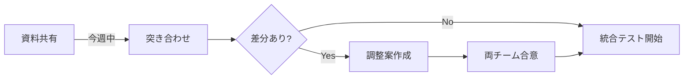
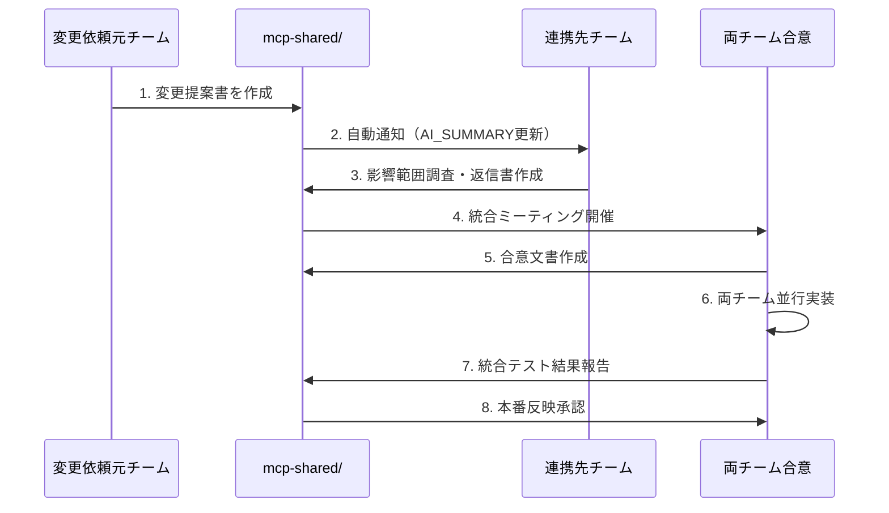
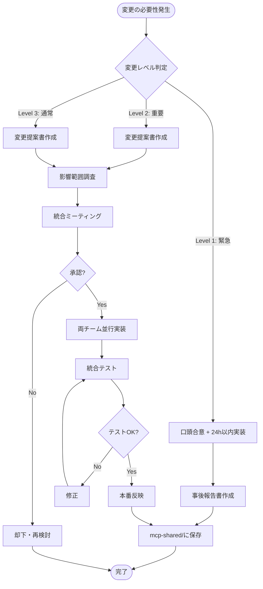

# アカウントレベル定義整合確認・今後の変更管理体制について

**文書番号**: RES-2025-1006-001
**作成日**: 2025年10月6日
**作成者**: 医療システムチーム
**宛先**: VoiceDriveチーム
**件名**: Re: 【重要】VoiceDriveアカウントレベル定義更新 - 医療チーム確認完了

---

## エグゼクティブサマリー

VoiceDriveチーム様からの**25段階アカウントレベル定義更新のご連絡**を受け、医療システム側の実装状況を確認いたしました。

**結論**: 医療システム側は**既に25段階のアカウントレベル定義を実装済み**です（2025年9月25日実装完了）。

本文書では以下を報告します：
1. ✅ 医療システム側の実装状況詳細
2. 🤝 整合性確認の提案
3. 📋 **今後の変更管理体制の提案**（最重要）

---

## 1. 医療システム側の実装状況

### 1.1 実装完了日
**2025年9月25日**（VoiceDrive連携準備として実装）

### 1.2 実装内容

#### ✅ 基本18レベル（1-18）
実装ファイル: [src/services/accountLevelCalculator.ts:12-43](../../../src/services/accountLevelCalculator.ts#L12-43)

| レベル | 役職名 | コード |
|-------|--------|--------|
| 1 | 新人（1年目） | `NEW_STAFF` |
| 2 | 若手（2-3年目） | `JUNIOR_STAFF` |
| 3 | 中堅（4-10年目） | `MIDLEVEL_STAFF` |
| 4 | ベテラン（11年以上） | `VETERAN_STAFF` |
| 5 | 副主任 | `DEPUTY_CHIEF` |
| 6 | 主任 | `CHIEF` |
| 7 | 副師長・副科長 | `DEPUTY_MANAGER` |
| 8 | 師長・科長・課長 | `MANAGER` |
| 9 | 副部長 | `DEPUTY_DIRECTOR` |
| 10 | 部長・医局長 | `DIRECTOR` |
| 11 | 事務長 | `ADMINISTRATIVE_DIRECTOR` |
| 12 | 副院長 | `VICE_PRESIDENT` |
| 13 | 院長・施設長 | `PRESIDENT` |
| 14 | 人事部門員 | `HR_STAFF` |
| 15 | 人事各部門長 | `HR_MANAGER` |
| 16 | 戦略企画部門員 | `STRATEGIC_PLANNING_STAFF` |
| 17 | 戦略企画部門長 | `STRATEGIC_PLANNING_MANAGER` |
| 18 | 理事長 | `BOARD_MEMBER` |

#### ✅ 看護職専用4レベル（0.5刻み）
実装ファイル: [src/services/accountLevelCalculator.ts:15-21](../../../src/services/accountLevelCalculator.ts#L15-21)

| レベル | 役職名 | コード |
|-------|--------|--------|
| 1.5 | 新人看護師（リーダー可） | `NEW_STAFF_LEADER` |
| 2.5 | 若手看護師（リーダー可） | `JUNIOR_STAFF_LEADER` |
| 3.5 | 中堅看護師（リーダー可） | `MIDLEVEL_STAFF_LEADER` |
| 4.5 | ベテラン看護師（リーダー可） | `VETERAN_STAFF_LEADER` |

**判定ロジック**: [src/services/accountLevelCalculator.ts:206-211](../../../src/services/accountLevelCalculator.ts#L206-211)

```typescript
// 看護職のリーダー業務加算（0.5加算）
if (this.isNursingProfession(staff.profession)) {
  if (staff.canPerformLeaderDuty === true) {
    baseLevel += 0.5;
  }
}
```

#### ✅ 特別権限3レベル（97-99）
実装ファイル: [src/services/accountLevelCalculator.ts:45-50](../../../src/services/accountLevelCalculator.ts#L45-50)

| レベル | 役職名 | コード | 権限詳細 |
|-------|--------|--------|---------|
| 97 | 健診担当者 | `HEALTH_CHECKUP_STAFF` | ストレスチェック実施者 |
| 98 | 産業医 | `OCCUPATIONAL_PHYSICIAN` | 健康管理全般 |
| 99 | システム管理者 | `SYSTEM_ADMIN` | システム全権限（Xレベル） |

**アクセス制御実装**: [src/config/accessControl.ts:274-350](../../../src/config/accessControl.ts#L274-350)

### 1.3 関連実装ファイル一覧

| ファイル | 行数 | 内容 |
|---------|------|------|
| `src/services/accountLevelCalculator.ts` | 391行 | 25段階レベル計算ロジック |
| `src/types/staff.ts` | - | `StaffDetail.accountLevel: number` 型定義 |
| `src/config/accessControl.ts` | - | 特別権限（97-99）のアクセス制御 |
| `src/pages/api/v1/calculate-level.ts` | - | レベル計算API |
| `mcp-shared/docs/Account_Level_Definition_Unification_Request_20251004.md` | - | 統一定義書（10/4作成） |

### 1.4 データベース設計（想定）

```sql
-- unified_staff_master テーブル（Lightsail共通DB）
CREATE TABLE unified_staff_master (
    staff_id VARCHAR(20) PRIMARY KEY,
    employee_number VARCHAR(10) UNIQUE NOT NULL,
    full_name VARCHAR(100) NOT NULL,

    -- アカウントレベル関連
    voicedrive_account_level DECIMAL(3,1),  -- 1.0～99.0（25段階対応）
    can_perform_leader_duty BOOLEAN DEFAULT FALSE,
    profession_category VARCHAR(20),        -- 'nursing', 'medical', 'administrative', etc.
    special_authority_type VARCHAR(50),     -- 'health_checkup', 'occupational_physician', 'system_admin', NULL

    -- 基本情報
    facility_id VARCHAR(20),
    department_id VARCHAR(20),
    position_id VARCHAR(20),

    -- その他
    created_at TIMESTAMP DEFAULT CURRENT_TIMESTAMP,
    updated_at TIMESTAMP DEFAULT CURRENT_TIMESTAMP ON UPDATE CURRENT_TIMESTAMP,

    INDEX idx_vd_level (voicedrive_account_level),
    INDEX idx_facility (facility_id)
);
```

---

## 2. 整合性確認の提案

### 2.1 確認依頼事項

VoiceDriveチーム側の実装と医療チーム側の実装が完全一致しているか確認したいです。

以下の資料を共有いただけますか？

#### Priority 1: 必須資料（今週中）

1. **VoiceDrive側のAccountLevel enum定義**
   - `src/types/accountLevel.ts`（全コード）
   - 25段階の定義が医療側と一致しているか

2. **25段階の詳細マッピングテーブル**
   - レベル番号 → 権限名 → 説明の対応表
   - Excel or Markdown形式

3. **看護職リーダー判定ロジック**
   - `canPerformLeaderDuty`フラグの使用方法
   - 0.5加算のロジック

#### Priority 2: 推奨資料（来週中）

4. **プロジェクトモード権限設定**
   - `src/permissions/config/projectModePermissions.ts`
   - レベル別の権限詳細

5. **議題モード権限設定**
   - `src/permissions/config/agendaModePermissions.ts`
   - レベル別の権限詳細

### 2.2 差分確認プロセス



---

## 3. 今後の変更管理体制の提案【最重要】🔴

### 3.1 変更管理の重要性

アカウントレベル定義は**両システムの連携基盤の中核**です。

一方のシステムで変更が発生した場合、もう一方のシステムとの整合性が崩れ、以下のリスクが発生します：

#### リスク例
- ❌ SSO認証エラー（JWTペイロードの不整合）
- ❌ 権限チェック失敗（VoiceDrive投票時の権限判定エラー）
- ❌ データ同期エラー（レベル番号の意味の齟齬）
- ❌ 監査ログの不整合（説明責任の喪失）

### 3.2 変更管理フロー（提案）

#### 📋 変更申請～反映までのプロセス



### 3.3 変更管理ドキュメントテンプレート

#### テンプレート1: 変更提案書

```markdown
# アカウントレベル定義変更提案書

**提案日**: YYYY-MM-DD
**提案者**: [医療チーム / VoiceDriveチーム]
**緊急度**: [高 / 中 / 低]

## 変更内容

### 追加レベル
- レベル番号: XX
- 役職名: XXX
- コード: `XXX_XXX`
- 説明: XXX

### 変更理由
- 背景: XXX
- 必要性: XXX

## 影響範囲分析

### 医療システム側
- [ ] accountLevelCalculator.ts修正
- [ ] 権限マッピングテーブル更新
- [ ] DB設計変更
- [ ] API仕様変更

### VoiceDriveシステム側
- [ ] accountLevel.ts修正
- [ ] 権限設定ファイル更新
- [ ] 投票ロジック修正
- [ ] UI表示更新

## 実装スケジュール
- Phase 1（設計）: XXX～XXX
- Phase 2（実装）: XXX～XXX
- Phase 3（テスト）: XXX～XXX
- Phase 4（本番反映）: XXX～XXX

## 承認
- [ ] 医療チームリーダー承認
- [ ] VoiceDriveチームリーダー承認
- [ ] 統合テスト完了
```

#### テンプレート2: 影響範囲調査報告書

```markdown
# アカウントレベル定義変更 影響範囲調査報告書

**調査日**: YYYY-MM-DD
**調査者**: [医療チーム / VoiceDriveチーム]
**対象変更**: [変更提案書番号]

## 影響範囲サマリー

| 項目 | 影響度 | 工数見積 | リスク |
|------|--------|---------|--------|
| DB設計 | 高/中/低 | X時間 | XXX |
| API仕様 | 高/中/低 | X時間 | XXX |
| 権限ロジック | 高/中/低 | X時間 | XXX |
| UI表示 | 高/中/低 | X時間 | XXX |

## 詳細分析

### 1. データベース変更
- 変更内容: XXX
- 影響テーブル: XXX
- マイグレーション必要性: [要/不要]

### 2. API変更
- 影響エンドポイント: XXX
- 互換性: [後方互換あり / 破壊的変更]

### 3. 推奨事項
- 実装順序: XXX
- テスト重点項目: XXX
- ロールバック計画: XXX
```

### 3.4 変更管理ルール（合意案）

#### ルール1: 変更の分類

| 変更レベル | 定義 | 承認プロセス | 実装期限 |
|----------|------|-------------|---------|
| **Level 1: 緊急** | セキュリティ脆弱性・重大バグ | 口頭合意 + 事後報告 | 24時間以内 |
| **Level 2: 重要** | 新レベル追加、レベル番号変更 | 統合ミーティング必須 | 2週間以内 |
| **Level 3: 通常** | 説明文修正、コメント追加 | mcp-shared/での書面合意 | 1ヶ月以内 |

#### ルール2: 禁止事項

以下の変更は**両チーム合意なしに実施禁止**：

- ❌ 既存レベル番号の変更（例: レベル6の定義変更）
- ❌ 既存レベルの削除
- ❌ 0.5刻みロジックの変更（看護職リーダー加算）
- ❌ 特別権限レベル（97-99）の用途変更

#### ルール3: 推奨事項

- ✅ 新レベル追加は空き番号（20-96）を使用
- ✅ 変更提案は必ずmcp-shared/docs/に文書化
- ✅ 実装完了時は必ず統合テスト実施
- ✅ 本番反映時は必ず監査ログ記録

### 3.5 統合管理ファイルの提案

両チームで**単一の真実の源泉（Single Source of Truth）**を管理する提案：

#### ファイル: `mcp-shared/config/unified-account-level-definition.json`

```json
{
  "version": "1.0.0",
  "lastUpdated": "2025-10-06",
  "updatedBy": "医療チーム",
  "levels": [
    {
      "level": 1.0,
      "code": "NEW_STAFF",
      "name": "新人（1年目）",
      "category": "一般職員",
      "medicalImplemented": true,
      "voicedriveImplemented": true,
      "lastModified": "2025-09-25"
    },
    {
      "level": 1.5,
      "code": "NEW_STAFF_LEADER",
      "name": "新人看護師（リーダー可）",
      "category": "一般職員（看護職専用）",
      "requiresFlag": "canPerformLeaderDuty",
      "medicalImplemented": true,
      "voicedriveImplemented": true,
      "lastModified": "2025-09-25"
    },
    // ... 25段階全て定義
    {
      "level": 99.0,
      "code": "SYSTEM_ADMIN",
      "name": "システム管理者",
      "category": "特別権限",
      "medicalImplemented": true,
      "voicedriveImplemented": true,
      "lastModified": "2025-09-25"
    }
  ],
  "changelog": [
    {
      "date": "2025-09-25",
      "version": "1.0.0",
      "changes": "初回リリース（25段階定義）",
      "implementedBy": ["医療チーム", "VoiceDriveチーム"]
    }
  ]
}
```

**メリット**:
- ✅ 両チームが同じ定義を参照（齟齬防止）
- ✅ 変更履歴の自動追跡
- ✅ CI/CDでの自動検証が可能
- ✅ APIドキュメント自動生成の基盤

### 3.6 定期レビュー会議の提案

**頻度**: 月次（毎月第1金曜15:00）

**アジェンダ**:
1. 前月の変更実績レビュー
2. 統合テスト結果の確認
3. 今後の変更予定の共有
4. 課題・リスクの洗い出し

**参加者**:
- 医療チーム: プロジェクトリーダー、技術担当
- VoiceDriveチーム: プロジェクトリーダー、技術担当

---

## 4. 次のアクション

### 4.1 今週中（10/6-10/12）

#### 医療チーム
- [ ] 本文書をVoiceDriveチームに共有
- [ ] VoiceDrive側の定義資料の受領待機
- [ ] 統合管理ファイル（JSON）のドラフト作成

#### VoiceDriveチーム
- [ ] VoiceDrive側のAccountLevel定義資料を共有
- [ ] 医療側との差分確認
- [ ] 変更管理体制の提案レビュー

### 4.2 来週（10/13-10/19）

#### 両チーム
- [ ] 統合ミーティング開催（差分確認・変更管理体制合意）
- [ ] マスタープラン Phase 0.5セクション更新
- [ ] 統合管理ファイル（JSON）の合意・コミット

### 4.3 再来週（10/20-）

#### 両チーム
- [ ] Lightsail統合DB設計への反映
- [ ] Phase 1実装開始

---

## 5. 連絡先

### 医療システムチーム
- プロジェクトリーダー: medical-lead@example.com
- 技術担当: medical-tech@example.com

### VoiceDriveチーム
- プロジェクトリーダー: voicedrive-lead@example.com
- 技術担当: voicedrive-tech@example.com

### Slack
- **統合プロジェクト**: #lightsail-integration
- **アカウントレベル管理**: #account-level-sync（新設提案）

---

## 6. 添付資料

1. `src/services/accountLevelCalculator.ts`（医療側実装）
2. `mcp-shared/docs/Account_Level_Definition_Unification_Request_20251004.md`（統一定義書）
3. `mcp-shared/config/unified-account-level-definition.json`（統合管理ファイルドラフト）← 次週作成予定

---

**医療システムチーム**
2025年10月6日

---

## Appendix: 変更管理フローチャート


