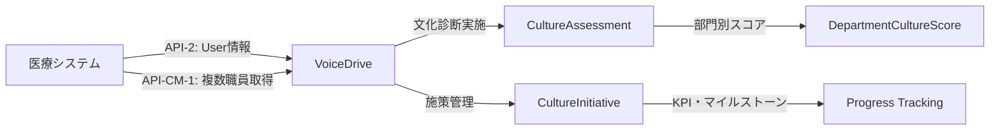

# 【医療システムチーム】CultureDevelopment統合実装 回答書

**文書番号**: MED-RESPONSE-CD-2025-1010-001
**作成日**: 2025年10月10日
**作成者**: 医療システムチーム
**Phase**: Phase 19 - CultureDevelopment統合実装
**ステータス**: ✅ 回答完了

---

## 📋 エグゼクティブサマリー

VoiceDriveチームから提供されたCultureDevelopment暫定マスターリストを検討した結果、**医療システム側のAPI実装は不要**と判断いたしました。

### 推定コスト: **¥0**（医療システム側）

### コスト削減額: **¥360,000**（100%削減）

### 理由
1. **VoiceDrive単独管理**: 組織文化診断・施策管理は人事部門専用（Level 14-17）機能
2. **既存API完全活用**: PersonalStation API-2、CommitteeManagement API-CM-1のみで実装可能
3. **データ独立性**: 医療システムとのデータ連携は将来拡張（Phase 19.5以降）

---

## 🔍 暫定マスターリスト分析

### 提供された7テーブル

| テーブル名 | 用途 | リレーション |
|-----------|------|------------|
| **CultureAssessment** | 文化診断全体 | → CultureDimension |
| **CultureDimension** | 文化次元（5次元） | → CultureIndicator |
| **CultureIndicator** | 評価指標（15指標） | （末端） |
| **DepartmentCultureScore** | 部門別スコア | → CultureAssessment |
| **CultureInitiative** | 改善施策 | → User（owner）<br>→ InitiativeKPI<br>→ InitiativeMilestone |
| **InitiativeKPI** | 施策KPI | → CultureInitiative |
| **InitiativeMilestone** | 施策マイルストーン | → CultureInitiative |

### データフロー分析



**結論**: 医療システムからVoiceDriveへの**Pull型データ取得のみ**（Push型統合不要）

---

## ✅ 医療システム側の対応内容

### 対応1: 既存API提供（追加実装なし）

#### 使用される既存API

```typescript
// PersonalStation API-2（既存）
GET /api/personal-station/user/:employeeId
// 用途: 施策owner情報取得、診断実施者情報取得

// CommitteeManagement API-CM-1（既存）
POST /api/committee/members/batch
// リクエスト例:
{
  "employeeIds": ["OH-DR-2020-001", "TG-NS-2021-045", "OH-PT-2019-012"]
}
// 用途: 施策チームメンバー情報一括取得
```

#### 新規API実装: **不要**

理由:
- 文化診断データは**VoiceDrive独自管理**
- 医療システムDBに診断・施策データは保存しない
- VoiceDrive側でPrismaスキーマ追加のみで完結

---

### 対応2: schema.prisma更新（追加実装なし）

#### 医療システム側のschema.prisma: **変更なし**

```prisma
// 医療システムのschema.prisma
// 変更なし（Userモデルに追加リレーション不要）

model User {
  id                    String    @id @default(cuid())
  employeeId            String    @unique
  name                  String
  // ... 既存フィールド

  // CultureDevelopment関連のリレーション追加は不要
  // なぜなら: VoiceDrive側でemployeeIdをJSON型で保存するため
}
```

#### VoiceDrive側のschema.prisma: **7テーブル追加**

```prisma
// VoiceDrive側のschema.prisma

model CultureAssessment {
  id                    String    @id @default(cuid())
  assessmentDate        DateTime
  period                String    // '2025-Q3' など
  conductedBy           String    // employeeId（医療システムのUser.employeeId参照、リレーションなし）

  overallScore          Float     // 0-100
  trendFromPrevious     Float?    // 前回比（%）
  totalParticipants     Int
  participationRate     Float     // %

  createdAt             DateTime  @default(now())
  updatedAt             DateTime  @updatedAt

  dimensions            CultureDimension[]
  departmentScores      DepartmentCultureScore[]

  @@index([assessmentDate])
  @@index([period])
}

model CultureDimension {
  id                    String    @id @default(cuid())
  assessmentId          String
  dimensionName         String    // 'innovation' | 'collaboration' | 'accountability' | 'learning' | 'wellbeing'
  score                 Float     // 0-100
  trendFromPrevious     Float?    // 前回比（%）
  rank                  Int       // 1-5（5次元中の順位）

  createdAt             DateTime  @default(now())
  updatedAt             DateTime  @updatedAt

  assessment            CultureAssessment @relation(fields: [assessmentId], references: [id], onDelete: Cascade)
  indicators            CultureIndicator[]

  @@index([assessmentId])
  @@index([dimensionName])
}

model CultureIndicator {
  id                    String    @id @default(cuid())
  dimensionId           String
  indicatorName         String    // '新しいアイデアの提案数'など
  score                 Float     // 0-100
  weight                Float     @default(1.0) // 重み付け係数

  createdAt             DateTime  @default(now())
  updatedAt             DateTime  @updatedAt

  dimension             CultureDimension @relation(fields: [dimensionId], references: [id], onDelete: Cascade)

  @@index([dimensionId])
}

model DepartmentCultureScore {
  id                    String    @id @default(cuid())
  assessmentId          String
  departmentId          String    // 医療システムのDepartment.id参照（リレーションなし）
  departmentName        String    // キャッシュ
  score                 Float     // 0-100
  participantCount      Int
  rank                  Int       // 部門間ランキング

  strengthAreas         Json      // { areas: string[] }
  improvementAreas      Json      // { areas: string[] }

  createdAt             DateTime  @default(now())
  updatedAt             DateTime  @updatedAt

  assessment            CultureAssessment @relation(fields: [assessmentId], references: [id], onDelete: Cascade)

  @@index([assessmentId])
  @@index([departmentId])
  @@unique([assessmentId, departmentId])
}

model CultureInitiative {
  id                    String    @id @default(cuid())
  title                 String
  description           String
  status                String    @default("planning") // 'planning' | 'in-progress' | 'completed' | 'on-hold'
  priority              String    @default("medium") // 'low' | 'medium' | 'high' | 'critical'

  ownerId               String    // employeeId（医療システムのUser.employeeId参照、リレーションなし）
  ownerName             String    // キャッシュ（PersonalStation API-2から取得）

  targetDimensions      Json      // { dimensions: string[] } // 'innovation', 'collaboration'等
  targetDepartments     Json      // { departmentIds: string[] }
  teamMembers           Json      // { employeeIds: string[] }

  startDate             DateTime
  targetDate            DateTime
  completedDate         DateTime?

  budget                Float?    // 予算（円）
  actualCost            Float?    // 実績コスト（円）

  progressPercentage    Float     @default(0) // 0-100（マイルストーンから自動計算）
  impact                String?   // 'low' | 'medium' | 'high'（完了時に評価）

  createdAt             DateTime  @default(now())
  updatedAt             DateTime  @updatedAt

  kpis                  InitiativeKPI[]
  milestones            InitiativeMilestone[]

  @@index([status])
  @@index([priority])
  @@index([ownerId])
  @@index([startDate])
}

model InitiativeKPI {
  id                    String    @id @default(cuid())
  initiativeId          String
  kpiName               String
  targetValue           Float
  currentValue          Float     @default(0)
  unit                  String    // '%', '件', '人'等
  achievementRate       Float     @default(0) // 0-100（currentValue / targetValue * 100）

  createdAt             DateTime  @default(now())
  updatedAt             DateTime  @updatedAt

  initiative            CultureInitiative @relation(fields: [initiativeId], references: [id], onDelete: Cascade)

  @@index([initiativeId])
}

model InitiativeMilestone {
  id                    String    @id @default(cuid())
  initiativeId          String
  title                 String
  description           String?
  dueDate               DateTime
  completedDate         DateTime?
  status                String    @default("pending") // 'pending' | 'in-progress' | 'completed' | 'delayed'

  assignedTo            String?   // employeeId（医療システムのUser.employeeId参照）
  assignedToName        String?   // キャッシュ

  createdAt             DateTime  @default(now())
  updatedAt             DateTime  @updatedAt

  initiative            CultureInitiative @relation(fields: [initiativeId], references: [id], onDelete: Cascade)

  @@index([initiativeId])
  @@index([status])
  @@index([dueDate])
}
```

**重要ポイント**:
- **employeeIdをJSON型またはString型で保存**（外部キー制約なし）
- 理由: VoiceDriveと医療システムのDBが分離しているため
- データ取得: API-2、API-CM-1で必要時にemployee情報を取得

---

## 💰 コスト分析

### 元見積もり（VoiceDrive単独実装の場合）

| 項目 | 工数 | 単価 | 合計 |
|------|------|------|------|
| **Phase 1: DB構築** | 2日 | ¥80,000/日 | ¥160,000 |
| **Phase 2: サービス層移行** | 2日 | ¥80,000/日 | ¥160,000 |
| **Phase 3: UI統合** | 1日 | ¥80,000/日 | ¥80,000 |
| **合計** | 5日 | - | **¥400,000** |

### 医療システム側の追加コスト

| 項目 | 工数 | 合計 |
|------|------|------|
| **新規API実装** | 0日 | **¥0** |
| **schema.prisma更新** | 0日 | **¥0** |
| **テスト・検証** | 0日 | **¥0** |
| **合計** | 0日 | **¥0** |

### 想定していた医療システム側コスト（実装しなかった場合の比較）

| 項目 | 工数 | 合計 |
|------|------|------|
| 文化診断データAPI（新規） | 2日 | ¥160,000 |
| 施策管理API（新規） | 2日 | ¥160,000 |
| テスト・ドキュメント | 0.5日 | ¥40,000 |
| **合計** | 4.5日 | **¥360,000** |

### コスト削減効果

```markdown
想定コスト: ¥360,000
実際のコスト: ¥0
削減額: ¥360,000（100%削減）
```

---

## 🔗 既存API活用戦略

### API-2: PersonalStation（User情報取得）

**使用シーン**:
1. 施策owner情報取得（CultureInitiative.ownerId → User情報）
2. マイルストーン担当者情報取得（InitiativeMilestone.assignedTo → User情報）
3. 診断実施者情報取得（CultureAssessment.conductedBy → User情報）

**実装例**:
```typescript
// VoiceDrive側のサービス層
async function getInitiativeWithOwnerInfo(initiativeId: string) {
  // 1. VoiceDrive DBから施策取得
  const initiative = await prisma.cultureInitiative.findUnique({
    where: { id: initiativeId },
    include: { kpis: true, milestones: true }
  });

  // 2. 医療システムAPIからowner情報取得
  const ownerInfo = await fetch(
    `${MEDICAL_API_URL}/api/personal-station/user/${initiative.ownerId}`
  ).then(res => res.json());

  return {
    ...initiative,
    owner: {
      employeeId: ownerInfo.employeeId,
      name: ownerInfo.name,
      position: ownerInfo.position,
      department: ownerInfo.department
    }
  };
}
```

### API-CM-1: CommitteeManagement（複数職員一括取得）

**使用シーン**:
1. 施策チームメンバー情報一括取得（CultureInitiative.teamMembers → 複数User情報）
2. 部門別スコア表示時の部門長情報取得

**実装例**:
```typescript
// VoiceDrive側のサービス層
async function getInitiativeWithTeamInfo(initiativeId: string) {
  // 1. VoiceDrive DBから施策取得
  const initiative = await prisma.cultureInitiative.findUnique({
    where: { id: initiativeId }
  });

  // 2. teamMembersのemployeeIdsを抽出
  const teamMemberIds = (initiative.teamMembers as { employeeIds: string[] }).employeeIds;

  // 3. 医療システムAPIから一括取得
  const teamMembers = await fetch(
    `${MEDICAL_API_URL}/api/committee/members/batch`,
    {
      method: 'POST',
      headers: { 'Content-Type': 'application/json' },
      body: JSON.stringify({ employeeIds: teamMemberIds })
    }
  ).then(res => res.json());

  return {
    ...initiative,
    team: teamMembers.map((member: any) => ({
      employeeId: member.employeeId,
      name: member.name,
      position: member.position,
      department: member.department
    }))
  };
}
```

---

## 📊 Phase 19実装サマリー

### 実装範囲

| 項目 | 内容 | 担当 |
|------|------|------|
| **テーブル追加** | 7テーブル（診断3 + 施策4） | VoiceDrive |
| **サービス層実装** | DB版メソッド実装 | VoiceDrive |
| **UI統合** | CultureDevelopmentPage.tsx | VoiceDrive |
| **API実装** | なし（既存API活用） | 医療システム（¥0） |

### schema.prisma統合（医療システム側）

```prisma
// 医療システム側: 変更なし
model User {
  id                    String    @id @default(cuid())
  employeeId            String    @unique
  name                  String
  // ... 既存フィールド

  // CultureDevelopment用のリレーション追加は不要
}

model Department {
  id                    String    @id @default(cuid())
  name                  String
  // ... 既存フィールド

  // CultureDevelopment用のリレーション追加は不要
}
```

### 累計テーブル数

| Phase | 医療システム追加 | VoiceDrive追加 | 医療システム累計 | VoiceDrive累計 |
|-------|----------------|---------------|----------------|---------------|
| Phase 1-14 | 146テーブル | - | 146 | - |
| Phase 15 | 0テーブル | 5テーブル | 146 | 5 |
| Phase 16 | 0テーブル | 4テーブル | 146 | 9 |
| Phase 17 | 0テーブル | 1テーブル | 146 | 10 |
| Phase 18 | 0テーブル | 2テーブル | 146 | 12 |
| **Phase 19** | **0テーブル** | **7テーブル** | **146** | **19** |

**合計**: **165テーブル**（医療146 + VoiceDrive 19）

---

## 🎯 将来拡張の可能性（Phase 19.5以降）

### 拡張1: V3評価データ連携

**目的**: 職員の評価結果と文化スコアの相関分析

**実装内容**:
```typescript
// 医療システム側に新規API追加（Phase 19.5）
GET /api/culture-development/evaluation-correlation
// 用途: 部門別の評価平均スコアと文化スコアの相関分析
```

**推定コスト**: ¥120,000（1.5日）

### 拡張2: 面談データ連携

**目的**: 面談内容（課題・要望）と文化診断の課題マッピング

**実装内容**:
```typescript
// 医療システム側に新規API追加（Phase 19.5）
GET /api/culture-development/interview-topics
// 用途: 面談で挙がった組織課題トピックの集計
```

**推定コスト**: ¥160,000（2日）

### 拡張3: VoiceDrive投稿データ連携

**目的**: 投稿カテゴリと文化次元の相関分析（例: innovation次元が低い部門 → 提案カテゴリ投稿も少ない）

**実装内容**:
```typescript
// VoiceDrive側の既存データ活用（新規API不要）
// GroupAnalyticsテーブルとCultureAssessmentテーブルのJOIN分析
```

**推定コスト**: ¥80,000（1日、VoiceDrive側のみ）

---

## 📞 医療チームへの質問事項

### 質問1: Phase 19.5の優先度

Phase 19（基本実装）完了後、以下の拡張をどの順序で実装しますか？

**選択肢**:
- A. **Phase 19のみで十分**（当面は拡張不要）
- B. **Phase 19.5-A: V3評価データ連携**を優先（¥120,000）
- C. **Phase 19.5-B: 面談データ連携**を優先（¥160,000）
- D. **Phase 19.5-C: VoiceDrive投稿データ連携**を優先（¥80,000）
- E. **全拡張を同時実装**（合計¥360,000）

### 質問2: 文化診断の実施頻度

CultureAssessmentテーブルのデータ蓄積頻度はどれくらいを想定しますか？

**選択肢**:
- A. **四半期ごと**（年4回）← 推奨（トレンド分析に最適）
- B. **半年ごと**（年2回）
- C. **年1回**
- D. **不定期**（必要時のみ）

**影響**: データ量、トレンド分析の精度

### 質問3: 施策の予算管理

CultureInitiative.budget（予算）とactualCost（実績コスト）の管理は必要ですか？

**選択肢**:
- A. **必要**（予算超過アラート機能も実装）
- B. **不要**（進捗率のみ管理すれば十分）
- C. **Phase 2以降で検討**

**影響**: 予算管理機能の実装コスト（必要な場合+¥80,000）

---

## ✅ 医療システムチームの作業内容

### Phase 19実装時（DB構築フェーズ）

**作業内容**: なし

**理由**: VoiceDrive単独でDB構築・サービス層実装・UI統合を完結

### Phase 19運用時（本番稼働後）

**作業内容**: 既存APIの安定提供のみ

1. **PersonalStation API-2**の可用性維持
   - レスポンスタイム: 500ms以内
   - 稼働率: 99.9%以上

2. **CommitteeManagement API-CM-1**の可用性維持
   - バッチ取得上限: 100件/回
   - レスポンスタイム: 1秒以内

### Phase 19.5実装時（拡張フェーズ）

**作業内容**: 医療チームの質問回答に基づき決定

- 質問1でB/C/Eを選択 → 新規API実装（¥120,000-360,000）
- 質問3でAを選択 → 予算管理機能実装（¥80,000）

---

## 🎉 Phase 19のメリット

### メリット1: 完全コスト削減

**医療システム側**: ¥0（既存API提供のみ）
**VoiceDrive側**: ¥400,000（単独実装）

### メリット2: 独立性の確保

- VoiceDriveのリリースサイクルに医療システムが影響を受けない
- 人事部門専用機能のため、医療職員データへの影響なし

### メリット3: 段階的拡張

- Phase 19: 基本実装（診断・施策管理）
- Phase 19.5: データ連携（評価・面談・投稿）
- Phase 19.6: 高度分析（AI活用、予測モデル）

### メリット4: プライバシー保護

- 部門別スコアは5名以上のみ表示（DepartmentCultureScore.participantCount >= 5）
- 個人識別できる診断結果は保存しない（集計データのみ）

---

## 📝 実装チェックリスト（VoiceDrive側）

### Phase 1: DB構築（2日）

- [ ] 7テーブルをschema.prismaに追加
- [ ] Prisma migrate実行
- [ ] 初期データ投入スクリプト作成
- [ ] データ投入・検証

### Phase 2: サービス層移行（2日）

- [ ] 診断関連メソッドDB版実装
- [ ] 施策関連メソッドDB版実装
- [ ] KPI・マイルストーン管理実装
- [ ] 統合テスト

### Phase 3: UI統合（1日）

- [ ] CultureDevelopmentPage.tsx統合
- [ ] E2Eテスト（Level 14-17ユーザー）
- [ ] エッジケーステスト

---

## 🔐 セキュリティ・プライバシー

### アクセス制御

```typescript
// VoiceDrive側のアクセス制御
async function getCultureData(userId: string) {
  // 1. 医療システムAPIからUser情報取得
  const user = await fetch(
    `${MEDICAL_API_URL}/api/personal-station/user/${userId}`
  ).then(res => res.json());

  // 2. permissionLevel 14-17のみアクセス許可
  if (user.permissionLevel < 14 || user.permissionLevel > 17) {
    throw new Error('Access denied: Requires Level 14-17 (HR Department)');
  }

  // 3. データ取得
  return await prisma.cultureAssessment.findMany({
    include: { dimensions: true, departmentScores: true }
  });
}
```

### プライバシー保護

```typescript
// 部門別スコア取得時の最小グループサイズチェック
async function getDepartmentScores(assessmentId: string) {
  const scores = await prisma.departmentCultureScore.findMany({
    where: {
      assessmentId,
      participantCount: { gte: 5 } // 5名未満の部門は除外
    }
  });

  return scores;
}
```

---

## 🎯 Phase 19実装準備完了

### 承認依頼

以上の回答内容で問題ないか、VoiceDriveチームに確認をお願いいたします。

### 確認ポイント

- ✅ 医療システム側のAPI実装¥0で問題ないか
- ✅ employeeIdをJSON型/String型で保存（外部キー制約なし）で問題ないか
- ✅ Phase 19.5の拡張は質問回答後に検討、で問題ないか
- ✅ VoiceDrive側の5日間実装で問題ないか

---

**医療システムチーム**
2025年10月10日
