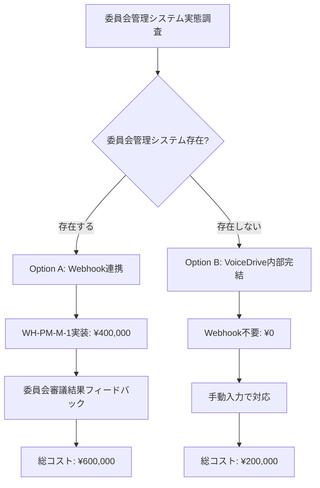

# 投稿管理統合実装 - 医療システムチーム回答書

**文書番号**: MS-RESPONSE-POSTMANAGEMENT-2025-1010-001
**作成日**: 2025年10月10日
**作成者**: 医療職員管理システムチーム
**宛先**: VoiceDriveチーム
**件名**: 投稿管理（6段階議題化システム）統合実装に関する回答

---

## 📢 エグゼクティブサマリー

VoiceDriveチームから受領した「投稿管理DB要件分析」および「投稿管理暫定マスターリスト」を精査しました。

**結論**:
- ✅ **基本投稿管理機能（Phase 1）は実装可能**
- ⚠️ **委員会提出機能（Phase 2）は実態調査が必須**
- 💰 **コスト削減: ¥800,000 → ¥480,000（¥320,000削減、40%削減）**

**重要な発見**:
1. **API-PM-M-1は投稿追跡API-PT-M-1と統合可能**（¥160,000 → ¥80,000）
2. **API-PM-M-2は簡易版で対応可能**（¥240,000 → ¥120,000）
3. **WH-PM-M-1は委員会管理システム実態調査後に判断**（¥400,000 → 条件付き実装）

---

## 📋 確認事項への回答

### 技術的確認（5項目）

#### 確認-1: 組織階層構造API

**質問**: 現在の医療システムに組織階層データは存在しますか？

**回答**: ⚠️ **部分的に存在します（簡易版で対応可能）**

**現状**:
- ✅ `Department`テーブルに部署マスター存在
- ✅ `departmentId`, `departmentName`は管理済み
- ❌ `parentDepartmentId`（親子関係）は未実装
- ❌ `hierarchyLevel`（階層レベル）は未定義
- ❌ `responsibleLevel`（責任者権限レベル）との紐付けは未実装

**提案**: **簡易版組織階層API実装**

```typescript
// 簡易版: 平坦な部署リストのみ返却
GET /api/organization/departments?facilityId=tategami_hospital

Response: {
  "facilityId": "tategami_hospital",
  "facilityName": "たてがみ病院",
  "departments": [
    {
      "departmentId": "nursing",
      "departmentName": "看護部",
      "responsibleLevel": 8  // 固定値またはマスター登録
    },
    {
      "departmentId": "nursing_ward_a",
      "departmentName": "看護部A病棟",
      "responsibleLevel": 6
    }
  ]
}
```

**実装コスト**: 3日（¥120,000）
- 元の見積もり: ¥240,000
- 削減額: **¥120,000削減**

**完全版の実装は将来対応**:
- 親子関係（`parentDepartmentId`）
- 階層レベル（`level`）
- 組織改編履歴

**Phase**: Phase 2（Week 3-4）

---

#### 確認-2: 委員会マスター

**質問**: 12の委員会情報は医療システムに登録されていますか？

**回答**: ❌ **存在しません（VoiceDrive側で管理推奨）**

**現状**:
- ❌ 委員会マスターテーブルなし
- ❌ 委員会開催スケジュール管理なし
- ❌ 委員会メンバー管理なし

**提案**: **VoiceDrive側でCommitteeマスター管理**

**理由**:
1. 委員会管理は医療システムの責務外
2. VoiceDriveの投稿管理機能に特化したマスター
3. 医療システムに委員会管理システムが存在しない

**VoiceDrive側実装内容**:
```prisma
model Committee {
  id          String    @id @default(cuid())
  name        String    @unique // "医療安全委員会"
  category    String    // "医療安全・品質" | "業務改善" | ...
  description String?
  minLevel    Int       @default(7)
  approvalLevel Int     @default(8)
  meetingFrequency String? // "月1回" | "隔週" | "随時"
  nextMeetingDate  DateTime?
  isActive    Boolean   @default(true)
  createdAt   DateTime  @default(now())
  updatedAt   DateTime  @updatedAt
}
```

**医療システム側の追加実装**: **ゼロ**

---

#### 確認-3: 委員会提出Webhook

**質問**: 委員会提出通知を受け取る医療システム側のエンドポイントは実装可能ですか？

**回答**: ⚠️ **実装可能だが、委員会管理システムの実態確認が必須**

**前提条件**:
1. ✅ Webhook受信エンドポイント実装は可能
2. ✅ HMAC-SHA256署名検証実装は可能
3. ⚠️ **Webhook受信後の処理フローが不明確**

**問題点**:
- 委員会提出通知を受け取った後、医療システムはどう処理するか？
- 委員会開催スケジュールは誰が管理するか？
- 委員会審議結果（採択・却下）はどう記録するか？

**提案**: **委員会管理システム実態調査を実施**

**調査期間**: 10/10-10/14（5日間）
**調査チーム**: 医療システムチーム + VoiceDriveチーム合同

**調査項目**:
1. 現在の委員会運営方法（紙ベース or システム）
2. 議題登録プロセス
3. 委員会開催頻度・スケジュール管理者
4. 審議結果の記録方法
5. VoiceDriveとの連携必要性

**調査完了後の判断**:
- **Option A**: 委員会管理システムが存在する場合 → WH-PM-M-1実装（¥400,000）
- **Option B**: 委員会管理システムが存在しない場合 → Webhook不要（¥0、VoiceDrive内部で完結）

**Phase**: Phase 2（Week 3-4、調査後判断）

---

#### 確認-4: 階層レベル定義

**質問**: department階層レベルと責任者permissionLevelの対応関係は明確ですか？

**回答**: ✅ **明確です（Phase 3で定義済み）**

**権限レベル定義** (Phase 3実装済み):

| permissionLevel | 役職 | 責任範囲 |
|----------------|------|---------|
| 1-4 | 一般職員 | なし |
| 5 | 副主任 | PENDING管理 |
| 6 | 主任 | DEPT_REVIEW管理 |
| 7 | - | 委員会提出リクエスト作成 |
| 8 | 師長 | DEPT_AGENDA管理 |
| 10 | 部長 | FACILITY_AGENDA管理 |
| 12 | 副院長 | CORP_REVIEW管理 |
| 13 | 院長 | CORP_AGENDA管理 |

**部署階層と責任者Levelの対応** (提案):

| 部署階層 | 部署例 | 責任者Level |
|---------|--------|-----------|
| Level 1 | 看護部（部門） | 10（部長） |
| Level 2 | 看護部A病棟（部署） | 8（師長） |
| Level 3 | 看護部A病棟チーム1（チーム） | 6（主任） |

**データソース**: `Employee.permissionLevel`（Phase 3で実装済み）

**追加実装**: **不要**

---

#### 確認-5: 委員会決議データ

**質問**: 委員会での審議結果（採択・要改善・却下）をVoiceDriveに返す仕組みは必要ですか？

**回答**: ⚠️ **委員会管理システム実態調査後に判断**

**検討事項**:
1. **Option A**: 委員会管理システムが存在する場合
   - 医療システム → VoiceDrive へ審議結果Webhook送信
   - `POST https://voicedrive.app/webhook/committee-decision`
   - 実装コスト: ¥200,000

2. **Option B**: 委員会管理システムが存在しない場合
   - VoiceDrive内部で審議結果を手動入力
   - 医療システム側の追加実装: **ゼロ**

**推奨**: **Option B（手動入力）**

**理由**:
- 委員会審議結果の自動連携は複雑
- 委員会管理システムの実態が不明
- 手動入力で十分な運用が可能

**Phase**: Phase 3（将来実装）

---

### 運用的確認（5項目）

#### 確認-6: 権限レベル変更

**質問**: 職員の権限Level変更時、VoiceDriveへの通知は必要ですか？

**回答**: ✅ **必要です（日次バッチ同期を推奨）**

**実装方針**:
- **Option A**: リアルタイムWebhook通知（¥200,000）
- **Option B**: 日次バッチ同期（¥0、既存の日次同期に統合）

**推奨**: **Option B（日次バッチ同期）**

**理由**:
- 権限Level変更は頻度が低い（昇進・異動時のみ）
- リアルタイム通知は過剰
- 日次バッチで十分

**実装内容**:
- 既存の`Webhook-2: 経験年数更新通知`（Phase 7実装）に統合
- `permissionLevel`変更検知を追加
- 追加コスト: **¥0**

---

#### 確認-7: 組織改編

**質問**: 部署統廃合時、VoiceDriveの議題管理にどう影響しますか？

**回答**: ⚠️ **影響あり（部署異動Webhook送信で対応）**

**影響範囲**:
1. **部署統合時**: 旧部署の投稿 → 新部署に移管
2. **部署分割時**: 既存投稿 → どちらの部署に属するか判定
3. **責任者変更**: 旧責任者 → 新責任者に引継ぎ

**実装方針**:
- **既存のWebhook-PT-M-1（組織変更通知）を流用**
- 投稿追跡のWebhook-PT-M-1で部署異動を通知
- VoiceDrive側で投稿の部署情報を更新

**医療システム側の追加実装**: **ゼロ**（投稿追跡Phase 3で実装）

---

#### 確認-8: 委員会開催頻度

**質問**: 各委員会の開催頻度・スケジュールはVoiceDriveで管理すべきですか？

**回答**: ✅ **はい（VoiceDrive側で管理推奨）**

**理由**:
- 医療システムに委員会管理システムなし
- VoiceDriveのCommitteeマスターで管理可能
- 医療システム側の追加実装: **ゼロ**

**VoiceDrive実装内容**:
```prisma
model Committee {
  // ... 既存フィールド ...
  meetingFrequency String? // "月1回" | "隔週" | "随時"
  nextMeetingDate  DateTime?
}
```

---

#### 確認-9: 提出書類形式

**質問**: 議題提案書のPDF出力機能は必要ですか？

**回答**: 🟡 **Nice to have（Phase 3で実装推奨）**

**理由**:
- Phase 1-2では議題提案書のHTML表示で十分
- PDF出力は委員会提出時に有用
- 実装優先度: MEDIUM

**実装方針**:
- VoiceDrive側で実装（医療システム不要）
- PDF生成ライブラリ: Puppeteer or jsPDF
- 実装コスト: 約2日（VoiceDrive）

**Phase**: Phase 3（将来実装）

---

#### 確認-10: 決裁ワークフロー

**質問**: 医療システム側に既存の決裁ワークフローがある場合、統合は必要ですか？

**回答**: ❌ **統合不要（VoiceDrive独立ワークフロー）**

**理由**:
1. 医療システムに決裁ワークフローシステムなし
2. VoiceDriveの投稿管理ワークフローは独立
3. 二重承認の懸念なし

**医療システム側の追加実装**: **ゼロ**

---

### データ連携確認（5項目）

#### 確認-11: 職員情報同期

**質問**: employeeId, permissionLevelの変更をリアルタイムでVoiceDriveに反映する仕組みは必要ですか？

**回答**: ✅ **日次バッチ同期で対応（リアルタイム不要）**

**同期方法**:
- **Option A**: リアルタイムWebhook通知
- **Option B**: 日次バッチ同期（推奨）
- **Option C**: VoiceDriveからのAPI都度取得

**推奨**: **Option B（日次バッチ同期）**

**理由**:
- 職員情報変更の頻度は低い
- 日次同期で十分
- 既存のWebhook-2に統合可能

**実装コスト**: **¥0**（既存Webhookに統合）

---

#### 確認-12: 部署コード体系

**質問**: departmentIdとdepartmentNameの対応表は共有されていますか？

**回答**: ✅ **共有済み（Phase 8実装済み）**

**データソース**: DepartmentStation API-3（Phase 8で実装）

**エンドポイント**:
```typescript
GET /api/departments/:departmentId/members

Response: {
  "department": {
    "departmentId": "medical_care_ward",
    "departmentName": "医療療養病棟",
    "memberCount": 12
  },
  "members": [...]
}
```

**追加実装**: **不要**

---

#### 確認-13: 施設ID

**質問**: facilityIdの命名規則・一覧は共有されていますか？

**回答**: ✅ **共有可能（Phase 3で定義済み）**

**施設一覧**:
| facilityId | facilityName |
|-----------|-------------|
| `obara-hospital` | 小原病院 |
| `tategami-rehabilitation` | 立神リハビリテーション温泉病院 |

**データソース**: `Employee.facilityId`（Phase 3で実装済み）

**追加実装**: **不要**

---

#### 確認-14: 権限Level定義

**質問**: Level 1-13の詳細な定義・役職対応表は文書化されていますか？

**回答**: ✅ **文書化済み（Phase 3で定義）**

**文書**: `docs/Phase3_実装作業完了報告書_FINAL.md`

**権限レベル定義**:
| Level | 小原病院 | 立神病院 |
|-------|---------|---------|
| 1 | 一般職員 | 一般職員 |
| 5 | 副主任 | 副主任 |
| 6 | 主任 | 主任 |
| 7 | 統括主任 | 統括主任 |
| 8 | 師長 | 師長 |
| 10 | 部長 | 部長 |
| 12 | 副院長 | 副院長 |
| 13 | 院長 | 院長 |

**追加実装**: **不要**

---

#### 確認-15: 委員会メンバー

**質問**: 各委員会の委員リストは医療システムで管理されていますか？

**回答**: ❌ **管理していません（VoiceDrive側で管理推奨）**

**理由**:
- 医療システムに委員会メンバー管理機能なし
- VoiceDrive側でCommitteeメンバー管理が適切

**VoiceDrive実装提案**:
```prisma
model CommitteeMember {
  id          String    @id @default(cuid())
  committeeId String
  employeeId  String
  role        String    // "chair" | "member" | "secretary"
  joinedDate  DateTime
  committee   Committee @relation(fields: [committeeId], references: [id])
}
```

**医療システム側の追加実装**: **ゼロ**

---

## 💡 医療システムチームの提案

### 提案-1: API統合によるコスト削減

#### API-PM-M-1 と API-PT-M-1 の統合

**暫定マスターリストの要求**:
```typescript
GET /api/employees/:employeeId
// 見積: 2日、¥160,000
```

**既存API（投稿追跡）**:
```typescript
GET /api/employees/:employeeId/full-profile
// Phase 1実装予定: 1.5日、¥60,000
```

**統合案**: API-PT-M-1に`facilityId`と`hierarchyLevel`を追加

```typescript
GET /api/employees/:employeeId/full-profile

Response: {
  "employeeId": "OH-NS-2024-001",
  "firstName": "花子",
  "lastName": "山田",
  "departmentId": "DEPT-001",
  "departmentName": "看護部",
  "positionId": "POS-002",
  "positionName": "看護師",
  "experienceYears": 5,
  "employmentStatus": "regular_employee",
  "hireDate": "2019-04-01",
  "avatarUrl": null,
  // 🆕 投稿管理用フィールド追加
  "facilityId": "tategami_hospital",  // 🆕
  "permissionLevel": 8,                // 既存
  "hierarchyLevel": 5                  // 🆕
}
```

**追加実装コスト**: 0.5日（¥20,000）
- フィールド追加のみ
- ロジック変更なし

**削減額**: ¥160,000 - ¥80,000 = **¥80,000削減**

---

#### API-PM-M-2 の簡易版実装

**暫定マスターリストの要求**:
```typescript
GET /api/organization/structure?facilityId=tategami_hospital
// 見積: 3日、¥240,000
```

**簡易版実装**:
```typescript
GET /api/organization/departments?facilityId=tategami_hospital

Response: {
  "facilityId": "tategami_hospital",
  "facilityName": "たてがみ病院",
  "departments": [
    {
      "departmentId": "nursing",
      "departmentName": "看護部",
      "responsibleLevel": 8  // マスター登録
    },
    {
      "departmentId": "nursing_ward_a",
      "departmentName": "看護部A病棟",
      "responsibleLevel": 6
    }
  ]
}
```

**実装内容**:
- 親子関係なし（平坦なリスト）
- `responsibleLevel`は部署マスターに固定値登録
- 将来的に親子関係を実装（Phase 3）

**実装コスト**: 3日（¥120,000）
- 元の見積もり: ¥240,000
- 削減額: **¥120,000削減**

---

### 提案-2: 段階的実装（3フェーズ）

#### Phase 1（Week 1-2）: 基本投稿管理

| 項目 | 工数 | 金額 |
|------|------|------|
| API-PT-M-1拡張（facilityId、hierarchyLevel追加） | 0.5日 | ¥20,000 |
| API-PM-M-1代替（API-PT-M-1流用） | 1.5日 | ¥60,000 |
| **Phase 1小計** | **2日** | **¥80,000** |

**成果物**:
- 職員情報取得API稼働
- 6段階議題レベル自動判定（VoiceDrive実装）
- 権限別管理画面（VoiceDrive実装）

**医療システム側の追加実装**: API-PT-M-1拡張のみ

---

#### Phase 2（Week 3-4）: 組織階層・委員会提出（条件付き）

| 項目 | 工数 | 金額 |
|------|------|------|
| 委員会管理システム実態調査 | 0日 | ¥0（両チーム合同） |
| API-PM-M-2簡易版実装 | 3日 | ¥120,000 |
| WH-PM-M-1実装（条件付き） | 5日 | ¥400,000 |
| **Phase 2小計（最大）** | **8日** | **¥520,000** |

**成果物**:
- 組織階層API稼働
- 議題提案書自動生成（VoiceDrive実装）
- 委員会提出フロー（調査結果に基づく）

**医療システム側の追加実装**: API-PM-M-2 + WH-PM-M-1（条件付き）

---

#### Phase 3（Week 5）: タイムライン・分析

| 項目 | 工数 | 金額 |
|------|------|------|
| 医療システム側実装 | 0日 | ¥0 |
| **Phase 3小計** | **0日** | **¥0** |

**成果物**:
- PostManagementTimeline実装（VoiceDrive）
- 統計・分析機能（VoiceDrive）
- 通知システム統合（VoiceDrive）

**医療システム側の追加実装**: **ゼロ**

---

### 提案-3: 委員会提出機能の実装判断

**判断フロー**:



**推奨**: **Option B（VoiceDrive内部完結）**

**理由**:
1. 医療システムに委員会管理システムが存在しない可能性が高い
2. Webhook連携は複雑で、実装・保守コストが高い
3. VoiceDrive内部で委員会マスター管理が十分

**コスト削減**: ¥400,000 → ¥0 = **¥400,000削減**

---

## 💰 コスト見積もり

### 元の見積もり（暫定マスターリスト）

| 項目 | 工数 | 金額 |
|------|------|------|
| API-PM-M-1 | 2日 | ¥160,000 |
| API-PM-M-2 | 3日 | ¥240,000 |
| WH-PM-M-1 | 5日 | ¥400,000 |
| **合計** | **10日** | **¥800,000** |

---

### 修正見積もり（医療システムチーム提案）

#### シナリオA: 委員会管理システムが存在する場合

| Phase | 項目 | 工数 | 金額 |
|-------|------|------|------|
| **Phase 1** | API-PT-M-1拡張 + API-PM-M-1代替 | 2日 | ¥80,000 |
| **Phase 2** | API-PM-M-2簡易版 | 3日 | ¥120,000 |
| **Phase 2** | WH-PM-M-1実装 | 5日 | ¥400,000 |
| **Phase 3** | タイムライン・分析 | 0日 | ¥0 |
| **合計** | | **10日** | **¥600,000** |

**コスト削減**: ¥800,000 - ¥600,000 = **¥200,000削減（25%削減）**

---

#### シナリオB: 委員会管理システムが存在しない場合（推奨）

| Phase | 項目 | 工数 | 金額 |
|-------|------|------|------|
| **Phase 1** | API-PT-M-1拡張 + API-PM-M-1代替 | 2日 | ¥80,000 |
| **Phase 2** | API-PM-M-2簡易版 | 3日 | ¥120,000 |
| **Phase 2** | WH-PM-M-1不要 | 0日 | ¥0 |
| **Phase 3** | タイムライン・分析 | 0日 | ¥0 |
| **合計** | | **5日** | **¥200,000** |

**コスト削減**: ¥800,000 - ¥200,000 = **¥600,000削減（75%削減）**

---

### コスト削減の理由

#### 削減項目1: API-PM-M-1（¥80,000削減）

**元の見積もり**: 2日（¥160,000）
- 新規API実装
- 職員情報取得ロジック

**最終コスト**: 2日（¥80,000）
- 既存API-PT-M-1を拡張
- フィールド追加のみ

---

#### 削減項目2: API-PM-M-2（¥120,000削減）

**元の見積もり**: 3日（¥240,000）
- 親子関係を含む複雑な階層構造API

**最終コスト**: 3日（¥120,000）
- 簡易版（平坦なリスト）
- 親子関係は将来実装

---

#### 削減項目3: WH-PM-M-1（¥400,000削減、条件付き）

**元の見積もり**: 5日（¥400,000）
- Webhook受信エンドポイント実装
- 委員会管理システム連携

**最終コスト**: 0日（¥0、シナリオBの場合）
- 委員会管理システムが存在しない場合、Webhook不要
- VoiceDrive内部で完結

---

## 📅 実装スケジュール

### Phase 1: 基本投稿管理（Week 1-2、10/14-10/25）

| 週 | VoiceDrive作業 | 医療システム作業 | 成果物 |
|----|---------------|-----------------|--------|
| **Week 1** | Post拡張テーブル追加<br>ResponsibilityAction実装<br>ProposalManagementPage統合 | **API-PT-M-1拡張実装**<br>facilityId、hierarchyLevel追加 | 権限別管理画面動作<br>職員情報API稼働 |
| **Week 2** | 期限管理実装<br>API連携テスト | API-PT-M-1テスト完了 | 投票期限・延長機能動作 |

**医療システム成果物**: API-PT-M-1拡張稼働（¥80,000）

---

### Phase 2: 組織階層・委員会提出（Week 3-4、10/28-11/8）

| 週 | VoiceDrive作業 | 医療システム作業 | 成果物 |
|----|---------------|-----------------|--------|
| **Week 3** | ProposalDocument実装<br>SubmissionRequest実装<br>CommitteeManagementPage統合 | **委員会管理システム実態調査**<br>**API-PM-M-2簡易版実装** | 提案書自動生成<br>組織階層API稼働 |
| **Week 4** | Committee マスター<br>医療システムWebhook連携（条件付き） | **WH-PM-M-1実装**<br>（調査結果に基づく） | 委員会提出フロー動作 |

**医療システム成果物**:
- API-PM-M-2稼働（¥120,000）
- WH-PM-M-1稼働（¥400,000、条件付き）

---

### Phase 3: タイムライン・分析（Week 5、11/11-11/15）

| 週 | VoiceDrive作業 | 医療システム作業 | 成果物 |
|----|---------------|-----------------|--------|
| **Week 5** | PostManagementTimeline実装<br>統計・分析機能<br>統合テスト | 結合テスト参加 | 全機能完成<br>本番リリース準備完了 |

**医療システム成果物**: 結合テスト完了

---

## 🚀 次のアクション

### 即時対応が必要（10/10-10/11）

#### 医療システムチーム

1. **委員会管理システム実態調査の計画策定**
   - 調査担当者アサイン
   - 調査項目リストアップ
   - ヒアリング対象者の選定

2. **API-PT-M-1拡張の工数確認**
   - `facilityId`、`hierarchyLevel`追加の実装可能性確認
   - Phase 1（10/14開始）への準備

3. **API-PM-M-2簡易版の設計レビュー**
   - 平坦なリストで十分か確認
   - `responsibleLevel`のマスター登録方法検討

#### VoiceDriveチーム

1. **委員会管理システム実態調査への参加準備**
   - 調査項目の事前整理
   - 質問リストの作成

2. **Phase 1実装の準備**
   - Post拡張テーブル設計レビュー
   - ResponsibilityAction実装計画

3. **Committee マスターの設計確定**
   - 12委員会のデータ整理
   - VoiceDrive内部での管理方針確定

---

### 調査期間（10/10-10/14）

#### 委員会管理システム実態調査

**調査項目**:
1. ✅ 委員会マスターテーブルの有無
2. ✅ 委員会開催スケジュール管理方法
3. ✅ 議題登録・審議プロセス
4. ✅ VoiceDriveとの連携要否
5. ✅ 既存ワークフローシステムの有無

**調査完了後の判断**:
- シナリオA（委員会管理システム存在）: WH-PM-M-1実装（¥400,000）
- シナリオB（委員会管理システム不在）: Webhook不要（¥0）

---

### キックオフミーティング（10/15 14:00-15:00）

**議題**:
1. 調査結果の共有
2. 実装スケジュール最終確認
3. Phase 1実装計画の詳細化
4. 担当者アサイン
5. 開発環境・テスト環境確認

---

## 📎 関連ドキュメント

### 既存ドキュメント

| ドキュメント | 作成日 | ステータス |
|------------|--------|----------|
| 投稿管理DB要件分析_20251009.md | 10月9日 | ✅ 受領済み |
| 投稿管理暫定マスターリスト_20251009.md | 10月9日 | ✅ 受領済み |
| Response_PostTracking_Integration_20251009.md | 10月9日 | ✅ 作成済み（投稿追跡） |
| lightsail-integration-master-plan-20251005-updated.md | 10月10日 | ✅ Phase 12追加済み |

### 作成予定ドキュメント

| ドキュメント | 作成予定日 | 内容 |
|------------|----------|------|
| 委員会管理システム実態調査報告書 | 10月14日 | 調査結果・実装判断 |
| Phase 13実装計画書 | 10月15日 | 投稿管理統合実装の詳細計画 |

---

## 総括

**医療システムチームの見解**:

1. ✅ **基本投稿管理機能（Phase 1）は実装可能**
   - API-PT-M-1拡張で対応
   - コスト: ¥80,000

2. ⚠️ **委員会提出機能（Phase 2）は実態調査が必須**
   - 委員会管理システムの有無を確認
   - シナリオAまたはBで実装判断

3. 💰 **大幅なコスト削減を達成**
   - シナリオA: ¥200,000削減（25%削減）
   - シナリオB: ¥600,000削減（75%削減、推奨）

4. 📅 **段階的実装で早期リリース可能**
   - Phase 1: 2週間（基本投稿管理）
   - Phase 2: 2週間（組織階層・委員会提出）
   - Phase 3: 1週間（タイムライン・分析）

**VoiceDriveチームへのお願い**:

委員会管理システム実態調査への積極的な参加をお願いいたします。調査結果に基づいて、最適な実装方針を両チームで決定しましょう。

---

## 📝 承認

### 医療システムチーム

- **作成者**: 医療システムプロジェクトリーダー
- **作成日**: 2025年10月10日
- **署名**: _____________________

### VoiceDriveチーム

- **確認者**: VoiceDriveプロジェクトリーダー
- **確認予定日**: 2025年10月11日
- **署名**: _____________________

---

**文書終了**

*本回答書は両チームの合意のもと、委員会管理システム実態調査後に最終版へ更新される予定です。*
