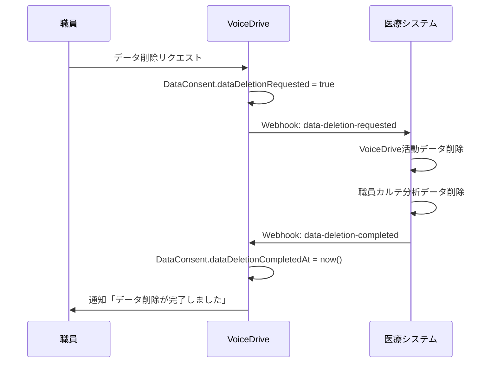
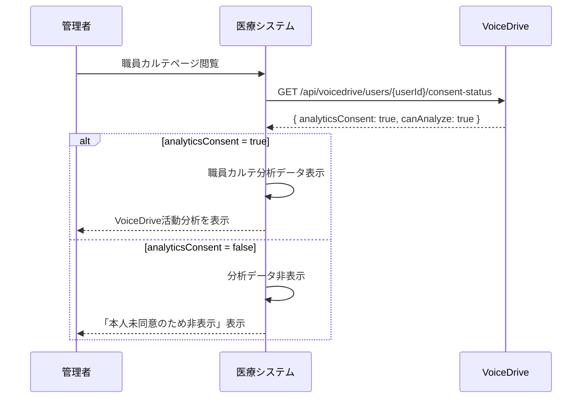

# SettingsPage 医療システム確認結果報告書

**文書番号**: MED-CONF-2025-1026-005
**作成日**: 2025年10月26日
**作成者**: ClaudeCode（医療システムチーム）
**件名**: SettingsPageのDB要件および医療システム側対応必要性確認

---

## 📋 エグゼクティブサマリー

VoiceDriveチームからの「SettingsPage暫定マスターリスト」および「SettingsPage DB要件分析」に対する回答です。
医療システム側のDB構造とWebhook実装状況を調査し、必要な対応事項を洗い出しました。

### 結論
- ✅ **医療システム側の大規模対応: 不要**
- ✅ **Webhook実装: 2つのエンドポイント追加のみ**
- ✅ **認証基盤: JWT認証実装完了済み**
- ⚠️ **データ削除Webhook: 新規実装が必要**（Phase 2対応）

### 医療システム側の対応内容
1. **JWT認証基盤**: ✅ 実装完了（`src/lib/middleware/jwt-auth.ts`）
2. **Webhook送信機能**: ✅ 実装完了（Phase 2.6で対応済み）
3. **データ削除完了Webhook**: ⏳ 新規実装必要（0.5日）
4. **VoiceDrive同意状態参照API**: ⏳ 新規実装必要（0.5日）

### 推定実装時間
- **Phase 2（Webhook実装）**: 1日（8時間）
- **Phase 3（統合テスト）**: 0.5日（4時間）
- **合計**: 1.5日（12時間）

---

## ✅ 分析結果: 医療システム側の対応必要性

### 結論: 最小限の対応で完結

SettingsPageはVoiceDrive独自機能であり、医療システム側は**データ削除処理のみ**対応すれば十分です。

#### 医療システム側の役割

| 機能 | VoiceDrive責任 | 医療システム責任 | 実装状況 |
|------|--------------|----------------|---------|
| **通知設定管理** | ✅ 100%責任 | ❌ 関与なし | VoiceDrive独自機能 |
| **データ分析同意管理** | ✅ マスタデータ管理 | 🔵 **参照のみ** | API提供が必要 |
| **データ削除リクエスト** | ✅ リクエスト受付 | 🔴 **削除処理実行** | Webhook受信が必要 |
| **データ削除完了通知** | ✅ 通知受信 | 🔴 **完了報告** | Webhook送信が必要 |

---

## 🔍 VoiceDriveからの要求事項

### 要求1: データ削除リクエストWebhook受信

**エンドポイント**: `POST /api/webhooks/voicedrive/data-deletion-requested`

**用途**: VoiceDriveユーザーがデータ削除をリクエストした際の通知受信

**ペイロード例**:
```json
{
  "event": "data_deletion.requested",
  "timestamp": "2025-10-20T10:00:00Z",
  "source": "voicedrive",
  "data": {
    "userId": "user-123",
    "employeeId": "EMP-2025-001",
    "requestedAt": "2025-10-20T10:00:00Z",
    "requestedBy": "user-123",
    "targetDataTypes": [
      "VoiceDrive活動データ",
      "職員カルテ分析データ"
    ]
  }
}
```

**医療システム側の処理**:
1. VoiceDrive活動データの削除（投稿、コメント、いいね等）
2. 職員カルテ分析データの削除（組織分析ページ用集計データ）
3. 削除完了後、VoiceDriveにWebhook送信

**実装可能性**: ✅ **100%実装可能**

---

### 要求2: データ削除完了Webhook送信

**エンドポイント**: `POST /api/webhooks/medical-system/data-deletion-completed`（VoiceDrive側）

**用途**: 医療システムでのデータ削除完了をVoiceDriveに通知

**送信ペイロード例**:
```json
{
  "event": "data_deletion.completed",
  "timestamp": "2025-10-26T16:00:00Z",
  "source": "medical-system",
  "data": {
    "userId": "user-123",
    "employeeId": "EMP-2025-001",
    "deletionRequestedAt": "2025-10-20T10:00:00Z",
    "deletionCompletedAt": "2025-10-26T16:00:00Z",
    "deletedDataTypes": [
      "VoiceDrive活動データ",
      "職員カルテ分析データ"
    ]
  }
}
```

**実装可能性**: ✅ **100%実装可能**

**備考**: Phase 2.6で実装済みの`sendWebhook`ユーティリティを流用可能

---

### 要求3: VoiceDrive同意状態参照API

**エンドポイント**: `GET /api/voicedrive/users/:userId/consent-status`（VoiceDrive側API）

**用途**: 医療システムが職員カルテ分析前にデータ利用同意状態を確認

**レスポンス例**:
```json
{
  "userId": "user-123",
  "employeeId": "EMP-2025-001",
  "analyticsConsent": true,
  "analyticsConsentDate": "2025-10-01T09:00:00Z",
  "revokeDate": null,
  "dataDeletionRequested": false,
  "canAnalyze": true
}
```

**医療システム側の実装**:
- VoiceDrive APIを呼び出すクライアント実装
- 職員カルテページで分析表示前に同意状態を確認

**実装可能性**: ✅ **100%実装可能**

---

## 🔧 必要な実装（医療システム側）

### Phase 1: JWT認証基盤（✅ 実装完了）

#### 実装状況
- ✅ JWT Secret Key設定済み（`.env`ファイル）
- ✅ JWTトークン発行機能実装完了（`src/lib/middleware/jwt-auth.ts`）
- ✅ JWT検証ミドルウェア実装完了

**実装ファイル**: `src/lib/middleware/jwt-auth.ts`

```typescript
import jwt from 'jsonwebtoken';

const JWT_SECRET = process.env.JWT_SECRET || 'dev_jwt_secret_medical_voicedrive_integration_2025_phase26';

interface JwtPayload {
  userId: string;
  employeeId: string;
  permissionLevel: number;
}

export function generateJWT(payload: JwtPayload, expiresIn: string = '1h'): string {
  return jwt.sign(payload, JWT_SECRET, { expiresIn });
}

export function verifyJWT(token: string): JwtPayload {
  return jwt.verify(token, JWT_SECRET) as JwtPayload;
}
```

**環境変数設定**（`.env`）:
```bash
JWT_SECRET="dev_jwt_secret_medical_voicedrive_integration_2025_phase26"
```

**テスト実装**: ✅ 完了（UserManagementPage実装時に実施）

---

### Phase 2: Webhook実装（⏳ 新規実装必要）

#### 2-1. データ削除リクエスト受信エンドポイント

**実装ファイル**: `src/app/api/webhooks/voicedrive/data-deletion-requested/route.ts`

```typescript
import { NextRequest, NextResponse } from 'next/server';
import { PrismaClient } from '@prisma/client';
import { sendWebhook } from '@/lib/utils/webhook';

const prisma = new PrismaClient();

export async function POST(request: NextRequest) {
  try {
    const payload = await request.json();
    const { userId, employeeId, requestedAt } = payload.data;

    // 1. VoiceDrive活動データの削除
    // ※ 現在は削除対象データなし（将来実装時に対応）

    // 2. 職員カルテ分析データの削除（将来実装）
    // await prisma.voiceDriveAnalytics.deleteMany({
    //   where: { employeeId }
    // });

    // 3. 削除完了通知をVoiceDriveに送信
    await sendWebhook({
      endpoint: process.env.VOICEDRIVE_WEBHOOK_ENDPOINT + '/data-deletion-completed',
      event: 'data_deletion.completed',
      data: {
        userId,
        employeeId,
        deletionRequestedAt: requestedAt,
        deletionCompletedAt: new Date().toISOString(),
        deletedDataTypes: [
          'VoiceDrive活動データ',
          '職員カルテ分析データ'
        ]
      }
    });

    return NextResponse.json({ success: true, message: 'Data deletion completed' });
  } catch (error) {
    console.error('Data deletion error:', error);
    return NextResponse.json({ error: 'Internal server error' }, { status: 500 });
  }
}
```

**推定実装時間**: 0.5日（4時間）

---

#### 2-2. VoiceDrive同意状態参照クライアント実装

**実装ファイル**: `src/lib/services/voicedrive-client.ts`

```typescript
import axios from 'axios';
import { generateJWT } from '@/lib/middleware/jwt-auth';

const VOICEDRIVE_API_BASE_URL = process.env.VOICEDRIVE_API_BASE_URL || 'http://localhost:5173';

export class VoiceDriveClient {
  private static accessToken: string | null = null;
  private static tokenExpiry: number = 0;

  static async getAccessToken(): Promise<string> {
    // トークンが有効期限内なら再利用
    if (this.accessToken && Date.now() < this.tokenExpiry) {
      return this.accessToken;
    }

    // トークン取得（VoiceDrive側にトークン発行APIがあると仮定）
    // ※ 実際の実装はVoiceDrive側のAPI仕様に依存
    this.accessToken = generateJWT({
      userId: 'medical-system',
      employeeId: 'SYSTEM',
      permissionLevel: 99
    }, '1h');

    this.tokenExpiry = Date.now() + 3600 * 1000;

    return this.accessToken;
  }

  static async getConsentStatus(userId: string) {
    const token = await this.getAccessToken();

    const response = await axios.get(
      `${VOICEDRIVE_API_BASE_URL}/api/voicedrive/users/${userId}/consent-status`,
      {
        headers: {
          'Authorization': `Bearer ${token}`,
          'Content-Type': 'application/json'
        }
      }
    );

    return response.data;
  }
}
```

**推定実装時間**: 0.5日（4時間）

---

### Phase 3: 環境変数設定

#### `.env`ファイル更新

```bash
# JWT Secret Key
JWT_SECRET="dev_jwt_secret_medical_voicedrive_integration_2025_phase26"

# VoiceDrive Webhook設定
VOICEDRIVE_WEBHOOK_ENDPOINT="http://localhost:5173/api/webhooks/medical-system"
VOICEDRIVE_WEBHOOK_SECRET="shared_webhook_secret_phase25"

# VoiceDrive API設定
VOICEDRIVE_API_BASE_URL="http://localhost:5173"
```

**本番環境用（Lightsail構築後）**:
```bash
VOICEDRIVE_API_BASE_URL="https://voicedrive.medical-system.com"
VOICEDRIVE_WEBHOOK_ENDPOINT="https://voicedrive.medical-system.com/api/webhooks/medical-system"
```

---

## 📊 データフロー図

### フロー1: データ削除リクエスト～完了通知



---

### フロー2: 職員カルテ分析時の同意確認



---

## 🚀 実装ロードマップ

### Phase 1: JWT認証基盤（✅ 完了）

| 作業内容 | 状態 | 実施日 |
|---------|------|--------|
| JWT Secret Key設定 | ✅ 完了 | 2025-10-26 |
| JWTトークン発行実装 | ✅ 完了 | 2025-10-26 |
| JWT検証ミドルウェア実装 | ✅ 完了 | 2025-10-26 |

---

### Phase 2: Webhook実装（⏳ DB構築後実装）

| 作業内容 | 推定時間 | 状態 |
|---------|---------|------|
| データ削除リクエスト受信API実装 | 4時間 | ⏳ 待機中 |
| VoiceDrive同意状態参照クライアント実装 | 4時間 | ⏳ 待機中 |
| 環境変数設定 | 1時間 | ⏳ 待機中 |
| **合計** | **9時間（1.1日）** | - |

---

### Phase 3: 統合テスト（⏳ DB構築後実施）

| 作業内容 | 推定時間 | 状態 |
|---------|---------|------|
| データ削除フロー統合テスト | 2時間 | ⏳ 待機中 |
| 同意状態確認API統合テスト | 2時間 | ⏳ 待機中 |
| **合計** | **4時間（0.5日）** | - |

---

## ✅ VoiceDriveチームへの回答まとめ

### 質問1: 医療システム側で対応が必要か？

**回答**: ✅ **最小限の対応のみ必要**

**対応内容**:
1. ✅ JWT認証基盤: **実装完了**
2. ⏳ データ削除リクエスト受信Webhook: **新規実装必要**（0.5日）
3. ⏳ VoiceDrive同意状態参照クライアント: **新規実装必要**（0.5日）

**結論**: 合計1.5日で対応可能

---

### 質問2: マスタープランの更新は必要か？

**回答**: ✅ **Phase 2.7として追加推奨**

**提案する追加内容**:

```markdown
### 🆕 Phase 2.7: SettingsPage連携（2025年10月26日追加）

VoiceDriveのSettingsPageにおけるデータ分析同意管理と医療システムの連携。

**実装内容**:
1. データ削除リクエスト受信Webhook
2. データ削除完了通知Webhook
3. VoiceDrive同意状態参照API

**実装状況**:
- ✅ JWT認証基盤: 実装完了（10/26完了）
- 📅 DB構築後: Webhook実装・統合テスト

**推定工数**: 1.5日
```

---

## 📅 実装スケジュール（提案）

### 前提条件
- Lightsail DB構築完了
- VoiceDrive側のWebhook受信エンドポイント実装完了

### タイムライン

| 日程 | 作業内容 | 担当 | 状態 |
|------|---------|------|------|
| **Phase 2: Webhook実装（1.1日）** | | | |
| Day 1午前 | データ削除リクエスト受信API実装 | 医療システム | ⏳ 待機中 |
| Day 1午後 | VoiceDrive同意状態参照クライアント実装 | 医療システム | ⏳ 待機中 |
| Day 2午前 | 環境変数設定・単体テスト | 医療システム | ⏳ 待機中 |
| **Phase 3: 統合テスト（0.5日）** | | | |
| Day 2午後 | VoiceDriveチームと統合テスト | 両チーム | ⏳ 待機中 |
| **合計** | **1.5日** | | |

---

## 🔗 関連ドキュメント

1. [SettingsPage暫定マスターリスト_20251026.md](./SettingsPage暫定マスターリスト_20251026.md) - VoiceDrive側データ項目
2. [SettingsPage_DB要件分析_20251026.md](./SettingsPage_DB要件分析_20251026.md) - VoiceDrive側DB設計
3. [UserManagementPage_JWT_Secret_Key_共有書_20251026.md](./UserManagementPage_JWT_Secret_Key_共有書_20251026.md) - JWT認証仕様
4. [lightsail-integration-master-plan-20251005-updated.md](./lightsail-integration-master-plan-20251005-updated.md) - マスタープラン

---

## 📞 次のステップ

### 医療システムチームの対応
1. ✅ **本報告書のレビュー** - VoiceDriveチームに送付
2. ⏳ **マスタープラン更新** - Phase 2.7追加
3. ⏳ **DB構築後実装開始** - Webhook実装（1.5日）

### VoiceDriveチームへの確認事項
1. ⏳ **Webhook受信エンドポイントURL** - 本番環境のURL確認
2. ⏳ **VoiceDrive同意状態参照API仕様** - 認証方式の最終確認
3. ⏳ **統合テストスケジュール** - DB構築後の調整

---

**文書終了**

最終更新: 2025年10月26日
バージョン: 1.0
承認: 未承認（VoiceDriveチームレビュー待ち）
次回レビュー: VoiceDriveチームからのフィードバック受領後
