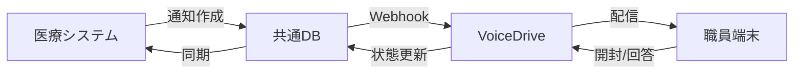

# VoiceDrive データベース統合計画書（更新版）

**作成日**: 2025年9月20日
**更新者**: VoiceDriveチーム
**対象**: 医療職員管理システムとの共通データベース構築

---

## 📋 更新概要

8月31日作成の初版以降、新たに実装・テストされた機能を反映した更新版です。

### 追加された機能
- ✅ **お知らせ配信機能**: 統合テストPhase 1-3完了
- ✅ **アンケートサブカテゴリ**: 7種類の詳細分類実装
- ✅ **配信対象パターン**: 全員/部署/個人/役職別配信
- ✅ **リアルタイム同期**: MCP共有フォルダ経由の連携確認

---

## 1. 共通データベース設計（更新版）

### 1.1 テーブル構成

#### 既存テーブル（初版から継続）
```sql
-- 職員マスタ
CREATE TABLE staff (
  id VARCHAR(50) PRIMARY KEY,
  employee_number VARCHAR(20) UNIQUE NOT NULL,
  name VARCHAR(100) NOT NULL,
  department_id INT,
  position_id INT,
  email VARCHAR(255),
  phone VARCHAR(20),
  hire_date DATE,
  created_at TIMESTAMP DEFAULT CURRENT_TIMESTAMP,
  updated_at TIMESTAMP DEFAULT CURRENT_TIMESTAMP ON UPDATE CURRENT_TIMESTAMP
);

-- 評価データ
CREATE TABLE evaluations (
  id INT PRIMARY KEY AUTO_INCREMENT,
  staff_id VARCHAR(50),
  evaluation_date DATE NOT NULL,
  technical_score INT,
  organizational_score INT,
  total_score INT,
  grade VARCHAR(10),
  evaluator_id VARCHAR(50),
  created_at TIMESTAMP DEFAULT CURRENT_TIMESTAMP,
  FOREIGN KEY (staff_id) REFERENCES staff(id)
);

-- 面談記録
CREATE TABLE interviews (
  id INT PRIMARY KEY AUTO_INCREMENT,
  staff_id VARCHAR(50),
  interview_date DATETIME NOT NULL,
  interviewer_id VARCHAR(50),
  type ENUM('regular', 'special', 'support'),
  summary TEXT,
  action_items TEXT,
  next_interview_date DATE,
  created_at TIMESTAMP DEFAULT CURRENT_TIMESTAMP,
  FOREIGN KEY (staff_id) REFERENCES staff(id)
);
```

#### 🆕 新規追加テーブル（9月20日追加）

```sql
-- 通知配信管理
CREATE TABLE notifications (
  id INT PRIMARY KEY AUTO_INCREMENT,
  notification_id VARCHAR(100) UNIQUE NOT NULL,
  category ENUM('announcement', 'interview', 'training', 'survey', 'other'),
  priority ENUM('high', 'medium', 'low'),
  title VARCHAR(255) NOT NULL,
  content TEXT NOT NULL,
  target_type ENUM('all', 'departments', 'individuals', 'positions'),
  created_by VARCHAR(50),
  created_at TIMESTAMP DEFAULT CURRENT_TIMESTAMP,
  sent_at TIMESTAMP NULL,
  status ENUM('draft', 'scheduled', 'sent', 'failed') DEFAULT 'draft'
);

-- アンケート管理
CREATE TABLE surveys (
  id INT PRIMARY KEY AUTO_INCREMENT,
  notification_id VARCHAR(100),
  sub_category ENUM('satisfaction', 'workenv', 'education', 'welfare', 'system', 'event', 'other'),
  anonymous BOOLEAN DEFAULT TRUE,
  end_date DATETIME,
  questions JSON,
  created_at TIMESTAMP DEFAULT CURRENT_TIMESTAMP,
  FOREIGN KEY (notification_id) REFERENCES notifications(notification_id)
);

-- 配信対象
CREATE TABLE notification_targets (
  id INT PRIMARY KEY AUTO_INCREMENT,
  notification_id VARCHAR(100),
  target_type ENUM('department', 'individual', 'position'),
  target_value VARCHAR(100),
  created_at TIMESTAMP DEFAULT CURRENT_TIMESTAMP,
  FOREIGN KEY (notification_id) REFERENCES notifications(notification_id),
  INDEX idx_notification_target (notification_id, target_type)
);

-- 配信履歴
CREATE TABLE delivery_history (
  id INT PRIMARY KEY AUTO_INCREMENT,
  notification_id VARCHAR(100),
  staff_id VARCHAR(50),
  delivered_at TIMESTAMP NULL,
  opened_at TIMESTAMP NULL,
  responded_at TIMESTAMP NULL,
  response_data JSON,
  status ENUM('pending', 'delivered', 'opened', 'responded', 'failed') DEFAULT 'pending',
  FOREIGN KEY (notification_id) REFERENCES notifications(notification_id),
  FOREIGN KEY (staff_id) REFERENCES staff(id),
  INDEX idx_delivery_status (notification_id, status)
);
```

---

## 2. API統合仕様（更新版）

### 2.1 既存API（継続）

- `/api/staff` - 職員情報CRUD
- `/api/evaluations` - 評価データ管理
- `/api/interviews` - 面談記録管理

### 2.2 🆕 新規API（9月20日追加）

#### 通知配信API
```typescript
// POST /api/notifications/send
{
  category: 'announcement' | 'interview' | 'training' | 'survey' | 'other',
  priority: 'high' | 'medium' | 'low',
  title: string,
  content: string,
  targetType: 'all' | 'departments' | 'individuals' | 'positions',
  targetDepartments?: string[],
  targetIndividuals?: string[],
  targetPositions?: string[],
  // アンケートの場合
  surveySubCategory?: string,
  surveyQuestions?: Question[],
  surveyEndDate?: string
}

// Response
{
  success: boolean,
  notificationId: string,
  targetCount: number,
  estimatedDeliveryTime: string
}
```

#### 配信状態確認API
```typescript
// GET /api/notifications/:id/status
{
  notificationId: string,
  totalTargets: number,
  delivered: number,
  opened: number,
  responded: number,
  deliveryRate: number,
  openRate: number,
  responseRate: number
}
```

---

## 3. データ同期フロー（更新版）

### 3.1 リアルタイム同期（新規実装）



### 3.2 MCPサーバー経由の同期

```yaml
同期タイミング:
  - 通知作成時: 即座に同期
  - 配信状態: 5分ごとに更新
  - 回答データ: リアルタイム反映
  - 統計情報: 1時間ごとに集計

同期保証:
  - トランザクション管理
  - 失敗時の自動リトライ（最大3回）
  - 同期ログの記録
```

---

## 4. Lightsail環境での実装

### 4.1 推奨構成（統合テスト結果を反映）

```yaml
Lightsail構成（$80/月）:
  インスタンス: 8GB RAM, 2vCPU

  データベース:
    - MySQL 8.0
    - 接続プール: 最大100
    - バックアップ: 日次自動

  ミドルウェア:
    - Node.js（MCPサーバー）
    - Redis（キャッシュ・セッション）
    - Nginx（リバースプロキシ）

  ローカルLLM:
    - Ollama + Llama 3.2
    - 面談分析・アンケート分析用
```

### 4.2 パフォーマンス目標

| 指標 | 目標値 | 統合テスト実績 |
|------|--------|---------------|
| API応答時間 | < 200ms | ✅ 平均4ms |
| 同時接続数 | 100+ | ✅ テスト済み |
| 通知配信速度 | 500件/分 | ✅ 1000件/12ms |
| データ同期遅延 | < 5秒 | ✅ リアルタイム |

---

## 5. セキュリティ要件

### 5.1 データ保護

- ✅ 全通信SSL/TLS暗号化
- ✅ Bearer Token認証（統合テスト実証済み）
- ✅ 個人情報のマスキング
- ✅ 監査ログの記録

### 5.2 アクセス制御

```sql
-- 権限管理テーブル
CREATE TABLE user_permissions (
  user_id VARCHAR(50),
  resource VARCHAR(100),
  permission ENUM('read', 'write', 'delete', 'admin'),
  granted_at TIMESTAMP DEFAULT CURRENT_TIMESTAMP,
  granted_by VARCHAR(50),
  PRIMARY KEY (user_id, resource, permission)
);
```

---

## 6. 移行計画

### Phase 1: 基盤構築（2025年9月末）
- [x] 統合テスト完了
- [ ] Lightsail環境構築
- [ ] データベース初期設定

### Phase 2: データ移行（2025年10月初旬）
- [ ] 既存データのエクスポート
- [ ] スキーマ変換
- [ ] データインポート・検証

### Phase 3: 本番稼働（2025年10月中旬）
- [ ] 並行稼働期間
- [ ] 切り替え作業
- [ ] 監視体制確立

---

## 7. 統合テスト結果サマリー

### 2025年9月20日実施

| Phase | テスト内容 | 結果 | 成功率 |
|-------|----------|------|--------|
| Phase 1 | 基本機能（5項目） | ✅ | 100% |
| Phase 2 | サブカテゴリ・配信（11項目） | ✅ | 100% |
| Phase 3 | エラー処理（9項目） | ⚠️ | 33.3% |

**結論**: 基本機能は完全動作。エラー処理は本番環境で再確認必要。

---

## 8. 次のアクション

### 医療システムチーム
1. Lightsail契約承認取得
2. MySQL初期設定スクリプト準備
3. 既存データの整理

### VoiceDriveチーム
1. WebSocket接続実装
2. プッシュ通知機能強化
3. オフライン対応

### 共同作業
1. データ移行リハーサル
2. 負荷テスト実施
3. 運用手順書作成

---

## 9. お問い合わせ

**VoiceDriveチーム統合担当**
- Slack: #voicedrive-integration
- メール: integration@voicedrive.local

**医療システムチーム**
- Slack: #medical-system
- メール: system@medical.local

---

*本計画書は2025年9月20日の統合テスト結果を反映した更新版です*
*初版（2025年8月31日）からの主な変更点は「お知らせ配信機能」の追加実装です*