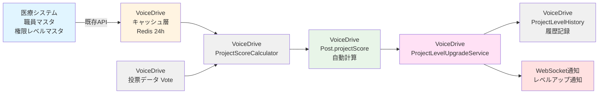

# Idea Tracking (Project Mode) 医療システム確認結果

**文書番号**: MEDICAL-CONFIRM-2025-1019-001
**作成日**: 2025年10月19日
**対象ページ**: Idea Tracking - Project Mode（アイデア追跡 - プロジェクトモード）
**対象レベル**: 全職員（Level 1+）
**参照文書**:
- [IdeaTracking_Implementation_Strategy_20251019.md](./IdeaTracking_Implementation_Strategy_20251019.md)
- [データ管理責任分界点定義書_20251008.md](./データ管理責任分界点定義書_20251008.md)

---

## 📋 エグゼクティブサマリー

### 結論
**医療システムDB設計への影響**: ❌ **追加不要**

VoiceDriveの「Idea Tracking (Project Mode)」ページで必要なデータベース拡張は、**全てVoiceDrive側で管理するプロジェクト追跡データ**であり、医療システム側のDB構築計画への追加は不要です。

### 理由
1. **データ責任分界点の明確化**
   - 医療システム: 職員マスタ、権限レベルマスタ、組織構造マスタ
   - VoiceDrive: プロジェクト投稿、投票データ、スコア計算、レベル履歴

2. **既存APIで対応可能**
   - 医療システムは既存の職員情報API、権限レベルAPIのみ提供
   - VoiceDrive側が独自にプロジェクト追跡テーブルを管理

3. **新規API実装不要**
   - PersonalStationページやProjectPortfolioManagementページと同様、医療システム側の新規API実装は不要

---

## 🎯 機能概要

### Idea Tracking (Project Mode) とは

職員が提案した改善アイデアを、投票エンゲージメントスコアに基づいて**5段階のプロジェクトレベル**で自動昇格させる機能。

#### プロジェクトレベル進行

```
PENDING (0-99点)
    ↓ 100点到達 = プロジェクト承認
TEAM (100-199点)
    ↓ 200点到達
DEPARTMENT (200-399点)
    ↓ 400点到達
FACILITY (400-799点)
    ↓ 800点到達
ORGANIZATION (800点以上)
```

#### スコア計算式

**投票レベル × 権限レベル重み**

投票レベル:
- 強く賛成 (strongly-support): 10点
- 賛成 (support): 5点
- 中立 (neutral): 2点
- 反対 (oppose): 1点
- 強く反対 (strongly-oppose): 0.5点

権限レベル重み:
- Level 1: 1.0x
- Level 6 (主任): 3.2x
- Level 10 (部長): 6.4x
- Level 13 (院長): 8.5x
- Level 18 (理事長): 10.0x

**例**: 院長（Level 13, 8.5x）が「強く賛成」した場合 = 10点 × 8.5 = **85点**

---

## 🗄️ VoiceDrive側で必要なDB拡張

以下の全データは**VoiceDrive側のデータベースで管理**します。

### 1. Postモデル拡張（9フィールド追加）

```prisma
model Post {
  // ... 既存フィールド ...

  projectLevel              String?   @map("project_level")  // ✅ 既に存在

  // 🆕 追加フィールド（9個）
  projectScore              Int?      @default(0) @map("project_score")
  currentProjectLevelStartedAt DateTime? @map("current_project_level_started_at")
  lastProjectLevelUpgrade   DateTime? @map("last_project_level_upgrade")

  // エンゲージメント集計キャッシュ（パフォーマンス最適化）
  totalEngagements          Int       @default(0) @map("total_engagements")
  stronglySupportCount      Int       @default(0) @map("strongly_support_count")
  supportCount              Int       @default(0) @map("support_count")
  neutralCount              Int       @default(0) @map("neutral_count")
  opposeCount               Int       @default(0) @map("oppose_count")
  stronglyOpposeCount       Int       @default(0) @map("strongly_oppose_count")

  // Relations
  projectLevelHistory       ProjectLevelHistory[]

  @@index([projectLevel, projectScore])
  @@map("posts")
}
```

**データソース**: VoiceDrive内での投票データから自動計算

---

### 2. ProjectLevelHistory（新規テーブル）

```prisma
model ProjectLevelHistory {
  id              String    @id @default(cuid())
  postId          String    @map("post_id")

  // レベル変更情報
  fromLevel       String?   @map("from_level")  // PENDING, TEAM, etc.
  toLevel         String    @map("to_level")
  fromScore       Int?      @map("from_score")
  toScore         Int       @map("to_score")

  // トリガー情報
  triggeredBy     String?   @map("triggered_by")  // 'auto' | 'manual'
  triggeringUserId String?  @map("triggering_user_id")  // 昇格のきっかけとなった投票者

  // メタデータ
  upgradedAt      DateTime  @default(now()) @map("upgraded_at")
  notes           String?

  // Relations
  post            Post      @relation(fields: [postId], references: [id], onDelete: Cascade)

  @@index([postId])
  @@index([upgradedAt])
  @@map("project_level_history")
}
```

**データソース**: VoiceDrive内でのスコア更新時に自動記録

**レコード数目安**: 1プロジェクトあたり平均3-5件（レベル昇格回数）

---

## ✅ 医療システム側の対応

### 対応内容: ❌ **新規テーブル追加不要**

**理由**:
1. 全2テーブルはVoiceDrive側のプロジェクト追跡データ
2. 医療システムは職員マスタ、権限レベルマスタの提供のみ
3. データ責任分界点に基づき、プロジェクト追跡データはVoiceDrive側で完結

### 必要なAPI: ✅ **既存APIのみ**

VoiceDriveがスコア計算時に使用する既存API:

#### API-1: 職員情報取得（既存）
```http
GET /api/v2/employees/{employeeId}
Authorization: Bearer {token}
X-API-Key: {api_key}
```

**レスポンス例**:
```json
{
  "data": {
    "employee": {
      "employeeId": "EMP12345",
      "name": "山田太郎",
      "department": "看護部",
      "position": "看護師長",
      "permissionLevel": 8,
      "facility": "小原病院"
    }
  }
}
```

**使用目的**: 投票者の権限レベル取得（スコア重み計算用）

#### API-2: 権限レベルマスタ取得（既存）
```http
GET /api/v2/permission-levels
Authorization: Bearer {token}
X-API-Key: {api_key}
```

**レスポンス例**:
```json
{
  "data": {
    "permissionLevels": [
      { "level": 1, "name": "一般職員", "weight": 1.0 },
      { "level": 6, "name": "主任", "weight": 3.2 },
      { "level": 8, "name": "師長・科長", "weight": 5.0 },
      { "level": 10, "name": "部長", "weight": 6.4 },
      { "level": 13, "name": "院長", "weight": 8.5 },
      { "level": 18, "name": "理事長", "weight": 10.0 }
    ]
  }
}
```

**使用目的**: 権限レベルごとの投票重み取得

---

## 🔧 VoiceDrive側の実装推奨事項

### 1. 閾値統一化（最優先）

**問題**: 現在、ProjectScoring.tsとUIコンポーネントで閾値が異なる

- **ProjectScoring.ts**: 50/100/300/600
- **UIコンポーネント**: 100/200/400/800

**解決策**: 統一設定ファイルの作成

```typescript
// src/config/projectThresholds.ts (新規作成)
export const PROJECT_THRESHOLDS = {
  TEAM: 100,
  DEPARTMENT: 200,
  FACILITY: 400,
  ORGANIZATION: 800
} as const;

export type ProjectLevel = 'PENDING' | 'TEAM' | 'DEPARTMENT' | 'FACILITY' | 'ORGANIZATION';

export const getProjectLevelFromScore = (score: number): ProjectLevel => {
  if (score >= PROJECT_THRESHOLDS.ORGANIZATION) return 'ORGANIZATION';
  if (score >= PROJECT_THRESHOLDS.FACILITY) return 'FACILITY';
  if (score >= PROJECT_THRESHOLDS.DEPARTMENT) return 'DEPARTMENT';
  if (score >= PROJECT_THRESHOLDS.TEAM) return 'TEAM';
  return 'PENDING';
};
```

---

### 2. 自動レベルアップグレードサービス

```typescript
// src/services/ProjectLevelUpgradeService.ts (新規作成)
import { prisma } from '@/lib/prisma';
import { PROJECT_THRESHOLDS, getProjectLevelFromScore } from '@/config/projectThresholds';
import { WebSocketService } from './WebSocketService';

export class ProjectLevelUpgradeService {
  /**
   * 投票後のスコア再計算とレベルアップグレード判定
   */
  async checkAndUpgradeLevel(postId: string, triggeringUserId: string) {
    // 1. 現在のスコアとレベルを取得
    const post = await prisma.post.findUnique({
      where: { id: postId },
      select: {
        projectScore: true,
        projectLevel: true,
        authorId: true
      }
    });

    if (!post) return;

    const currentScore = post.projectScore || 0;
    const currentLevel = post.projectLevel || 'PENDING';
    const newLevel = getProjectLevelFromScore(currentScore);

    // 2. レベルアップが必要か判定
    if (newLevel === currentLevel) {
      return; // レベル変更なし
    }

    // 3. トランザクションでPost更新とProjectLevelHistory作成
    await prisma.$transaction(async (tx) => {
      // Post更新
      await tx.post.update({
        where: { id: postId },
        data: {
          projectLevel: newLevel,
          lastProjectLevelUpgrade: new Date(),
          currentProjectLevelStartedAt: new Date()
        }
      });

      // ProjectLevelHistory作成
      await tx.projectLevelHistory.create({
        data: {
          postId,
          fromLevel: currentLevel,
          toLevel: newLevel,
          fromScore: currentScore,
          toScore: currentScore,
          triggeredBy: 'auto',
          triggeringUserId,
          upgradedAt: new Date(),
          notes: `自動昇格: ${currentLevel} → ${newLevel} (${currentScore}点)`
        }
      });
    });

    // 4. WebSocket通知送信
    await WebSocketService.notifyLevelUpgrade({
      postId,
      authorId: post.authorId,
      fromLevel: currentLevel,
      toLevel: newLevel,
      score: currentScore
    });

    console.log(`[ProjectLevelUpgrade] postId=${postId}, ${currentLevel} → ${newLevel}, score=${currentScore}`);
  }
}
```

---

### 3. スコア計算サービス（医療システムAPI連携）

```typescript
// src/services/ProjectScoreCalculator.ts (既存ファイル修正)
import { PROJECT_THRESHOLDS } from '@/config/projectThresholds';

export class ProjectScoreCalculator {
  /**
   * 医療システムAPIから権限レベル重みを取得（キャッシュ付き）
   */
  private async getPermissionLevelWeight(employeeId: string): Promise<number> {
    // Redis 24時間キャッシュ
    const cacheKey = `permission:${employeeId}:weight`;
    const cached = await redis.get(cacheKey);

    if (cached) {
      return parseFloat(cached);
    }

    // 医療システムAPIから取得
    const response = await fetch(`${process.env.MEDICAL_API_URL}/api/v2/employees/${employeeId}`, {
      headers: {
        'Authorization': `Bearer ${process.env.MEDICAL_API_TOKEN}`,
        'X-API-Key': process.env.MEDICAL_API_KEY
      }
    });

    const data = await response.json();
    const permissionLevel = data.data.employee.permissionLevel;

    // 権限レベル重みマスタから取得
    const weightResponse = await fetch(`${process.env.MEDICAL_API_URL}/api/v2/permission-levels`, {
      headers: {
        'Authorization': `Bearer ${process.env.MEDICAL_API_TOKEN}`,
        'X-API-Key': process.env.MEDICAL_API_KEY
      }
    });

    const weightData = await weightResponse.json();
    const levelInfo = weightData.data.permissionLevels.find(
      (l: any) => l.level === permissionLevel
    );

    const weight = levelInfo?.weight || 1.0;

    // 24時間キャッシュ
    await redis.setex(cacheKey, 86400, weight.toString());

    return weight;
  }

  /**
   * プロジェクトスコア再計算
   */
  async recalculateProjectScore(postId: string): Promise<number> {
    // 投票データ取得
    const votes = await prisma.vote.findMany({
      where: { postId },
      select: {
        voteLevel: true,  // strongly-support, support, neutral, oppose, strongly-oppose
        userId: true
      }
    });

    // 投票レベルごとの基礎点
    const VOTE_POINTS = {
      'strongly-support': 10,
      'support': 5,
      'neutral': 2,
      'oppose': 1,
      'strongly-oppose': 0.5
    };

    // スコア計算
    let totalScore = 0;
    const engagementCounts = {
      stronglySupport: 0,
      support: 0,
      neutral: 0,
      oppose: 0,
      stronglyOppose: 0
    };

    for (const vote of votes) {
      const basePoints = VOTE_POINTS[vote.voteLevel] || 0;
      const weight = await this.getPermissionLevelWeight(vote.userId);
      totalScore += basePoints * weight;

      // エンゲージメントカウント
      if (vote.voteLevel === 'strongly-support') engagementCounts.stronglySupport++;
      else if (vote.voteLevel === 'support') engagementCounts.support++;
      else if (vote.voteLevel === 'neutral') engagementCounts.neutral++;
      else if (vote.voteLevel === 'oppose') engagementCounts.oppose++;
      else if (vote.voteLevel === 'strongly-oppose') engagementCounts.stronglyOppose++;
    }

    // Post更新（スコアとエンゲージメントカウント）
    await prisma.post.update({
      where: { id: postId },
      data: {
        projectScore: Math.round(totalScore),
        totalEngagements: votes.length,
        stronglySupportCount: engagementCounts.stronglySupport,
        supportCount: engagementCounts.support,
        neutralCount: engagementCounts.neutral,
        opposeCount: engagementCounts.oppose,
        stronglyOpposeCount: engagementCounts.stronglyOppose
      }
    });

    return Math.round(totalScore);
  }
}
```

---

### 4. 必要なAPI実装（4エンドポイント）

#### API-1: ユーザーのアイデア一覧取得
```typescript
// GET /api/my/ideas
// プロジェクトスコア付きで自分のアイデアを取得
```

#### API-2: プロジェクトレベル履歴取得
```typescript
// GET /api/posts/:postId/project-level-history
// レベル昇格履歴を取得
```

#### API-3: プロジェクトスコア再計算（管理者用）
```typescript
// POST /api/posts/:postId/recalculate-project-score
// スコアを手動で再計算
```

#### API-4: プロジェクト承認（管理者用）
```typescript
// POST /api/projects/:postId/approve
// 特定レベルでプロジェクトを承認
```

---

## 📊 データフロー図



**データフロー説明**:
1. 医療システムは職員マスタ、権限レベルマスタAPIのみ提供（Single Source of Truth）
2. VoiceDriveは権限レベル重みを24時間キャッシュ（Redis）
3. 投票時にProjectScoreCalculatorがスコアを計算
4. ProjectLevelUpgradeServiceがレベルアップを判定・実行
5. ProjectLevelHistoryに履歴を記録
6. WebSocketでリアルタイム通知

---

## 🎯 DB構築計画書への影響

### 結論: ❌ **影響なし**

**理由**:
1. 医療システム側の新規テーブル追加不要
2. 既存APIのみで対応可能
3. VoiceDrive側で独自にテーブル管理

### DB構築計画書前準備への追記内容

**追加セクション案**:

```markdown
## Section 32: VoiceDrive Idea Tracking (Project Mode)（アイデア追跡プロジェクトモード）連携

### 概要
VoiceDriveのIdea Tracking機能にProject Modeを追加。
5段階レベル進行（PENDING→TEAM→DEPARTMENT→FACILITY→ORGANIZATION）。
スコア閾値: 100/200/400/800点。

### 医療システムDB設計への影響
❌ **追加不要**

### 必要なAPI
✅ **既存APIのみ**
- `GET /api/v2/employees/{employeeId}` - 職員情報取得（権限レベル）
- `GET /api/v2/permission-levels` - 権限レベルマスタ取得（投票重み）

### データ責任分界点
- **医療システム**: 職員マスタ、権限レベルマスタ（Single Source of Truth）
- **VoiceDrive**: プロジェクト投稿、投票データ、スコア計算、レベル履歴

### VoiceDrive側で管理するテーブル（2件）
1. **Post拡張** - projectScore, エンゲージメントカウント（9フィールド追加）
2. **ProjectLevelHistory** - レベル昇格履歴（新規テーブル）

### キャッシュ戦略
- Redis 24時間キャッシュ（権限レベル重み）
- リアルタイムスコア計算（投票時トリガー）

### 実装期間
Phase 1-5: 22日間（VoiceDrive側のみ）

### 実装コスト
- 医療システム: ¥0
- VoiceDrive: 内部リソースのみ

### 参照ドキュメント
- idea-tracking-project-mode_医療システム確認結果_20251019.md
- IdeaTracking_Implementation_Strategy_20251019.md
```

---

## 📋 VoiceDriveチームへの実装ガイダンス

### Phase 1: データベーススキーマ拡張（1-2日）

**目標**: Prismaスキーマ更新とマイグレーション完了

**実装項目**:
1. `prisma/schema.prisma`にPost拡張フィールド追加
2. ProjectLevelHistoryテーブル追加
3. マイグレーション生成・実行
4. Prisma Client再生成

**完了基準**:
- ✅ `npx prisma migrate dev`成功
- ✅ `npx prisma generate`成功
- ✅ 開発環境DBに新フィールド・テーブル追加完了

---

### Phase 2: 設定統一化（1日）

**目標**: 閾値の不一致を解消

**実装項目**:
1. `src/config/projectThresholds.ts`作成
2. ProjectScoring.ts修正（統一設定使用）
3. UIコンポーネント修正（統一設定使用）
4. 単体テスト追加

**完了基準**:
- ✅ ProjectScoring.ts、UIコンポーネントで同一閾値使用
- ✅ 単体テスト成功

---

### Phase 3: API実装（4-10日）

**目標**: 4つのAPIエンドポイント実装

**実装項目**:
1. `GET /api/my/ideas` - アイデア一覧取得
2. `GET /api/posts/:postId/project-level-history` - 履歴取得
3. `POST /api/posts/:postId/recalculate-project-score` - スコア再計算
4. `POST /api/projects/:postId/approve` - プロジェクト承認

**完了基準**:
- ✅ 4エンドポイント全て実装完了
- ✅ APIテスト成功（Postman/Jest）
- ✅ 医療システムAPI連携テスト成功

---

### Phase 4: 自動処理実装（5日）

**目標**: 投票時の自動スコア計算・レベルアップ

**実装項目**:
1. ProjectScoreCalculator実装
2. ProjectLevelUpgradeService実装
3. 投票API修正（スコア計算トリガー追加）
4. WebSocket通知実装
5. 統合テスト

**完了基準**:
- ✅ 投票時に自動スコア計算
- ✅ スコア閾値到達時に自動レベルアップ
- ✅ ProjectLevelHistory自動記録
- ✅ WebSocket通知送信成功

---

### Phase 5: フロントエンド統合（7日）

**目標**: IdeaVoiceTrackingPageのデモデータ削除、実データ連携

**実装項目**:
1. ダミーデータ削除
2. 実APIエンドポイント接続
3. リアルタイムスコア表示
4. レベルアップアニメーション
5. 履歴表示機能

**完了基準**:
- ✅ ダミーデータ完全削除
- ✅ 実データでページ正常動作
- ✅ レベルアップ通知動作
- ✅ E2Eテスト成功

---

## 📞 医療システムチームへのお願い

### 必要な確認事項

1. **既存API動作確認**
   - ✅ `GET /api/v2/employees/{employeeId}` で `permissionLevel` フィールドが返却されるか確認
   - ✅ `GET /api/v2/permission-levels` の動作確認（権限レベルマスタ）

2. **APIレート制限の確認**
   - VoiceDrive側で投票時に職員情報API呼び出し（24時間キャッシュ付き）
   - 1日あたり最大500-1,000リクエスト程度を想定
   - レート制限の設定確認をお願いします

3. **権限レベルマスタのデータ形式確認**
   - `GET /api/v2/permission-levels` のレスポンスに `weight` フィールドが含まれるか確認
   - 含まれない場合、VoiceDrive側でハードコード対応

### 必要なドキュメント

1. **権限レベルマスタの完全なデータ一覧**
   - Level 1-18の全権限レベルと投票重み
   - 例: Level 1=1.0x, Level 6=3.2x, Level 13=8.5x, Level 18=10.0x

2. **APIレート制限の仕様書**

3. **API認証トークンの発行手順**（VoiceDriveチーム向け）

---

## ✅ 最終確認チェックリスト

### 医療システム側
- [x] 新規テーブル追加: **不要**
- [x] 新規API実装: **不要**
- [ ] 既存API動作確認: `GET /api/v2/employees/{employeeId}`
- [ ] 既存API動作確認: `GET /api/v2/permission-levels`
- [ ] APIレート制限確認
- [ ] 権限レベルマスタデータ提供
- [ ] API認証トークン発行（VoiceDriveチーム向け）

### VoiceDrive側
- [ ] Postモデル拡張（9フィールド追加）
- [ ] ProjectLevelHistoryテーブル追加
- [ ] マイグレーション実行
- [ ] 閾値統一化（projectThresholds.ts作成）
- [ ] ProjectScoreCalculator実装
- [ ] ProjectLevelUpgradeService実装
- [ ] 医療システムAPI連携実装
- [ ] Redisキャッシュ設定
- [ ] 4つのAPIエンドポイント実装
- [ ] WebSocket通知実装
- [ ] IdeaVoiceTrackingPageの実データ連携

---

## 🔗 関連ドキュメント

- [IdeaTracking_Implementation_Strategy_20251019.md](./IdeaTracking_Implementation_Strategy_20251019.md)
- [データ管理責任分界点定義書_20251008.md](./データ管理責任分界点定義書_20251008.md)
- [PersonalStation暫定マスターリスト_20251008.md](./PersonalStation暫定マスターリスト_20251008.md)
- [project-portfolio-management_医療システム確認結果_20251013.md](./project-portfolio-management_医療システム確認結果_20251013.md)

---

**文書終了**

最終更新: 2025年10月19日
バージョン: 1.0
次回レビュー: DB構築開始時
