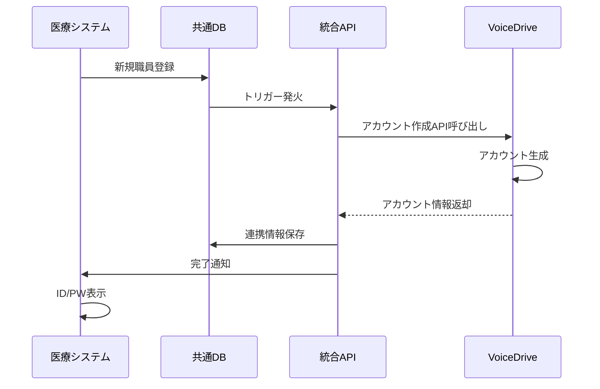
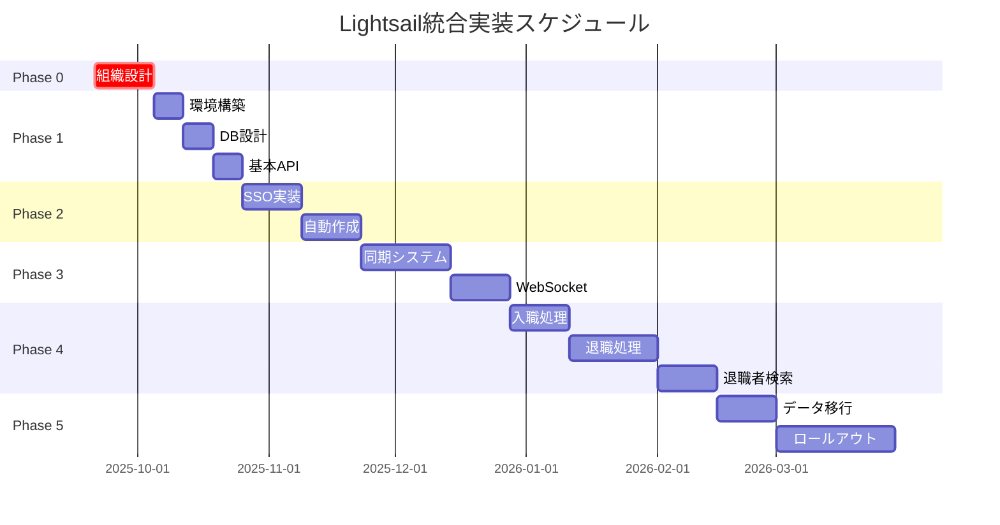

# AWS Lightsail統合実装マスタープラン

**文書番号**: MP-2025-0920-001
**作成日**: 2025年9月20日
**作成者**: 医療システムチーム
**宛先**: VoiceDriveチーム
**重要度**: 🔴 最重要

---

## エグゼクティブサマリー

医療職員管理システムとVoiceDriveシステムのAWS Lightsail環境での統合実装計画書です。
**Phase 0（組織設計）を最優先事項**として、5つのフェーズで段階的に実装を進めます。

### 🎯 核心目標
- **職員登録時の自動VoiceDriveアカウント作成**
- **SSO（シングルサインオン）による完全統合**
- **リアルタイム双方向データ同期**
- **統合レポート・分析機能**

---

## Phase 0: 組織設計【最優先】🔴

### 実施期間: 即座開始～2週間

### 0.1 医療法人厚生会組織構造の確定

```
医療法人厚生会
├── 本部
│   ├── 理事長
│   ├── 専務理事
│   └── 常務理事
├── 施設
│   ├── 厚生病院（300床）
│   ├── 厚生クリニック（3拠点）
│   ├── 介護老人保健施設（100床）
│   └── 訪問看護ステーション（2拠点）
└── 部門
    ├── 医療部門
    ├── 看護部門
    ├── 医療技術部門
    ├── 事務部門
    └── 施設管理部門
```

### 0.2 権限階層設計

| レベル | 役職 | 権限範囲 | システムロール |
|--------|------|----------|----------------|
| L1 | 幹部 | 全施設・全データ | EXECUTIVE |
| L2 | 部門長 | 部門内全データ | DEPARTMENT_HEAD |
| L3 | チームリーダー | チーム内データ | TEAM_LEADER |
| L4 | 一般職員 | 自己データのみ | STAFF |

### 0.3 データアクセスマトリックス

```sql
-- 権限マスタテーブル
CREATE TABLE permission_matrix (
    role_id VARCHAR(20) PRIMARY KEY,
    can_view_all_staff BOOLEAN DEFAULT FALSE,
    can_edit_all_staff BOOLEAN DEFAULT FALSE,
    can_view_department BOOLEAN DEFAULT FALSE,
    can_approve_interviews BOOLEAN DEFAULT FALSE,
    can_access_reports BOOLEAN DEFAULT FALSE
);
```

---

## Phase 1: 基盤構築

### 実施期間: 3週間（Phase 0完了後）

### 1.1 AWS Lightsail環境構築

#### インスタンス構成
```yaml
Production Environment:
  Instance:
    - Type: 4GB RAM, 2 vCPU, 80GB SSD
    - OS: Ubuntu 22.04 LTS
    - Cost: $40/month

  Database:
    - Type: Managed MySQL 8.0
    - Size: 1GB RAM, 40GB Storage
    - Cost: $30/month

  Storage:
    - Type: Object Storage
    - Size: 100GB
    - Cost: $10/month

  Total: $80/month
```

### 1.2 MySQL共通データベース設計

```sql
-- 共通データベース: lightsail_integrated_db

-- 1. 統合職員マスタ
CREATE TABLE unified_staff_master (
    staff_id VARCHAR(20) PRIMARY KEY,
    employee_number VARCHAR(10) UNIQUE NOT NULL,
    full_name VARCHAR(100) NOT NULL,
    facility_id VARCHAR(20),
    department_id VARCHAR(20),
    position_id VARCHAR(20),
    email VARCHAR(100) UNIQUE,
    medical_system_id VARCHAR(50),
    voicedrive_id VARCHAR(50),
    created_at TIMESTAMP DEFAULT CURRENT_TIMESTAMP,
    updated_at TIMESTAMP DEFAULT CURRENT_TIMESTAMP ON UPDATE CURRENT_TIMESTAMP,
    sync_status ENUM('synced', 'pending', 'error') DEFAULT 'pending',
    INDEX idx_facility (facility_id),
    INDEX idx_department (department_id),
    INDEX idx_sync_status (sync_status)
);

-- 2. アカウント連携テーブル
CREATE TABLE account_integration (
    integration_id INT AUTO_INCREMENT PRIMARY KEY,
    staff_id VARCHAR(20) NOT NULL,
    medical_username VARCHAR(50),
    voicedrive_username VARCHAR(50),
    sso_token VARCHAR(500),
    token_expires_at TIMESTAMP,
    auto_created BOOLEAN DEFAULT FALSE,
    created_at TIMESTAMP DEFAULT CURRENT_TIMESTAMP,
    FOREIGN KEY (staff_id) REFERENCES unified_staff_master(staff_id),
    INDEX idx_staff (staff_id),
    INDEX idx_token_expiry (token_expires_at)
);

-- 3. 同期ログテーブル
CREATE TABLE sync_log (
    log_id BIGINT AUTO_INCREMENT PRIMARY KEY,
    sync_type ENUM('staff', 'interview', 'notification', 'report') NOT NULL,
    source_system ENUM('medical', 'voicedrive') NOT NULL,
    target_system ENUM('medical', 'voicedrive') NOT NULL,
    record_count INT DEFAULT 0,
    status ENUM('success', 'partial', 'failed') NOT NULL,
    error_message TEXT,
    started_at TIMESTAMP DEFAULT CURRENT_TIMESTAMP,
    completed_at TIMESTAMP,
    INDEX idx_sync_type (sync_type),
    INDEX idx_status (status),
    INDEX idx_started (started_at)
);
```

---

## Phase 2: 認証システム統合

### 実施期間: 4週間

### 2.1 JWT基盤SSO実装

```typescript
// JWT Token Structure
interface JWTPayload {
    staffId: string;
    employeeNumber: string;
    systemAccess: {
        medical: boolean;
        voicedrive: boolean;
    };
    permissions: string[];
    facilityId: string;
    departmentId: string;
    role: 'EXECUTIVE' | 'DEPARTMENT_HEAD' | 'TEAM_LEADER' | 'STAFF';
    iat: number;
    exp: number;
}
```

### 2.2 自動アカウント作成フロー



### 2.3 自動作成API仕様

```typescript
// POST /api/v1/auto-create-account
interface AutoCreateRequest {
    staffId: string;
    employeeNumber: string;
    fullName: string;
    email: string;
    facility: {
        id: string;
        name: string;
    };
    department: {
        id: string;
        name: string;
    };
    position: {
        id: string;
        name: string;
        level: number;
    };
}

interface AutoCreateResponse {
    success: boolean;
    voicedriveAccount: {
        userId: string;
        username: string;
        initialPassword: string;
        loginUrl: string;
    };
    integrationId: string;
    message: string;
}
```

---

## Phase 3: データ連携実装

### 実施期間: 5週間

### 3.1 リアルタイム同期システム

#### 同期対象データ
1. **職員マスタ情報**（双方向）
2. **面談予約・記録**（VoiceDrive→医療）
3. **通知配信**（医療→VoiceDrive）
4. **評価データ**（双方向）

### 3.2 WebSocket通信実装

```javascript
// WebSocket Server Configuration
const wsConfig = {
    medical: 'wss://medical.lightsail.aws:8001',
    voicedrive: 'wss://voicedrive.lightsail.aws:8002',
    heartbeat: 30000, // 30秒
    reconnectDelay: 5000 // 5秒
};

// イベント定義
const SYNC_EVENTS = {
    STAFF_CREATED: 'staff.created',
    STAFF_UPDATED: 'staff.updated',
    INTERVIEW_SCHEDULED: 'interview.scheduled',
    NOTIFICATION_SENT: 'notification.sent',
    EVALUATION_COMPLETED: 'evaluation.completed'
};
```

### 3.3 データ変換マッピング

```typescript
// 医療→VoiceDrive変換
const medicalToVoicedriveMapper = {
    category: {
        'announcement': 'NOTIFICATION',
        'interview': 'MEETING',
        'training': 'EDUCATION',
        'survey': 'SURVEY',
        'other': 'OTHER'
    },
    priority: {
        'high': 'URGENT',
        'medium': 'NORMAL',
        'low': 'LOW'
    }
};
```

---

## Phase 4: 職員ライフサイクル管理（入職・退職処理）

### 実施期間: 8週間

### 4.1 入職処理の完成

#### 4.1.1 職員登録API実装
```typescript
// POST /api/v1/staff/onboarding
interface OnboardingRequest {
    staffInfo: {
        employeeNumber: string;
        lastName: string;
        firstName: string;
        email: string;
        phone: string;
        birthDate: string;
        hireDate: string;
    };
    assignment: {
        facilityId: string;
        departmentId: string;
        positionId: string;
        employmentType: 'full_time' | 'part_time' | 'contract';
    };
    voicedriveConfig: {
        autoCreateAccount: boolean;
        sendWelcomeEmail: boolean;
        initialTrainingModules: string[];
    };
}

interface OnboardingResponse {
    staffId: string;
    medicalSystemRegistered: boolean;
    voicedriveAccount: {
        created: boolean;
        userId: string;
        username: string;
        initialPassword: string;
        loginUrl: string;
    };
    scheduledInterviews: {
        newEmployeeMonthly: string; // ISO date
    };
    status: 'completed' | 'partial' | 'failed';
}
```

#### 4.1.2 VoiceDriveアカウント自動作成連携
- 職員登録と同時にVoiceDriveアカウントを自動作成
- 権限レベル（accountLevel）の自動計算
- 初回ログイン案内メールの自動送信
- 新入職員月次面談の自動スケジュール設定

#### 4.1.3 入職時のUI実装
- 職員管理ページに「新規入職」ボタン配置
- 入職情報入力フォーム（基本情報・所属・VoiceDrive設定）
- 確認画面・完了画面
- 登録完了通知（本人・上長・人事）

### 4.2 退職処理の実装

#### 4.2.1 退職処理API実装
```typescript
// POST /api/v1/staff/resignation
interface ResignationRequest {
    staffId: string;
    resignationDate: string;
    lastWorkingDate: string;
    resignationReason: 'personal' | 'career_change' | 'relocation' |
                       'health' | 'family' | 'retirement' | 'contract_end' |
                       'disciplinary' | 'company_initiated' | 'other';
    reasonDetail?: string;
    exitInterview: {
        required: boolean;
        scheduledDate?: string;
        skipReason?: string;
        approvedBy?: string;
    };
    voicedriveConfig: {
        deactivationDate: string;
        dataRetentionPeriod: number; // 年数
        archiveData: boolean;
    };
}

interface ResignationResponse {
    staffId: string;
    employmentStatus: 'resigned';
    medicalSystemUpdated: boolean;
    voicedriveAccount: {
        scheduled_deactivation: string;
        status: 'active' | 'pending_deactivation';
    };
    exitInterview?: {
        scheduled: boolean;
        interviewId?: string;
    };
    status: 'completed' | 'pending_approval' | 'failed';
}
```

#### 4.2.2 VoiceDriveアカウント無効化連携
```typescript
// POST /api/v1/voicedrive/accounts/deactivate
interface DeactivateAccountRequest {
    staffId: string;
    deactivationDate: string;
    reason: 'resignation' | 'disciplinary' | 'contract_end';
    immediateDeactivation: boolean;
    dataRetentionConfig: {
        retainFor: number; // 年数
        scheduleArchive: string; // ISO date
        scheduleDeletion: string; // ISO date
    };
}

interface DeactivateAccountResponse {
    accountStatus: 'deactivated' | 'scheduled_deactivation';
    dataRetentionSchedule: {
        archiveDate: string;
        anonymizeDate: string;
        deletionDate: string;
    };
    archiveCompleted: boolean;
}
```

#### 4.2.3 退職処理のフロー分岐

**通常退職（面談実施）**
```
退職申し出 → 退職面談予約 → 面談実施 → 退職手続き → 最終勤務日 → アカウント無効化
```

**緊急退職（面談なし）**
```
退職申し出 → 上長承認 → 即時退職手続き → アカウント無効化
```

**懲戒退職（面談なし）**
```
懲戒処分決定 → 即時退職処理 → 即時アカウント無効化
```

#### 4.2.4 退職者データ管理（staff_basicテーブル拡張）
```sql
-- 退職関連フィールド追加
ALTER TABLE staff_basic ADD COLUMN employment_status
    ENUM('active', 'resigned', 'on_leave', 'suspended')
    DEFAULT 'active';

ALTER TABLE staff_basic ADD COLUMN resignation_date DATE NULL;
ALTER TABLE staff_basic ADD COLUMN resignation_reason VARCHAR(50) NULL;
ALTER TABLE staff_basic ADD COLUMN resignation_reason_detail TEXT NULL;
ALTER TABLE staff_basic ADD COLUMN last_working_date DATE NULL;
ALTER TABLE staff_basic ADD COLUMN resignation_notice_date DATE NULL;

ALTER TABLE staff_basic ADD COLUMN exit_interview_applicable BOOLEAN DEFAULT TRUE;
ALTER TABLE staff_basic ADD COLUMN exit_interview_completed BOOLEAN DEFAULT FALSE;
ALTER TABLE staff_basic ADD COLUMN exit_interview_id INT NULL;
ALTER TABLE staff_basic ADD COLUMN exit_interview_skipped_reason VARCHAR(100) NULL;
ALTER TABLE staff_basic ADD COLUMN exit_interview_waived_by INT NULL;

ALTER TABLE staff_basic ADD COLUMN rehire_eligible BOOLEAN DEFAULT TRUE;
ALTER TABLE staff_basic ADD COLUMN rehire_notes TEXT NULL;

-- 退職者検索用インデックス
CREATE INDEX idx_employment_status ON staff_basic(employment_status);
CREATE INDEX idx_resignation_date ON staff_basic(resignation_date);
```

#### 4.2.5 退職時のUI実装
- 職員カルテページに「退職手続き」メニュー追加
- 職員管理ページに「退職処理」ボタン追加
- 退職情報入力フォーム
- 面談要否の選択
- 承認フロー（直属上長 → 人事部長）
- 業務引継ぎチェックリスト自動生成

### 4.3 採用管理ページでの退職者検索機能

#### 4.3.1 退職者検索の目的
- **再応募時の迅速な把握**: 退職者が再度応募した際に過去の勤務履歴を即座に確認
- **アルムナイ採用支援**: 退職者データベースから優秀な元職員を探して再雇用を打診
- **重複応募防止**: 現職員・退職者との重複をチェック

#### 4.3.2 TalentSearchPanelの拡張
```typescript
// src/components/recruitment/TalentSearchPanel.tsx

interface ExtendedSearchQuery extends TalentSearchQuery {
    // 既存の検索条件に追加
    includeResignedStaff?: boolean;  // 退職者を含める
    resignedDateRange?: {
        from: string;
        to: string;
    };
    rehireEligibleOnly?: boolean;    // 再雇用可能者のみ
}

// 検索結果の表示
interface SearchResultWithEmploymentHistory {
    talent: TalentProfile;
    previousEmployment?: {
        staffId: string;
        employeeNumber: string;
        hireDate: string;
        resignationDate: string;
        resignationReason: string;
        lastPosition: string;
        lastDepartment: string;
        lastFacility: string;
        evaluationHistory: {
            average: number;
            highest: string;
            latest: string;
        };
        exitInterviewSummary?: string;
        rehireEligible: boolean;
        rehireNotes?: string;
    };
}
```

#### 4.3.3 UI実装（採用管理ページ）
```typescript
// src/app/recruitment/page.tsx - 検索タブ

<TalentSearchPanel>
  <SearchFilters>
    {/* 既存のフィルタ */}
    <StatusFilter />
    <DepartmentFilter />

    {/* 新規追加: 退職者検索オプション */}
    <Card className="border-purple-200 bg-purple-50">
      <CardHeader>
        <CardTitle className="text-sm flex items-center">
          <History className="h-4 w-4 mr-2" />
          退職者データベース検索
        </CardTitle>
      </CardHeader>
      <CardContent>
        <Checkbox
          id="includeResigned"
          checked={includeResignedStaff}
          onCheckedChange={setIncludeResignedStaff}
          label="退職者を含めて検索"
        />

        {includeResignedStaff && (
          <>
            <DateRangePicker
              label="退職日の範囲"
              from={resignedDateRange.from}
              to={resignedDateRange.to}
              onChange={setResignedDateRange}
            />

            <Checkbox
              id="rehireEligible"
              checked={rehireEligibleOnly}
              onCheckedChange={setRehireEligibleOnly}
              label="再雇用可能者のみ"
            />
          </>
        )}
      </CardContent>
    </Card>
  </SearchFilters>

  {/* 検索結果 */}
  <SearchResults>
    {results.map(result => (
      <ResultCard key={result.talent.id}>
        <Badge variant={result.previousEmployment ? 'secondary' : 'default'}>
          {result.previousEmployment ? '元職員（再応募）' : '新規'}
        </Badge>

        {result.previousEmployment && (
          <Alert className="mt-2 border-blue-200 bg-blue-50">
            <AlertCircle className="h-4 w-4 text-blue-600" />
            <AlertDescription className="text-sm text-blue-800">
              <strong>過去の勤務履歴あり</strong>
              <ul className="mt-2 space-y-1">
                <li>在職期間: {result.previousEmployment.hireDate} 〜 {result.previousEmployment.resignationDate}</li>
                <li>最終所属: {result.previousEmployment.lastFacility} / {result.previousEmployment.lastDepartment}</li>
                <li>最終職位: {result.previousEmployment.lastPosition}</li>
                <li>平均評価: {result.previousEmployment.evaluationHistory.average}/5.0</li>
                <li>退職理由: {result.previousEmployment.resignationReason}</li>
                {result.previousEmployment.rehireEligible ? (
                  <li className="text-green-700">✓ 再雇用推奨</li>
                ) : (
                  <li className="text-red-700">✗ 再雇用非推奨</li>
                )}
              </ul>
            </AlertDescription>
          </Alert>
        )}
      </ResultCard>
    ))}
  </SearchResults>
</TalentSearchPanel>
```

#### 4.3.4 API実装（退職者検索）
```typescript
// GET /api/v1/recruitment/search-with-history

interface SearchWithHistoryRequest {
    query: ExtendedSearchQuery;
}

interface SearchWithHistoryResponse {
    results: SearchResultWithEmploymentHistory[];
    summary: {
        total: number;
        newApplicants: number;
        reapplicants: number;
        rehireEligible: number;
    };
}
```

### 4.4 アカウントライフサイクル自動管理

```typescript
// データ保持・削除スケジュール
interface DataLifecyclePolicy {
    staffId: string;
    currentStatus: 'active' | 'resigned' | 'archived' | 'deleted';

    schedule: {
        immediate: {  // 最終勤務日
            action: 'deactivate_voicedrive_account';
            items: ['ログイン機能', '投稿機能', 'メッセージ送信'];
        };
        after30days: {
            action: 'archive_voicedrive_content';
            items: ['過去の投稿', 'コメント', 'いいね'];
        };
        after1year: {
            action: 'anonymize_personal_data';
            items: ['連絡先情報', '個人識別情報'];
        };
        after5years: {
            action: 'complete_deletion';
            items: ['全データ物理削除（法定保存期間終了後）'];
        };
    };
}
```

### 4.5 実装優先度

| 優先度 | 実装項目 | 所要期間 | 依存関係 |
|--------|---------|---------|---------|
| 🔴 高 | 入職処理API実装 | 2週間 | Phase 1完了 |
| 🔴 高 | VoiceDriveアカウント作成API連携 | 2週間 | 入職処理API |
| 🟡 中 | 退職処理API実装 | 3週間 | Phase 1完了 |
| 🟡 中 | VoiceDriveアカウント無効化API連携 | 2週間 | 退職処理API |
| 🟢 低 | 採用管理ページ退職者検索機能 | 2週間 | 退職処理API |
| 🟢 低 | データライフサイクル自動管理 | 3週間 | 全API完成 |

---

## Phase 5: 本番移行

### 実施期間: 6週間

### 5.1 データ移行計画

| ステップ | 対象データ | データ量 | 所要時間 |
|---------|-----------|---------|----------|
| 1 | 施設・部門マスタ | 50件 | 30分 |
| 2 | 職員マスタ | 500件 | 2時間 |
| 3 | 退職者データ | 150件 | 1時間 |
| 4 | 面談記録 | 10,000件 | 6時間 |
| 5 | 通知履歴 | 5,000件 | 3時間 |
| 6 | 評価データ | 2,000件 | 2時間 |

### 5.2 段階的ロールアウト

```yaml
Week 1-2:
  - 本部スタッフ（10名）
  - 全機能テスト
  - 入職・退職フロー実証

Week 3-4:
  - 事務部門（50名）
  - 負荷テスト
  - 退職者検索機能テスト

Week 5-6:
  - 医療部門（200名）
  - パフォーマンス調整

Week 7-8:
  - 全職員（500名）
  - 完全移行
```

### 5.3 バックアップ・リカバリ計画

```bash
# 自動バックアップスケジュール
0 2 * * * /backup/daily-backup.sh      # 毎日2:00
0 3 * * 0 /backup/weekly-backup.sh     # 毎週日曜3:00
0 4 1 * * /backup/monthly-backup.sh    # 毎月1日4:00

# リカバリ時間目標
RTO: 4時間
RPO: 1時間
```

---

## 実装スケジュール



---

## コスト見積もり

### 初期構築費用
| 項目 | 金額 |
|-----|------|
| Lightsail環境構築 | ¥200,000 |
| DB設計・実装 | ¥500,000 |
| API開発（Phase 1-3） | ¥800,000 |
| SSO統合 | ¥600,000 |
| 入職・退職処理実装（Phase 4） | ¥500,000 |
| データ移行 | ¥400,000 |
| **合計** | **¥3,000,000** |

### 月額運用費用
| 項目 | 金額 |
|-----|------|
| Lightsail (Production) | ¥12,000 |
| Lightsail (Staging) | ¥6,000 |
| バックアップストレージ | ¥3,000 |
| 監視・ログ管理 | ¥2,000 |
| **合計** | **¥23,000/月** |

---

## リスク管理

### 主要リスクと対策

| リスク | 影響度 | 発生確率 | 対策 |
|--------|--------|----------|------|
| 組織構造の変更 | 高 | 中 | Phase 0で確定、変更管理プロセス確立 |
| データ移行エラー | 高 | 低 | 段階的移行、ロールバック計画 |
| パフォーマンス問題 | 中 | 中 | 負荷テスト、スケーリング計画 |
| セキュリティ侵害 | 高 | 低 | 多層防御、監査ログ、暗号化 |

---

## 成功指標（KPI）

1. **技術指標**
   - API応答時間: < 200ms（95パーセンタイル）
   - システム可用性: > 99.5%
   - データ同期遅延: < 5秒

2. **ビジネス指標**
   - 自動アカウント作成成功率: > 99%
   - SSO利用率: > 90%
   - ユーザー満足度: > 4.0/5.0

3. **運用指標**
   - インシデント解決時間: < 4時間
   - バックアップ成功率: 100%
   - セキュリティ監査合格率: 100%

---

## 次のアクション

### 即時実行項目（今週中）
1. ✅ Phase 0 組織設計会議の開催
2. ✅ 権限マトリックスの詳細定義
3. ✅ Lightsail環境の見積もり取得

### 来週実行項目
1. ⬜ 技術仕様書の作成
2. ⬜ API仕様の詳細設計
3. ⬜ セキュリティポリシーの策定

### Phase 4準備項目（Phase 3完了後）
1. ⬜ 入職・退職処理のUI/UXデザイン
2. ⬜ VoiceDriveチームへのアカウント管理API依頼
3. ⬜ 退職者データベーススキーマの最終確認
4. ⬜ 採用管理ページの機能拡張仕様策定

---

## 連絡先

### 医療システムチーム
- プロジェクトリーダー: medical-lead@example.com
- 技術担当: medical-tech@example.com

### VoiceDriveチーム
- プロジェクトリーダー: voicedrive-lead@example.com
- 技術担当: voicedrive-tech@example.com

---

---

## 更新履歴

| 日付 | バージョン | 更新者 | 更新内容 |
|------|-----------|--------|---------|
| 2025-09-20 | 1.0 | 医療システムチーム | 初版作成 |
| 2025-09-30 | 1.1 | 医療システムチーム | Phase 4（職員ライフサイクル管理）追加<br>- 入職・退職処理の詳細仕様<br>- VoiceDriveアカウント自動作成・無効化<br>- 採用管理ページ退職者検索機能<br>- データライフサイクル管理<br>実装スケジュール・コスト見積もり更新 |

---

**文書終了**

*本マスタープランは両チームの合意のもと、適宜更新される予定です。*