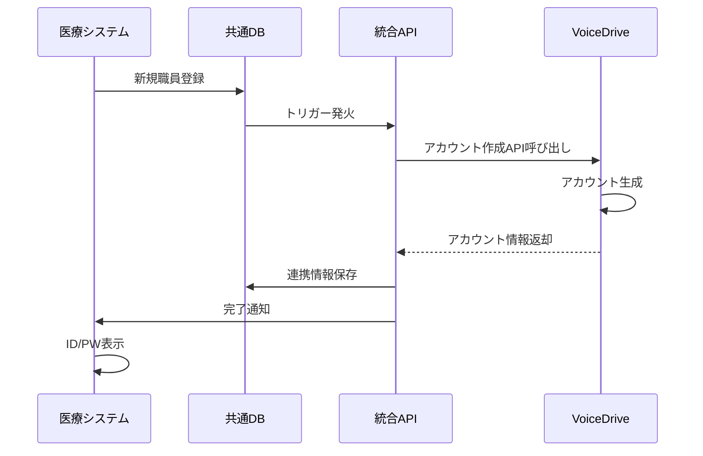
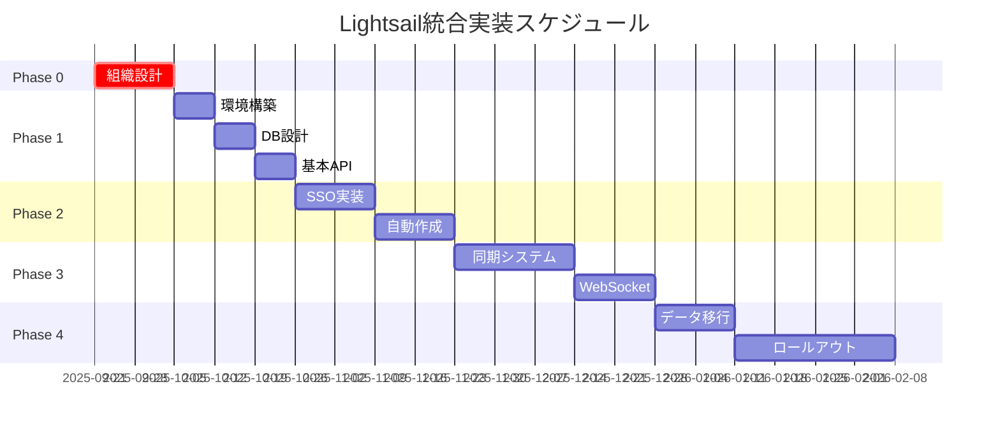

# AWS Lightsail統合実装マスタープラン

**文書番号**: MP-2025-0920-001
**作成日**: 2025年9月20日
**作成者**: 医療システムチーム
**宛先**: VoiceDriveチーム
**重要度**: 🔴 最重要

---

## エグゼクティブサマリー

医療職員管理システムとVoiceDriveシステムのAWS Lightsail環境での統合実装計画書です。
**Phase 0（組織設計）を最優先事項**として、5つのフェーズで段階的に実装を進めます。

### 🎯 核心目標
- **職員登録時の自動VoiceDriveアカウント作成**
- **SSO（シングルサインオン）による完全統合**
- **リアルタイム双方向データ同期**
- **統合レポート・分析機能**

---

## Phase 0: 組織設計【最優先】🔴

### 実施期間: 即座開始～2週間

### 0.1 医療法人厚生会組織構造の確定

```
医療法人厚生会
├── 本部
│   ├── 理事長
│   ├── 専務理事
│   └── 常務理事
├── 施設
│   ├── 厚生病院（300床）
│   ├── 厚生クリニック（3拠点）
│   ├── 介護老人保健施設（100床）
│   └── 訪問看護ステーション（2拠点）
└── 部門
    ├── 医療部門
    ├── 看護部門
    ├── 医療技術部門
    ├── 事務部門
    └── 施設管理部門
```

### 0.2 権限階層設計

| レベル | 役職 | 権限範囲 | システムロール |
|--------|------|----------|----------------|
| L1 | 幹部 | 全施設・全データ | EXECUTIVE |
| L2 | 部門長 | 部門内全データ | DEPARTMENT_HEAD |
| L3 | チームリーダー | チーム内データ | TEAM_LEADER |
| L4 | 一般職員 | 自己データのみ | STAFF |

### 0.3 データアクセスマトリックス

```sql
-- 権限マスタテーブル
CREATE TABLE permission_matrix (
    role_id VARCHAR(20) PRIMARY KEY,
    can_view_all_staff BOOLEAN DEFAULT FALSE,
    can_edit_all_staff BOOLEAN DEFAULT FALSE,
    can_view_department BOOLEAN DEFAULT FALSE,
    can_approve_interviews BOOLEAN DEFAULT FALSE,
    can_access_reports BOOLEAN DEFAULT FALSE
);
```

---

## Phase 1: 基盤構築

### 実施期間: 3週間（Phase 0完了後）

### 1.1 AWS Lightsail環境構築

#### インスタンス構成
```yaml
Production Environment:
  Instance:
    - Type: 4GB RAM, 2 vCPU, 80GB SSD
    - OS: Ubuntu 22.04 LTS
    - Cost: $40/month

  Database:
    - Type: Managed MySQL 8.0
    - Size: 1GB RAM, 40GB Storage
    - Cost: $30/month

  Storage:
    - Type: Object Storage
    - Size: 100GB
    - Cost: $10/month

  Total: $80/month
```

### 1.2 MySQL共通データベース設計

```sql
-- 共通データベース: lightsail_integrated_db

-- 1. 統合職員マスタ
CREATE TABLE unified_staff_master (
    staff_id VARCHAR(20) PRIMARY KEY,
    employee_number VARCHAR(10) UNIQUE NOT NULL,
    full_name VARCHAR(100) NOT NULL,
    facility_id VARCHAR(20),
    department_id VARCHAR(20),
    position_id VARCHAR(20),
    email VARCHAR(100) UNIQUE,
    medical_system_id VARCHAR(50),
    voicedrive_id VARCHAR(50),
    created_at TIMESTAMP DEFAULT CURRENT_TIMESTAMP,
    updated_at TIMESTAMP DEFAULT CURRENT_TIMESTAMP ON UPDATE CURRENT_TIMESTAMP,
    sync_status ENUM('synced', 'pending', 'error') DEFAULT 'pending',
    INDEX idx_facility (facility_id),
    INDEX idx_department (department_id),
    INDEX idx_sync_status (sync_status)
);

-- 2. アカウント連携テーブル
CREATE TABLE account_integration (
    integration_id INT AUTO_INCREMENT PRIMARY KEY,
    staff_id VARCHAR(20) NOT NULL,
    medical_username VARCHAR(50),
    voicedrive_username VARCHAR(50),
    sso_token VARCHAR(500),
    token_expires_at TIMESTAMP,
    auto_created BOOLEAN DEFAULT FALSE,
    created_at TIMESTAMP DEFAULT CURRENT_TIMESTAMP,
    FOREIGN KEY (staff_id) REFERENCES unified_staff_master(staff_id),
    INDEX idx_staff (staff_id),
    INDEX idx_token_expiry (token_expires_at)
);

-- 3. 同期ログテーブル
CREATE TABLE sync_log (
    log_id BIGINT AUTO_INCREMENT PRIMARY KEY,
    sync_type ENUM('staff', 'interview', 'notification', 'report') NOT NULL,
    source_system ENUM('medical', 'voicedrive') NOT NULL,
    target_system ENUM('medical', 'voicedrive') NOT NULL,
    record_count INT DEFAULT 0,
    status ENUM('success', 'partial', 'failed') NOT NULL,
    error_message TEXT,
    started_at TIMESTAMP DEFAULT CURRENT_TIMESTAMP,
    completed_at TIMESTAMP,
    INDEX idx_sync_type (sync_type),
    INDEX idx_status (status),
    INDEX idx_started (started_at)
);
```

---

## Phase 2: 認証システム統合

### 実施期間: 4週間

### 2.1 JWT基盤SSO実装

```typescript
// JWT Token Structure
interface JWTPayload {
    staffId: string;
    employeeNumber: string;
    systemAccess: {
        medical: boolean;
        voicedrive: boolean;
    };
    permissions: string[];
    facilityId: string;
    departmentId: string;
    role: 'EXECUTIVE' | 'DEPARTMENT_HEAD' | 'TEAM_LEADER' | 'STAFF';
    iat: number;
    exp: number;
}
```

### 2.2 自動アカウント作成フロー



### 2.3 自動作成API仕様

```typescript
// POST /api/v1/auto-create-account
interface AutoCreateRequest {
    staffId: string;
    employeeNumber: string;
    fullName: string;
    email: string;
    facility: {
        id: string;
        name: string;
    };
    department: {
        id: string;
        name: string;
    };
    position: {
        id: string;
        name: string;
        level: number;
    };
}

interface AutoCreateResponse {
    success: boolean;
    voicedriveAccount: {
        userId: string;
        username: string;
        initialPassword: string;
        loginUrl: string;
    };
    integrationId: string;
    message: string;
}
```

---

## Phase 3: データ連携実装

### 実施期間: 5週間

### 3.1 リアルタイム同期システム

#### 同期対象データ
1. **職員マスタ情報**（双方向）
2. **面談予約・記録**（VoiceDrive→医療）
3. **通知配信**（医療→VoiceDrive）
4. **評価データ**（双方向）

### 3.2 WebSocket通信実装

```javascript
// WebSocket Server Configuration
const wsConfig = {
    medical: 'wss://medical.lightsail.aws:8001',
    voicedrive: 'wss://voicedrive.lightsail.aws:8002',
    heartbeat: 30000, // 30秒
    reconnectDelay: 5000 // 5秒
};

// イベント定義
const SYNC_EVENTS = {
    STAFF_CREATED: 'staff.created',
    STAFF_UPDATED: 'staff.updated',
    INTERVIEW_SCHEDULED: 'interview.scheduled',
    NOTIFICATION_SENT: 'notification.sent',
    EVALUATION_COMPLETED: 'evaluation.completed'
};
```

### 3.3 データ変換マッピング

```typescript
// 医療→VoiceDrive変換
const medicalToVoicedriveMapper = {
    category: {
        'announcement': 'NOTIFICATION',
        'interview': 'MEETING',
        'training': 'EDUCATION',
        'survey': 'SURVEY',
        'other': 'OTHER'
    },
    priority: {
        'high': 'URGENT',
        'medium': 'NORMAL',
        'low': 'LOW'
    }
};
```

---

## Phase 4: 本番移行

### 実施期間: 6週間

### 4.1 データ移行計画

| ステップ | 対象データ | データ量 | 所要時間 |
|---------|-----------|---------|----------|
| 1 | 施設・部門マスタ | 50件 | 30分 |
| 2 | 職員マスタ | 500件 | 2時間 |
| 3 | 面談記録 | 10,000件 | 6時間 |
| 4 | 通知履歴 | 5,000件 | 3時間 |
| 5 | 評価データ | 2,000件 | 2時間 |

### 4.2 段階的ロールアウト

```yaml
Week 1-2:
  - 本部スタッフ（10名）
  - 全機能テスト

Week 3-4:
  - 事務部門（50名）
  - 負荷テスト

Week 5-6:
  - 医療部門（200名）
  - パフォーマンス調整

Week 7-8:
  - 全職員（500名）
  - 完全移行
```

### 4.3 バックアップ・リカバリ計画

```bash
# 自動バックアップスケジュール
0 2 * * * /backup/daily-backup.sh      # 毎日2:00
0 3 * * 0 /backup/weekly-backup.sh     # 毎週日曜3:00
0 4 1 * * /backup/monthly-backup.sh    # 毎月1日4:00

# リカバリ時間目標
RTO: 4時間
RPO: 1時間
```

---

## 実装スケジュール



---

## コスト見積もり

### 初期構築費用
| 項目 | 金額 |
|-----|------|
| Lightsail環境構築 | ¥200,000 |
| DB設計・実装 | ¥500,000 |
| API開発 | ¥800,000 |
| SSO統合 | ¥600,000 |
| データ移行 | ¥400,000 |
| **合計** | **¥2,500,000** |

### 月額運用費用
| 項目 | 金額 |
|-----|------|
| Lightsail (Production) | ¥12,000 |
| Lightsail (Staging) | ¥6,000 |
| バックアップストレージ | ¥3,000 |
| 監視・ログ管理 | ¥2,000 |
| **合計** | **¥23,000/月** |

---

## リスク管理

### 主要リスクと対策

| リスク | 影響度 | 発生確率 | 対策 |
|--------|--------|----------|------|
| 組織構造の変更 | 高 | 中 | Phase 0で確定、変更管理プロセス確立 |
| データ移行エラー | 高 | 低 | 段階的移行、ロールバック計画 |
| パフォーマンス問題 | 中 | 中 | 負荷テスト、スケーリング計画 |
| セキュリティ侵害 | 高 | 低 | 多層防御、監査ログ、暗号化 |

---

## 成功指標（KPI）

1. **技術指標**
   - API応答時間: < 200ms（95パーセンタイル）
   - システム可用性: > 99.5%
   - データ同期遅延: < 5秒

2. **ビジネス指標**
   - 自動アカウント作成成功率: > 99%
   - SSO利用率: > 90%
   - ユーザー満足度: > 4.0/5.0

3. **運用指標**
   - インシデント解決時間: < 4時間
   - バックアップ成功率: 100%
   - セキュリティ監査合格率: 100%

---

## 次のアクション

### 即時実行項目（今週中）
1. ✅ Phase 0 組織設計会議の開催
2. ✅ 権限マトリックスの詳細定義
3. ✅ Lightsail環境の見積もり取得

### 来週実行項目
1. ⬜ 技術仕様書の作成
2. ⬜ API仕様の詳細設計
3. ⬜ セキュリティポリシーの策定

---

## 連絡先

### 医療システムチーム
- プロジェクトリーダー: medical-lead@example.com
- 技術担当: medical-tech@example.com

### VoiceDriveチーム
- プロジェクトリーダー: voicedrive-lead@example.com
- 技術担当: voicedrive-tech@example.com

---

**文書終了**

*本マスタープランは両チームの合意のもと、適宜更新される予定です。*