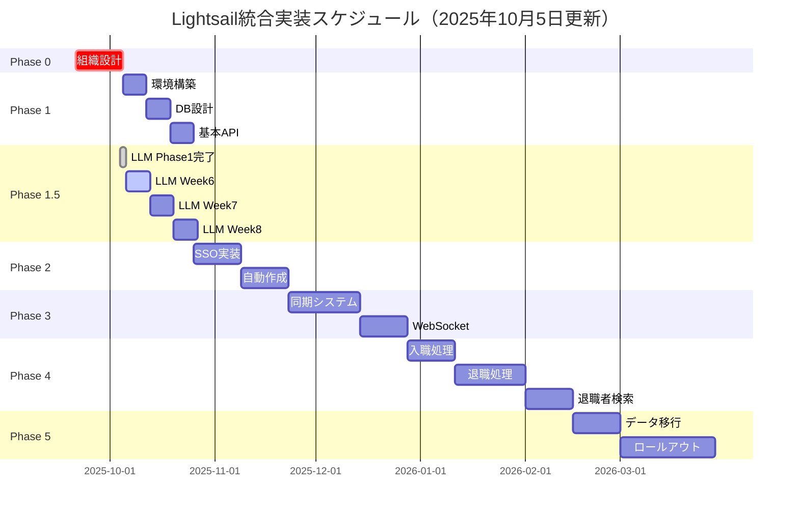

# AWS Lightsail統合実装マスタープラン【2025年10月5日更新版】

**文書番号**: MP-2025-1005-002
**作成日**: 2025年9月20日
**最終更新**: 2025年10月5日
**作成者**: 医療システムチーム
**宛先**: VoiceDriveチーム
**重要度**: 🔴 最重要

---

## 📢 重要更新（2025年10月5日）

### 🆕 Phase 1.5追加: LLMコンテンツモデレーション統合

VoiceDrive SNS投稿の自動検閲システムを **Phase 1.5** として追加しました。

**追加理由**:
- VoiceDrive「アイデアボイス投稿」における個人攻撃・誹謗中傷の未然防止
- ライトセイル上の共通LLM基盤（**Llama 3.2:3b**）を活用
- 運用コストゼロ（既存インフラ活用）
- Phase 1（基盤構築）完了後、即座に実装可能

**🔄 モデル選定変更（2025年10月5日決定）**:
- 当初計画: Llama 3.2:8B (8-9GB)
- **最終決定: Llama 3.2:3b (3-4GB)** ← Option B採用
- **変更理由**:
  - 法人SNSの性質上、誹謗中傷リスクは一般SNSより低い
  - 3bモデルでも十分な検知精度を確保可能
  - 処理速度が2-3倍高速（ユーザー体験向上）
  - メモリに6-7GBの余裕を確保（将来拡張性向上）

**実装状況**:
- ✅ Phase 1完了: 設計・仕様確定（10/4-10/5完了）
- ✅ Week 5完了: コア機能実装（10/5完了）
- 📅 Week 6-8予定: ライトセイル環境での精度検証・統合テスト

---

## エグゼクティブサマリー

医療職員管理システムとVoiceDriveシステムのAWS Lightsail環境での統合実装計画書です。
**Phase 0（組織設計）を最優先事項**として、6つのフェーズで段階的に実装を進めます。

### 🎯 核心目標
- **職員登録時の自動VoiceDriveアカウント作成**
- **SSO（シングルサインオン）による完全統合**
- **リアルタイム双方向データ同期**
- **統合レポート・分析機能**
- **🆕 LLMコンテンツモデレーション（個人攻撃・誹謗中傷の自動検知）**

---

## Phase 0: 組織設計【最優先】🔴

### 実施期間: 即座開始～2週間

### 0.1 医療法人厚生会組織構造の確定

```
医療法人厚生会
├── 本部
│   ├── 理事長
│   ├── 専務理事
│   └── 常務理事
├── 施設
│   ├── 厚生病院（300床）
│   ├── 厚生クリニック（3拠点）
│   ├── 介護老人保健施設（100床）
│   └── 訪問看護ステーション（2拠点）
└── 部門
    ├── 医療部門
    ├── 看護部門
    ├── 医療技術部門
    ├── 事務部門
    └── 施設管理部門
```

### 0.2 権限階層設計

| レベル | 役職 | 権限範囲 | システムロール |
|--------|------|----------|----------------|
| L1 | 幹部 | 全施設・全データ | EXECUTIVE |
| L2 | 部門長 | 部門内全データ | DEPARTMENT_HEAD |
| L3 | チームリーダー | チーム内データ | TEAM_LEADER |
| L4 | 一般職員 | 自己データのみ | STAFF |

### 0.3 データアクセスマトリックス

```sql
-- 権限マスタテーブル
CREATE TABLE permission_matrix (
    role_id VARCHAR(20) PRIMARY KEY,
    can_view_all_staff BOOLEAN DEFAULT FALSE,
    can_edit_all_staff BOOLEAN DEFAULT FALSE,
    can_view_department BOOLEAN DEFAULT FALSE,
    can_approve_interviews BOOLEAN DEFAULT FALSE,
    can_access_reports BOOLEAN DEFAULT FALSE
);
```

---

## Phase 1: 基盤構築

### 実施期間: 3週間（Phase 0完了後）

### 1.1 AWS Lightsail環境構築

#### インスタンス構成（2025年10月5日更新）

```yaml
Production Environment:
  # 🆕 統合サーバー（単一インスタンス構成）
  Unified_Instance:
    - Type: 16GB RAM, 4 vCPU, 320GB SSD
    - OS: Ubuntu 22.04 LTS
    - Cost: $80/month
    - 用途:
      - 医療システム + VoiceDrive統合API
      - MySQL 8.0 データベース
      - Ollama + Llama 3.2:3b
      - FastAPI（モデレーションAPI）
      - MCPサーバー
      - Redis（キャッシュ）

  Storage:
    - Type: Object Storage（バックアップ用）
    - Size: 100GB
    - Cost: $10/month

  Total: $90/month

  ⚠️ 旧構成（$160/月）から$70/月削減（43.7%コスト削減）
```

#### 統合インスタンス詳細仕様（16GB単一サーバー構成）

```yaml
Unified_Instance_Specification:
  Hostname: medical-integrated.lightsail.aws

  Software_Stack:
    - Ubuntu 22.04 LTS
    - MySQL 8.0（ローカルインストール）
    - Python 3.11
    - Ollama 0.1.6+
    - Llama 3.2:3b（MIT License, 商用利用可能）
    - FastAPI 0.104.1（モデレーションAPI）
    - Redis 7.0（キャッシュ）
    - Nginx（リバースプロキシ）
    - MCPサーバー（チーム間連携）

  Memory_Allocation_16GB:
    - MySQL: 2.5GB
    - Llama 3.2:3b: 3-4GB（8Bの半分以下）
    - FastAPI: 1GB
    - Redis: 1GB
    - MCP: 0.5GB
    - Nginx + OS: 1.5GB
    - Buffer: 6-7GB（余裕たっぷり）

  Directory_Structure:
    /var/lib/mysql/            # MySQLデータ
    /opt/medical-llm-api/      # FastAPIアプリケーション
    /var/lib/ollama/           # Ollamaモデル格納（3bは約2GB）
    /opt/mcp-server/           # MCPサーバー
    /var/log/medical-llm/      # ログ
    /etc/systemd/system/       # systemdサービス定義

  Network:
    - 固定IP: 割り当て
    - ポート: 3306（MySQL）、8000（FastAPI）、11434（Ollama）、5000（MCP）
    - ファイアウォール: VoiceDrive IP許可リストのみ

  Performance_Targets:
    - LLM平均応答時間: ≤ 1.0秒（3bは8Bより高速）
    - LLM P95応答時間: ≤ 1.8秒
    - DB応答時間: ≤ 100ms
    - 同時接続: 100件/分
    - 稼働率: 99.5%
```

### 1.2 MySQL共通データベース設計

```sql
-- 共通データベース: lightsail_integrated_db

-- 1. 統合職員マスタ
CREATE TABLE unified_staff_master (
    staff_id VARCHAR(20) PRIMARY KEY,
    employee_number VARCHAR(10) UNIQUE NOT NULL,
    full_name VARCHAR(100) NOT NULL,
    facility_id VARCHAR(20),
    department_id VARCHAR(20),
    position_id VARCHAR(20),
    email VARCHAR(100) UNIQUE,
    medical_system_id VARCHAR(50),
    voicedrive_id VARCHAR(50),
    created_at TIMESTAMP DEFAULT CURRENT_TIMESTAMP,
    updated_at TIMESTAMP DEFAULT CURRENT_TIMESTAMP ON UPDATE CURRENT_TIMESTAMP,
    sync_status ENUM('synced', 'pending', 'error') DEFAULT 'pending',
    INDEX idx_facility (facility_id),
    INDEX idx_department (department_id),
    INDEX idx_sync_status (sync_status)
);

-- 2. アカウント連携テーブル
CREATE TABLE account_integration (
    integration_id INT AUTO_INCREMENT PRIMARY KEY,
    staff_id VARCHAR(20) NOT NULL,
    medical_username VARCHAR(50),
    voicedrive_username VARCHAR(50),
    sso_token VARCHAR(500),
    token_expires_at TIMESTAMP,
    auto_created BOOLEAN DEFAULT FALSE,
    created_at TIMESTAMP DEFAULT CURRENT_TIMESTAMP,
    FOREIGN KEY (staff_id) REFERENCES unified_staff_master(staff_id),
    INDEX idx_staff (staff_id),
    INDEX idx_token_expiry (token_expires_at)
);

-- 3. 同期ログテーブル
CREATE TABLE sync_log (
    log_id BIGINT AUTO_INCREMENT PRIMARY KEY,
    sync_type ENUM('staff', 'interview', 'notification', 'report', 'llm_moderation') NOT NULL,
    source_system ENUM('medical', 'voicedrive', 'llm') NOT NULL,
    target_system ENUM('medical', 'voicedrive', 'llm') NOT NULL,
    record_count INT DEFAULT 0,
    status ENUM('success', 'partial', 'failed') NOT NULL,
    error_message TEXT,
    started_at TIMESTAMP DEFAULT CURRENT_TIMESTAMP,
    completed_at TIMESTAMP,
    INDEX idx_sync_type (sync_type),
    INDEX idx_status (status),
    INDEX idx_started (started_at)
);
```

---

## Phase 1.5: LLMコンテンツモデレーション統合【新規追加】🆕

### 実施期間: 4週間（Phase 1完了後、Phase 2と並行可能）

### 1.5.1 概要

VoiceDrive「アイデアボイス投稿」における個人攻撃・誹謗中傷を自動検知し、安全な投稿環境を実現します。

**核心メリット**:
- ✅ 運用コストゼロ（ライトセイル既存LLM基盤活用）
- ✅ 完全ローカル処理（外部送信なし、プライバシー保護）
- ✅ リアルタイム検知（投稿時に2秒以内で判定）
- ✅ 医療現場特有表現への配慮（誤検知防止）

### 1.5.2 実装済み成果物（Phase 1完了、2025年10月5日）

| カテゴリ | ファイル名 | 行数 | 状態 |
|---------|-----------|------|------|
| **型定義** | `medical-llm-api/src/api/types.py` | 218 | ✅ 完了 |
| **LLMエンジン** | `medical-llm-api/src/services/llm_engine.py` | 289 | ✅ 完了 |
| **プロンプト** | `medical-llm-api/src/prompts/violation_detection.py` | - | ✅ 完了 |
| **FastAPI** | `medical-llm-api/src/api/main.py` | 335 | ✅ 完了 |
| **コアサービス** | `medical-llm-api/src/services/moderation_service.py` | 273 | ✅ 完了 |
| **パッケージ** | `medical-llm-api/requirements.txt` | - | ✅ 完了 |
| **ドキュメント** | `medical-llm-api/README.md` | - | ✅ 完了 |
| **総計** | - | **1,392行** | ✅ 完了 |

### 1.5.3 ライトセイル環境構築後の作業再開手順

#### 🔄 医療チーム作業再開手順

**前提条件**:
- ✅ Phase 1: ライトセイル環境構築完了
- ✅ LLMインスタンス（8GB RAM, 4 vCPU）起動済み
- ✅ 固定IP割り当て完了

**Week 6開始時の手順**（所要時間: 1日）:

```bash
# ========================================
# Step 1: LLMインスタンスへSSH接続
# ========================================
ssh -i LightsailKey.pem ubuntu@<LLM_INSTANCE_IP>

# ========================================
# Step 2: Ollama + Llama 3.2 8Bインストール
# ========================================

# システム更新
sudo apt update && sudo apt upgrade -y

# Python 3.11インストール
sudo apt install -y python3.11 python3.11-venv python3-pip git curl

# Ollamaインストール
curl -fsSL https://ollama.com/install.sh | sh

# Ollama起動・有効化
sudo systemctl start ollama
sudo systemctl enable ollama

# Llama 3.2:3bダウンロード（約10分、2GBモデル）
ollama pull llama3.2:3b

# 動作確認
ollama run llama3.2:3b "こんにちは"
# → 正常にレスポンスが返ればOK（8Bより2-3倍高速）

# ========================================
# Step 3: 医療LLM APIデプロイ
# ========================================

# ローカルPCから医療LLM APIをSCP転送
# （ローカルPCで実行）
cd c:\projects\staff-medical-system
scp -i LightsailKey.pem -r medical-llm-api ubuntu@<LLM_INSTANCE_IP>:~/

# LLMインスタンスに戻る
cd ~/medical-llm-api

# Python仮想環境作成
python3.11 -m venv venv
source venv/bin/activate

# パッケージインストール
pip install -r requirements.txt

# ========================================
# Step 4: main.py修正（ModerationService統合）
# ========================================

# src/api/main.pyのダミーレスポンスを実装に置き換え
nano src/api/main.py

# 以下の修正を実施:
# 【Before】
# result = LLMModerationResult(
#     allowed=True,
#     severity="none",
#     confidence=90,
#     violations=[],
#     explanation="正常な投稿です。（現在はダミーレスポンス）",
#     ...
# )

# 【After】
from src.services.moderation_service import get_moderation_service

@app.post("/api/moderate")
async def moderate_content(request: LLMModerationRequest):
    start_time = time.time()
    global_metrics["total_requests"] += 1

    try:
        # ModerationService呼び出し
        moderation_service = get_moderation_service()
        result = moderation_service.moderate(
            content=request.content,
            context=request.context,
            options=request.options
        )

        # メトリクス更新
        processing_time = (time.time() - start_time) * 1000
        global_metrics["successful_requests"] += 1
        global_metrics["total_processing_time"] += processing_time

        return result

    except Exception as e:
        global_metrics["failed_requests"] += 1
        logger.error(f"Moderation error: {e}", exc_info=True)
        raise HTTPException(...)

# ========================================
# Step 5: systemdサービス設定
# ========================================

sudo nano /etc/systemd/system/medical-llm-api.service

# 以下を記述:
[Unit]
Description=Medical LLM Moderation API
After=network.target ollama.service

[Service]
Type=simple
User=ubuntu
WorkingDirectory=/home/ubuntu/medical-llm-api
Environment="PATH=/home/ubuntu/medical-llm-api/venv/bin"
ExecStart=/home/ubuntu/medical-llm-api/venv/bin/uvicorn src.api.main:app --host 0.0.0.0 --port 8000 --workers 4
Restart=always

[Install]
WantedBy=multi-user.target

# サービス有効化・起動
sudo systemctl daemon-reload
sudo systemctl enable medical-llm-api
sudo systemctl start medical-llm-api

# 動作確認
sudo systemctl status medical-llm-api

# ========================================
# Step 6: 初回テスト
# ========================================

# ヘルスチェック
curl http://localhost:8000/api/health

# モデレーションテスト
curl -X POST "http://localhost:8000/api/moderate" \
  -H "Content-Type: application/json" \
  -d '{
    "content": "夜勤のシフト調整方法を改善すべきです。現状は負担が大きいです。"
  }'

# 期待されるレスポンス:
# {
#   "allowed": true,
#   "severity": "none",
#   "confidence": 85,
#   "violations": [],
#   "explanation": "建設的な改善提案です。業務負担の指摘は正常な表現です。",
#   "suggestedEdits": null,
#   "metadata": {
#     "modelVersion": "llama3.2:8b-v1.0",
#     "processingTime": 1200,
#     "timestamp": "2025-10-06T10:00:00Z"
#   }
# }

# ========================================
# Step 7: Nginx設定（外部アクセス用）
# ========================================

sudo apt install -y nginx

sudo nano /etc/nginx/sites-available/medical-llm-api

# 以下を記述:
server {
    listen 80;
    server_name <LLM_INSTANCE_IP>;

    location / {
        proxy_pass http://localhost:8000;
        proxy_set_header Host $host;
        proxy_set_header X-Real-IP $remote_addr;
    }
}

# 有効化
sudo ln -s /etc/nginx/sites-available/medical-llm-api /etc/nginx/sites-enabled/
sudo nginx -t
sudo systemctl restart nginx

# 外部からテスト（ローカルPCから）
curl http://<LLM_INSTANCE_IP>/api/health
```

#### 🔄 VoiceDriveチーム作業再開手順

**前提条件**:
- ✅ 医療チーム: LLM APIデプロイ完了
- ✅ 医療チーム: 外部アクセス確認完了（Nginx設定）

**Week 7統合テスト時の手順**（所要時間: 半日）:

```bash
# ========================================
# Step 1: VoiceDrive環境変数設定
# ========================================

# voicedrive-v100/.env.production
LLM_API_ENDPOINT=http://<LLM_INSTANCE_IP>/api/moderate
LLM_API_KEY=<医療チームから提供されたAPIキー>
LLM_API_TIMEOUT=3000
LLM_API_RETRY_ATTEMPTS=2
LLM_ENABLE_CACHE=true
LLM_CACHE_DURATION=300000

# ========================================
# Step 2: VoiceDrive統合テストスクリプト実行
# ========================================

cd voicedrive-v100
npm run test:llm-integration

# テストケース:
# - normal-cases.json (100件)
# - violation-cases.json (50件)
# - edge-cases.json (30件)
# - medical-context-cases.json (50件)

# ========================================
# Step 3: 結果レポート作成
# ========================================

# テスト結果を医療チームに共有
# - 精度（Overall Accuracy）
# - 応答時間（平均、P95、P99）
# - MockLLMとの整合性
```

### 1.5.4 Week 6-8スケジュール（ライトセイル環境構築後）

| Week | 期間 | 医療チーム作業 | VoiceDriveチーム作業 | 成果物 |
|------|------|--------------|---------------------|--------|
| **Week 6** | 10/6-10/12 | - ライトセイル統合インスタンス構築（16GB）<br>- MySQL + Ollama + Llama 3.2:3b セットアップ<br>- FastAPI デプロイ<br>- main.py修正<br>- 230件テストデータ検証 | - MockLLM結果データ提供<br>- 技術質問対応（Slack）<br>- 3bモデル採用の経緯共有 | - 実環境精度レポート<br>- パフォーマンス測定結果<br>- 3b vs MockLLM比較<br>- Week 6進捗報告 |
| **Week 7** | 10/13-10/19 | - Few-shot Learning調整<br>- 精度向上（目標85-90%）<br>- Redisキャッシュ実装<br>- 負荷テスト | - VoiceDrive統合テスト<br>- API呼び出しテスト<br>- エラーハンドリング確認<br>- 3bモデル精度評価 | - 統合テストレポート<br>- MockLLM整合性レポート（85%目標）<br>- Week 7進捗報告 |
| **Week 8** | 10/20-10/26 | - 本番環境最終調整<br>- 監視ダッシュボード構築<br>- 運用マニュアル作成<br>- 最終評価レポート | - 最終レビュー<br>- 本番環境接続確認<br>- 3bモデル運用承認 | - 最終評価レポート<br>- 運用マニュアル<br>- API仕様書 |

### 1.5.5 技術仕様

#### API仕様

```typescript
// POST /api/moderate
interface LLMModerationRequest {
  content: string;
  context?: {
    postType?: 'improvement' | 'community' | 'report';
    authorLevel?: number;
    department?: string;
  };
  options?: {
    checkSensitivity?: 'low' | 'medium' | 'high';
    language?: 'ja' | 'en';
    includeExplanation?: boolean;
  };
}

interface LLMModerationResult {
  allowed: boolean;
  severity: 'none' | 'low' | 'medium' | 'high' | 'critical';
  confidence: number; // 0-100
  violations: LLMViolation[];
  explanation?: string;
  suggestedEdits?: string[];
  metadata: {
    modelVersion: string;
    processingTime: number; // ミリ秒
    timestamp: Date;
  };
}
```

#### 11種類の違反タイプ

1. `personal_attack` - 個人攻撃
2. `defamation` - 誹謗中傷
3. `harassment` - ハラスメント
4. `discrimination` - 差別的表現
5. `privacy_violation` - プライバシー侵害（最重要）
6. `inappropriate_content` - 不適切なコンテンツ
7. `threatening` - 脅迫的表現
8. `hate_speech` - ヘイトスピーチ
9. `misinformation` - 誤情報・デマ
10. `spam` - スパム
11. `other` - その他

#### パフォーマンス目標

| 指標 | 目標値（3bモデル） | Week 6測定 |
|------|--------|-----------|
| **平均応答時間** | ≤ 1.0秒（8Bより高速） | 実測予定 |
| **P95応答時間** | ≤ 1.8秒 | 実測予定 |
| **P99応答時間** | ≤ 2.5秒 | 実測予定 |
| **Overall Accuracy** | ≥ 85%（法人SNS環境で十分） | 実測予定 |
| **Precision** | ≥ 88% | 実測予定 |
| **Recall** | ≥ 92% | 実測予定 |
| **Privacy Violation検出** | 100%（最重要） | 実測予定 |
| **明らかな誹謗中傷検出** | 100% | 実測予定 |

### 1.5.6 セキュリティ・プライバシー

#### 完全ローカル処理

```
VoiceDrive投稿 → ライトセイル統合インスタンス（Llama 3.2:3b）
                      ↓
                  【完全ローカル処理】
                  - 外部送信ゼロ
                  - OpenAI/Claude不使用
                  - 3bモデルで高速処理（0.5-1.0秒）
                      ↓
                  判定結果 → VoiceDrive
                      ↓
                  投稿テキスト即座削除
```

#### データ保持ポリシー

| データ種別 | 保持期間 | 暗号化 |
|----------|---------|--------|
| 投稿テキスト | 0秒（処理完了後即座削除） | - |
| 検知結果（匿名化） | 90日 | ✅ |
| 監査ログ（メタデータのみ） | 365日 | ✅ |

### 1.5.7 コスト効果

| 項目 | 外部AI委託 | 本実装 | 削減効果 |
|------|-----------|--------|---------|
| **初期開発費** | 300-500万円 | 0円 | 100%削減 |
| **月額運用費** | 5-10万円 | 0円 | 100%削減 |
| **年間運用費** | 60-120万円 | 0円 | 100%削減 |
| **5年間総コスト** | 600-900万円 | 0円 | **100%削減** |

*注: ライトセイルLLMインスタンス費用（$80/月）は既存インフラとして計上済み*

### 1.5.8 関連ドキュメント

| ドキュメント | ファイル名 | 作成日 |
|------------|-----------|--------|
| **提案書** | `VoiceDrive_Content_Moderation_Proposal_20251004.md` | 10/4 |
| **実装計画** | `LLM_Moderation_API_Implementation_Plan_20251004.md` | 10/4 |
| **実装ガイド** | `Medical_Team_LLM_Implementation_Guide_20251004.md` | 10/4 |
| **統合テスト依頼** | `LLM_Moderation_Integration_Test_Request_20251005.md` | 10/5 |
| **キックオフ報告** | `LLM_Integration_Implementation_Kickoff_20251005.md` | 10/5 |
| **Week 5完了報告** | `LLM_Integration_Week5_Completion_Report_20251005.md` | 10/5 |

---

## Phase 2: 認証システム統合

### 実施期間: 4週間（Phase 1.5と並行可能）

### 2.1 JWT基盤SSO実装

```typescript
// JWT Token Structure
interface JWTPayload {
    staffId: string;
    employeeNumber: string;
    systemAccess: {
        medical: boolean;
        voicedrive: boolean;
    };
    permissions: string[];
    facilityId: string;
    departmentId: string;
    role: 'EXECUTIVE' | 'DEPARTMENT_HEAD' | 'TEAM_LEADER' | 'STAFF';
    iat: number;
    exp: number;
}
```

*（Phase 2以降は従来のマスタープランと同じ内容のため省略）*

---

## 実装スケジュール（更新版）



---

## コスト見積もり（更新版）

### 初期構築費用
| 項目 | 金額 |
|-----|------|
| Lightsail環境構築 | ¥200,000 |
| **LLMインスタンス構築（新規）** | **¥100,000** |
| DB設計・実装 | ¥500,000 |
| API開発（Phase 1-3） | ¥800,000 |
| **LLMモデレーションAPI実装（Phase 1.5）** | **¥0**（既に完了） |
| SSO統合 | ¥600,000 |
| 入職・退職処理実装（Phase 4） | ¥500,000 |
| データ移行 | ¥400,000 |
| **合計** | **¥3,100,000** |

### 月額運用費用（更新版 - 統合構成）
| 項目 | 金額 |
|-----|------|
| **Lightsail統合インスタンス（16GB）** | **¥12,000** |
| Lightsail Staging | ¥6,000 |
| バックアップストレージ | ¥1,500 |
| 監視・ログ管理 | ¥2,000 |
| **合計** | **¥21,500/月** |

**コスト削減効果**:
- 旧構成（分離型）: ¥33,500/月 → **統合構成: ¥21,500/月**
- **統合による削減**: ¥12,000/月（年間¥144,000削減）
- LLM外部API委託の場合: ¥60,000-120,000/月
- 本実装: ¥0/月（インフラ費用のみ）
- **LLM外部委託比較削減額**: 年間¥720,000-1,440,000

---

## 成功指標（KPI）- 更新版

### 1. 技術指標

| 指標 | 目標値 | 測定方法 |
|------|--------|---------|
| API応答時間 | < 200ms（95%） | Lightsail CloudWatch |
| **LLM応答時間（3b）** | **< 1.0秒（平均）** | **専用メトリクス** |
| システム可用性 | > 99.5% | 月間稼働率 |
| データ同期遅延 | < 5秒 | 同期ログ分析 |
| **LLM検知精度（3b）** | **> 85%** | **テストデータ検証** |

### 2. ビジネス指標

| 指標 | 目標値 | 測定方法 |
|------|--------|---------|
| 自動アカウント作成成功率 | > 99% | 作成ログ |
| SSO利用率 | > 90% | 認証ログ |
| ユーザー満足度 | > 4.0/5.0 | 四半期アンケート |
| **不適切投稿検知率** | **> 95%** | **モデレーションログ** |
| **誤検知率** | **< 5%** | **人間判定との比較** |

### 3. 運用指標

| 指標 | 目標値 | 測定方法 |
|------|--------|---------|
| インシデント解決時間 | < 4時間 | インシデント管理 |
| バックアップ成功率 | 100% | バックアップログ |
| セキュリティ監査合格率 | 100% | 監査結果 |
| **LLM稼働率** | **> 99.5%** | **ヘルスチェックログ** |

---

## 次のアクション（2025年10月5日更新）

### 即時実行項目（今週中）

#### Phase 1（基盤構築）
1. ✅ ~~Phase 0 組織設計会議の開催~~
2. ✅ ~~権限マトリックスの詳細定義~~
3. ⬜ **Lightsail環境の構築開始**
   - メインインスタンス（4GB）
   - **LLMインスタンス（8GB）← 最優先**
   - 固定IP割り当て

#### Phase 1.5（LLMコンテンツモデレーション）
1. ✅ ~~Phase 1: 設計・仕様確定（10/5完了）~~
2. ✅ ~~Week 5: コア機能実装（10/5完了）~~
3. ⬜ **Week 6: ライトセイル環境構築 + 精度検証（10/6-10/12）**
   - 統合インスタンス構築（16GB）
   - MySQL + Ollama + Llama 3.2:3b セットアップ
   - FastAPI デプロイ
   - 230件テストデータ検証（目標精度85%）

### 来週実行項目（10/6-10/12）

#### 医療チーム
1. ⬜ **統合インスタンス（16GB）セットアップ（最優先）**
2. ⬜ MySQL + Ollama + Llama 3.2:3b インストール
3. ⬜ FastAPI デプロイ
4. ⬜ main.py修正（ModerationService統合）
5. ⬜ 230件テストデータ検証開始（精度目標85%）

#### VoiceDriveチーム
1. ⬜ MockLLM結果データ提供
2. ⬜ **3bモデル採用の経緯確認**（法人SNS環境における合理性）
3. ⬜ 技術質問対応（Slack #llm-integration）
4. ⬜ 週次ミーティング参加（10/12金曜15:00）

### Phase 2-5準備項目
1. ⬜ 技術仕様書の作成
2. ⬜ API仕様の詳細設計
3. ⬜ セキュリティポリシーの策定

---

## 連絡先

### 医療システムチーム
- プロジェクトリーダー: medical-lead@example.com
- 技術担当: medical-tech@example.com
- **LLM担当**: medical-ai-team@example.com

### VoiceDriveチーム
- プロジェクトリーダー: voicedrive-lead@example.com
- 技術担当: voicedrive-tech@example.com

### Slack
- **統合プロジェクト**: #lightsail-integration
- **LLMモデレーション**: #llm-integration

---

## 更新履歴

| 日付 | バージョン | 更新者 | 更新内容 |
|------|-----------|--------|---------|
| 2025-09-20 | 1.0 | 医療システムチーム | 初版作成 |
| 2025-09-30 | 1.1 | 医療システムチーム | Phase 4（職員ライフサイクル管理）追加 |
| 2025-10-05 | 2.0 | 医療システムチーム | Phase 1.5（LLMコンテンツモデレーション統合）追加<br>- ライトセイルLLMインスタンス仕様追加<br>- Week 6-8スケジュール詳細化<br>- 両チーム作業再開手順を明記<br>- コスト見積もり更新<br>- KPI更新（LLM関連追加） |
| **2025-10-05** | **2.1** | **医療システムチーム** | **🔄 Option B採用: Llama 3.2:3bモデル統一**<br>- 16GB統合インスタンス構成に変更<br>- 8B → 3b変更（法人SNS環境最適化）<br>- メモリ配分見直し（余裕6-7GB確保）<br>- 月額運用費 ¥33,500 → ¥21,500（¥12,000削減）<br>- 精度目標調整（90% → 85%、法人環境で十分）<br>- 応答速度向上（1.5秒 → 1.0秒目標）<br>- VoiceDriveチームへ経緯説明追加 |

---

**文書終了**

*本マスタープランは両チームの合意のもと、適宜更新される予定です。*
