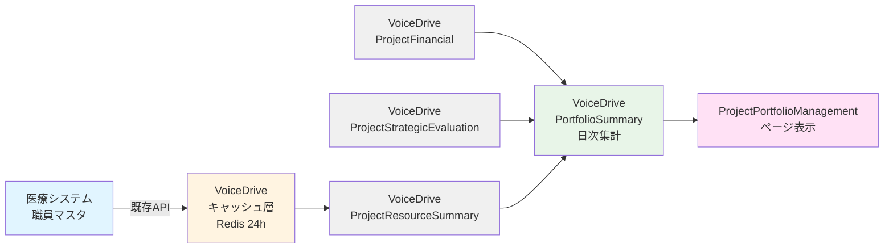

# Project Portfolio Management 医療システム確認結果

**文書番号**: MEDICAL-CONFIRM-2025-1013-003
**作成日**: 2025年10月13日
**対象ページ**: Project Portfolio Management（プロジェクトポートフォリオ管理）
**対象レベル**: Level 16+（戦略企画部門以上）
**参照文書**:
- [project-portfolio-management暫定マスターリスト_20251013.md](./project-portfolio-management暫定マスターリスト_20251013.md)
- [project-portfolio-management_DB要件分析_20251013.md](./project-portfolio-management_DB要件分析_20251013.md)
- [データ管理責任分界点定義書_20251008.md](./データ管理責任分界点定義書_20251008.md)

---

## 📋 エグゼクティブサマリー

### 結論
**医療システムDB設計への影響**: ❌ **追加不要**

VoiceDriveの「Project Portfolio Management」ページで必要な8つの新規テーブルは、**全てVoiceDrive側で管理するプロジェクト管理データ**であり、医療システム側のDB構築計画への追加は不要です。

### 理由
1. **データ責任分界点の明確化**
   - 医療システム: 職員マスタ、部門マスタ、施設マスタ
   - VoiceDrive: プロジェクト財務、戦略評価、リソース配分、ポートフォリオ分析

2. **既存APIで対応可能**
   - 医療システムは既存の職員情報API、部門マスタAPIのみ提供
   - VoiceDrive側が独自にプロジェクト管理テーブルを構築

3. **新規API実装不要**
   - PersonalStationページやProjectOrgDevelopmentページと同様、医療システム側の新規API実装は不要

---

## 🎯 VoiceDrive側で必要なテーブル（8件）

以下の全テーブルは**VoiceDrive側のデータベースで管理**します。

| No. | テーブル名 | 役割 | レコード数目安 | 管理責任 |
|-----|-----------|------|--------------|---------|
| 1 | **ProjectFinancial** | プロジェクト財務データ | 100-200件 | VoiceDrive |
| 2 | **ProjectStrategicEvaluation** | 戦略的評価 | 100-200件 | VoiceDrive |
| 3 | **ProjectResourceSummary** | リソース配分集計 | 100-200件 | VoiceDrive |
| 4 | **PortfolioSummary** | ポートフォリオサマリー | 10-20件 | VoiceDrive |
| 5 | **ProjectCategory**（オプション） | カテゴリマスタ | 8-15件 | VoiceDrive |
| 6 | **Post.projectCategory**（拡張） | プロジェクトカテゴリ | - | VoiceDrive |
| 7 | **Post.financial** (relation) | 財務データリレーション | - | VoiceDrive |
| 8 | **Post.strategicEvaluation** (relation) | 評価データリレーション | - | VoiceDrive |

### テーブル詳細

#### 1. ProjectFinancial（プロジェクト財務）
```prisma
model ProjectFinancial {
  id                      String    @id @default(cuid())
  projectId               String    @unique @map("project_id")

  // 財務データ
  investmentAmount        Int       @default(0) @map("investment_amount")  // 投資額（万円）
  expectedReturn          Int       @default(0) @map("expected_return")    // 期待リターン（万円）
  roi                     Float     @default(0) @map("roi")                // ROI（%）
  actualCost              Int?      @map("actual_cost")
  actualReturn            Int?      @map("actual_return")

  // 予算管理
  budgetYear              Int       @map("budget_year")
  budgetDepartment        String?   @map("budget_department")
  approvedBudget          Int?      @map("approved_budget")

  // 財務承認
  financialApprovalStatus String?   @map("financial_approval_status")
  financialApprovedBy     String?   @map("financial_approved_by")
  financialApprovedAt     DateTime? @map("financial_approved_at")

  calculatedAt            DateTime  @default(now()) @map("calculated_at")
  createdAt               DateTime  @default(now()) @map("created_at")
  updatedAt               DateTime  @updatedAt @map("updated_at")

  project                 Post      @relation(fields: [projectId], references: [id], onDelete: Cascade)

  @@index([budgetYear])
  @@index([roi])
  @@map("project_financial")
}
```

**データソース**: VoiceDrive内での財務データ入力、承認ワークフロー

---

#### 2. ProjectStrategicEvaluation（戦略的評価）
```prisma
model ProjectStrategicEvaluation {
  id                    String    @id @default(cuid())
  projectId             String    @unique @map("project_id")

  // 戦略的評価
  strategicImpact       Int       @default(3) @map("strategic_impact")     // 1-5
  urgency               Int       @default(3) @map("urgency")               // 1-5
  strategicAlignment    Int       @default(50) @map("strategic_alignment")  // 0-100

  // 優先度計算
  priorityQuadrant      String?   @map("priority_quadrant")
  // "high_priority", "important", "urgent", "normal"

  // 評価根拠
  impactReason          String?   @map("impact_reason")     @db.Text
  urgencyReason         String?   @map("urgency_reason")    @db.Text
  alignmentReason       String?   @map("alignment_reason")  @db.Text

  evaluatedBy           String?   @map("evaluated_by")
  evaluatedAt           DateTime? @map("evaluated_at")

  createdAt             DateTime  @default(now()) @map("created_at")
  updatedAt             DateTime  @updatedAt @map("updated_at")

  project               Post      @relation(fields: [projectId], references: [id], onDelete: Cascade)

  @@index([strategicImpact])
  @@index([urgency])
  @@index([priorityQuadrant])
  @@map("project_strategic_evaluation")
}
```

**データソース**: VoiceDrive内での戦略評価入力

---

#### 3. ProjectResourceSummary（リソース配分集計）
```prisma
model ProjectResourceSummary {
  id                      String    @id @default(cuid())
  projectId               String    @unique @map("project_id")

  // リソース集計
  totalMembers            Int       @default(0) @map("total_members")
  estimatedPersonDays     Int       @default(0) @map("estimated_person_days")
  actualPersonDays        Int?      @map("actual_person_days")
  resourceAllocationRate  Float     @default(0) @map("resource_allocation_rate")

  // 職種別リソース
  nursesCount             Int       @default(0) @map("nurses_count")
  doctorsCount            Int       @default(0) @map("doctors_count")
  adminCount              Int       @default(0) @map("admin_count")
  othersCount             Int       @default(0) @map("others_count")

  resourceEfficiency      Float?    @map("resource_efficiency")

  calculatedAt            DateTime  @default(now()) @map("calculated_at")
  createdAt               DateTime  @default(now()) @map("created_at")
  updatedAt               DateTime  @updatedAt @map("updated_at")

  project                 Post      @relation(fields: [projectId], references: [id], onDelete: Cascade)

  @@index([estimatedPersonDays])
  @@map("project_resource_summary")
}
```

**データソース**: VoiceDriveのProjectTeamMemberテーブルから集計、医療システムの職員情報API（職種情報取得用）

---

#### 4. PortfolioSummary（ポートフォリオサマリー）
```prisma
model PortfolioSummary {
  id                        String    @id @default(cuid())

  // 集計期間
  periodType                String    @map("period_type")  // quarter, year, all
  periodStart               DateTime  @map("period_start")
  periodEnd                 DateTime  @map("period_end")

  // プロジェクト統計
  totalProjects             Int       @default(0) @map("total_projects")
  activeProjects            Int       @default(0) @map("active_projects")
  completedProjects         Int       @default(0) @map("completed_projects")
  highPriorityProjects      Int       @default(0) @map("high_priority_projects")

  // 財務統計
  totalInvestment           Int       @default(0) @map("total_investment")
  totalExpectedReturn       Int       @default(0) @map("total_expected_return")
  portfolioROI              Float     @default(0) @map("portfolio_roi")
  averageProjectROI         Float     @default(0) @map("average_project_roi")

  // リソース統計
  totalResourceAllocation   Int       @default(0) @map("total_resource_allocation")
  averageResourcePerProject Int       @default(0) @map("average_resource_per_project")

  // 戦略整合性統計
  averageStrategicAlignment Float     @default(0) @map("average_strategic_alignment")
  highAlignmentProjects     Int       @default(0) @map("high_alignment_projects")

  calculatedAt              DateTime  @default(now()) @map("calculated_at")
  createdAt                 DateTime  @default(now()) @map("created_at")
  updatedAt                 DateTime  @updatedAt @map("updated_at")

  @@unique([periodType, periodStart])
  @@index([periodType])
  @@map("portfolio_summary")
}
```

**データソース**: VoiceDriveの日次バッチ処理で集計

---

## ✅ 医療システム側の対応

### 対応内容: ❌ **新規テーブル追加不要**

**理由**:
1. 全8テーブルはVoiceDrive側のプロジェクト管理データ
2. 医療システムは職員マスタ、部門マスタの提供のみ
3. データ責任分界点に基づき、プロジェクト管理データはVoiceDrive側で完結

### 必要なAPI: ✅ **既存APIのみ**

VoiceDriveがリソース配分集計時に使用する既存API:

#### API-1: 職員情報取得（既存）
```http
GET /api/v2/employees/{employeeId}
Authorization: Bearer {token}
X-API-Key: {api_key}
```

**レスポンス例**:
```json
{
  "data": {
    "employee": {
      "employeeId": "EMP12345",
      "name": "山田太郎",
      "department": "看護部",
      "position": "看護師",
      "professionCategory": "nurse",
      "facility": "小原病院"
    }
  }
}
```

**使用目的**: リソース配分集計時の職種別カウント

#### API-2: 部門マスタ取得（既存）
```http
GET /api/v2/departments?facilityId={facilityId}
Authorization: Bearer {token}
X-API-Key: {api_key}
```

**レスポンス例**:
```json
{
  "data": {
    "departments": [
      {
        "departmentId": "DEPT001",
        "departmentName": "看護部",
        "facilityId": "obara-hospital",
        "facilityName": "小原病院"
      }
    ]
  }
}
```

**使用目的**: 予算部署名の表示

---

## 🔧 VoiceDrive側の実装推奨事項

### 1. データキャッシュ戦略

医療システムAPIの呼び出し頻度を最小化するため、以下のキャッシュ戦略を推奨:

```typescript
// VoiceDrive側の実装例

import Redis from 'ioredis';
const redis = new Redis();

/**
 * 職員の職種情報をキャッシュ付きで取得
 */
async function getEmployeeProfession(employeeId: string): Promise<string> {
  // キャッシュ確認（24時間）
  const cacheKey = `employee:${employeeId}:profession`;
  const cached = await redis.get(cacheKey);

  if (cached) {
    return cached;
  }

  // 医療システムAPIから取得
  const response = await fetch(`https://medical-system.example.com/api/v2/employees/${employeeId}`, {
    headers: {
      'Authorization': `Bearer ${process.env.MEDICAL_API_TOKEN}`,
      'X-API-Key': process.env.MEDICAL_API_KEY
    }
  });

  const data = await response.json();
  const profession = data.data.employee.professionCategory;

  // 24時間キャッシュ
  await redis.setex(cacheKey, 86400, profession);

  return profession;
}

/**
 * リソース集計サービス（日次バッチ）
 */
async function calculateProjectResourceSummary(projectId: string) {
  // プロジェクトメンバー取得
  const members = await prisma.projectTeamMember.findMany({
    where: { projectId },
    select: { userId: true }
  });

  // 職種別集計
  const professionCounts = { nurse: 0, doctor: 0, admin: 0, others: 0 };

  for (const member of members) {
    const profession = await getEmployeeProfession(member.userId);

    if (profession === 'nurse') professionCounts.nurse++;
    else if (profession === 'doctor') professionCounts.doctor++;
    else if (profession === 'admin') professionCounts.admin++;
    else professionCounts.others++;
  }

  // ProjectResourceSummaryテーブルに保存
  await prisma.projectResourceSummary.upsert({
    where: { projectId },
    create: {
      projectId,
      totalMembers: members.length,
      nursesCount: professionCounts.nurse,
      doctorsCount: professionCounts.doctor,
      adminCount: professionCounts.admin,
      othersCount: professionCounts.others,
      estimatedPersonDays: members.length * 30, // 1メンバー30人日と仮定
      calculatedAt: new Date()
    },
    update: {
      totalMembers: members.length,
      nursesCount: professionCounts.nurse,
      doctorsCount: professionCounts.doctor,
      adminCount: professionCounts.admin,
      othersCount: professionCounts.others,
      calculatedAt: new Date()
    }
  });
}
```

### 2. バッチ処理スケジュール

```typescript
import cron from 'node-cron';

// 日次バッチ: リソース集計（深夜3:00）
cron.schedule('0 3 * * *', async () => {
  const projects = await prisma.post.findMany({
    where: { type: 'improvement' },
    select: { id: true }
  });

  for (const project of projects) {
    await calculateProjectResourceSummary(project.id);
  }
});

// 日次バッチ: ポートフォリオサマリー集計（深夜4:00）
cron.schedule('0 4 * * *', async () => {
  await calculatePortfolioSummary('quarter', quarterStart, today);
  await calculatePortfolioSummary('year', yearStart, today);
  await calculatePortfolioSummary('all', new Date('2025-01-01'), today);
});
```

**推奨理由**:
- リアルタイム集計は医療システムAPIへの負荷が高い
- 日次バッチであれば、深夜の低負荷時間帯に実行可能
- キャッシュ戦略により、API呼び出し回数を大幅削減

---

## 📊 データフロー図



**データフロー説明**:
1. 医療システムは職員マスタAPIのみ提供（Single Source of Truth）
2. VoiceDriveは職員情報を24時間キャッシュ（Redis）
3. 日次バッチでProjectResourceSummaryを集計
4. 日次バッチでPortfolioSummaryを集計
5. ページ表示時はPortfolioSummaryから高速取得

---

## 🎯 DB構築計画書への影響

### 結論: ❌ **影響なし**

**理由**:
1. 医療システム側の新規テーブル追加不要
2. 既存APIのみで対応可能
3. VoiceDrive側で独自にテーブル管理

### DB構築計画書前準備への追記内容

**追加セクション案**:

```markdown
## Section 31: VoiceDrive ProjectPortfolioManagement（プロジェクトポートフォリオ管理）連携

### 概要
VoiceDriveのプロジェクトポートフォリオ管理機能で必要な8つのテーブルは、全てVoiceDrive側で管理。

### 医療システムDB設計への影響
❌ **追加不要**

### 必要なAPI
✅ **既存APIのみ**
- `GET /api/v2/employees/{employeeId}` - 職員情報取得（職種情報）
- `GET /api/v2/departments?facilityId={facilityId}` - 部門マスタ取得

### データ責任分界点
- **医療システム**: 職員マスタ、部門マスタ（Single Source of Truth）
- **VoiceDrive**: プロジェクト財務、戦略評価、リソース配分、ポートフォリオ分析

### VoiceDrive側で管理するテーブル（8件）
1. ProjectFinancial - プロジェクト財務データ
2. ProjectStrategicEvaluation - 戦略的評価
3. ProjectResourceSummary - リソース配分集計
4. PortfolioSummary - ポートフォリオサマリー
5. ProjectCategory - カテゴリマスタ（オプション）
6. Post.projectCategory - プロジェクトカテゴリ（拡張）
7. Post.financial - 財務データリレーション
8. Post.strategicEvaluation - 評価データリレーション

### キャッシュ戦略
- Redis 24時間キャッシュ（職員職種情報）
- 日次バッチ処理（深夜3-4時）

### 実装優先順位
Phase 1（財務・戦略評価）: 3-4日
Phase 2（リソース配分）: 2-3日
Phase 3（ポートフォリオサマリー）: 1-2日
Phase 4（カテゴリマスタ）: 1-2日（オプション）

**総所要時間**: 7-11日（Phase 1-3）
```

---

## 📋 VoiceDriveチームへの実装ガイダンス

### Phase 1: 財務・戦略評価機能（3-4日）

**目標**: 優先度マトリクス、ROI分析、戦略整合性タブが動作する

**実装項目**:
1. ProjectFinancial, ProjectStrategicEvaluationテーブル追加（Prismaスキーマ）
2. Post.projectCategory追加
3. マイグレーション実行
4. ROI計算サービス実装
5. 優先度象限計算ロジック実装
6. APIエンドポイント実装（`/api/portfolio/projects`, `/api/portfolio/summary`）
7. ProjectPortfolioManagementPageのダミーデータ削除、実データ連携

**完了基準**:
- ✅ 優先度マトリクスタブで実データ表示
- ✅ ROI分析タブで実データ表示
- ✅ 戦略整合性タブで実データ表示

---

### Phase 2: リソース配分機能（2-3日）

**目標**: リソース配分タブが完全動作する

**実装項目**:
1. ProjectResourceSummaryテーブル追加
2. マイグレーション実行
3. リソース集計サービス実装（医療システムAPI連携）
4. リソース集計バッチ実装（日次3:00）
5. APIエンドポイント追加（`/api/portfolio/resources`）
6. リソース配分タブの実データ連携

**完了基準**:
- ✅ リソース配分タブで実データ表示
- ✅ 職種別リソース集計が正確
- ✅ 日次バッチが正常動作

---

### Phase 3: ポートフォリオサマリー集計（1-2日）

**目標**: サマリーカードの高速表示

**実装項目**:
1. PortfolioSummaryテーブル追加
2. マイグレーション実行
3. ポートフォリオ集計バッチ実装（日次4:00）
4. `/api/portfolio/summary`エンドポイント修正

**完了基準**:
- ✅ サマリーカードが高速表示（集計済みデータ使用）
- ✅ 四半期・年間・全期間の集計が正確

---

## 📞 医療システムチームへのお願い

### 必要な確認事項

1. **既存API動作確認**
   - `GET /api/v2/employees/{employeeId}` で `professionCategory` フィールドが返却されるか確認
   - `GET /api/v2/departments?facilityId={facilityId}` の動作確認

2. **APIレート制限の確認**
   - VoiceDrive側で日次バッチ処理時に500職員 × 100プロジェクト = 最大50,000リクエストの可能性
   - キャッシュ戦略により実際は1,000-2,000リクエスト程度に削減予定
   - レート制限の設定確認をお願いします

3. **Webhook通知（オプション）**
   - 職員の職種変更時にWebhook通知があれば、VoiceDrive側のキャッシュ無効化が可能
   - 現時点では不要（日次バッチで対応可能）

### 必要なドキュメント

1. 職員情報APIの`professionCategory`の値リスト
   - 例: `nurse`, `doctor`, `admin`, `therapist`, `pharmacist`, etc.
2. APIレート制限の仕様書
3. API認証トークンの発行手順

---

## ✅ 最終確認チェックリスト

### 医療システム側
- [x] 新規テーブル追加: **不要**
- [x] 新規API実装: **不要**
- [ ] 既存API動作確認: `GET /api/v2/employees/{employeeId}`
- [ ] 既存API動作確認: `GET /api/v2/departments?facilityId={facilityId}`
- [ ] APIレート制限確認
- [ ] API認証トークン発行

### VoiceDrive側
- [ ] ProjectFinancial, ProjectStrategicEvaluationテーブル追加
- [ ] ProjectResourceSummaryテーブル追加
- [ ] PortfolioSummaryテーブル追加
- [ ] ProjectCategoryテーブル追加（オプション）
- [ ] ROI計算サービス実装
- [ ] リソース集計サービス実装
- [ ] ポートフォリオ集計バッチ実装
- [ ] Redisキャッシュ設定
- [ ] APIエンドポイント実装
- [ ] ProjectPortfolioManagementPage実データ連携

---

## 🔗 関連ドキュメント

- [project-portfolio-management暫定マスターリスト_20251013.md](./project-portfolio-management暫定マスターリスト_20251013.md)
- [project-portfolio-management_DB要件分析_20251013.md](./project-portfolio-management_DB要件分析_20251013.md)
- [データ管理責任分界点定義書_20251008.md](./データ管理責任分界点定義書_20251008.md)
- [PersonalStation暫定マスターリスト_20251008.md](./PersonalStation暫定マスターリスト_20251008.md)

---

**文書終了**

最終更新: 2025年10月13日
バージョン: 1.0
次回レビュー: DB構築開始時
